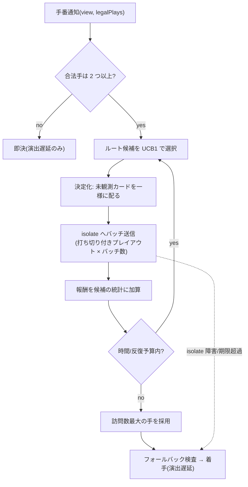

# E2: 対戦 AI(非 LLM ロジック)

> **改訂反映ノート(2026-07-25、E12 改訂による)** — 矛盾する記述は E12 を正とする。
> - **ルールはネイティブ実行になった**(E12 §4.6 改訂でサンドボックス棚上げ)。QuickJS isolate 境界コスト(h_q・バッチ境界呼び出し)を前提にした性能見積もり(§4)は**保守側に倒れた旧前提**であり、実際の探索予算は大幅に緩い。「core+ルールを AI 用 isolate に持ち込む」系の提案(§6)は不要になった。
> - **有効なもの**: 推奨方式(決定化モンテカルロ+ルート UCB1)、ルール非依存の設計、バッチ化の考え方(ネイティブでも関数呼び出しの一括化として有効)、フォールバック・難易度・テスト設計はすべてそのまま。
> - TS-03 の計測はネイティブ実行前提で条件を再定義する。
> - **探索の実行場所は `worker_threads`(2026-07-25 開発者レビューで決定)**: Node はブロッキングに弱く、50ms 級でもメインスレッド直列計算は全部屋の WebSocket 処理を止めるため、AI 探索は Node 標準のワーカースレッド(1〜2 本のプール)で実行する。ワーカーは同じランタイムなので **core+rules の TS モジュールをそのまま import でき、別言語(C/Rust)切り出しで生じる「ルールセットの再実装」問題が発生しない**。手番ごとに {GameConfig, 観測情報, 予算} を postMessage(数 KB)、応答は選択アクションのみ(AI 内部の非決定性は権威ログに残らずリプレイ再現性を壊さない)。親側ウォッチドッグ+既存 4 段フォールバックは不変。注意: shared-cpu-1x は vCPU 1 本のため CPU 総量は共有(イベントループ停止は防げるが譲り合いになる)— AI 予算を控えめにするか shared-cpu-2x への増強で対応。

- 作成日: 2026-07-24
- 状態: 承認済み(2026-07-27 開発者レビュー)
- 一次情報源: `docs/企画書.md`(§3.3, §3.4, §9-3)/ `docs/product-backlog.md`(AI-01, AI-02)/ `docs/epics/E12-tech-stack.md`(§3, §4.6, §4.8, §6)
- 調査出典: 文末の「付録: 出典」参照

---

## 1. Epic 概要

### 1.1 目的

LLM を使わないルールベース(プログラムロジック)の対戦 AI を提供し、あわせて「提案ルールが増えても AI を作り直さなくてよい」構造を確立する。企画書の該当箇所:

> 対戦相手となる AI は **LLM(大規模言語モデル)ではなく、通常のロジック(ルールベースのプログラム)で実装する**。対戦のたびに LLM を呼ぶ構成にはしない。(企画書 §3.3)

> **対戦 AI と新ルールの整合**: ロジックベースの対戦 AI が、後から追加されたルールにどう追従するか(ルール追加時に AI ロジックも codex が更新するのか等)。(企画書 §9-3)

開発者の設計要望(本文書が正面から答えるべき問い):

> AI ロジックはルール追加ごとにいちいち考えるのは大変なので汎用的な感じのものにしたい。UCT アルゴリズム(モンテカルロ木探索+UCB1)が無難にいいと思うけど、不完全情報ゲームでのモンテカルロ木探索をどうするといいのかとかあんまりわかってないからその辺を補完して提案がほしい。(麻雀 AI のアプローチとか知りたい)

本文書の結論を先に言うと: **UCT の方向性は正しい。不完全情報への対応は「決定化(あり得る配札をサンプリングして完全情報化)+単一木で統計を集約する ISMCTS 系」を採り、初版は木の深さを 1 に制限した縮退運用(ルート UCB1 + 決定化プレイアウト)で E12 の CPU 予算に収める。** ルールの意味は一切解釈せず、エンジンの合法手列挙とシミュレーション API だけを使うので、新ルールには自動追従する(AI-02)。詳細は §2.7。

### 1.2 担当ストーリー

| ID | 内容 | フェーズ |
|---|---|---|
| AI-01 | 初版 AI: 人間 1 人 + AI でゲームが最後まで進行する | 1 |
| AI-02 | 新ルール追従: 追従方針の決定・文書化と E7 パイプラインへの組み込み | 2 |

### 1.3 他 Epic との依存

| 相手 | 関係 |
|---|---|
| E1(エンジン) | **依存(最大)**。合法手列挙・状態遷移・順位判定・プレイヤー視点ビューの各 API(§3.1(c))と、シミュレーションハーネス(E12 §4.7 手順 4 の CI シミュレーションと共用)を E1 が提供する。E12 §6 末尾の「合法手列挙の未定義事項」(階段など手の種類を増やすルール)の決定にも従う |
| E12(技術基盤) | **制約**。CPU 予算(1 手 平常 50ms・上限 200ms)、サンドボックス(QuickJS isolate)経由のルール実行コスト、差分ガード(codex は `packages/rules/` 以外に触れない = **AI を codex に更新させる案は初期封印**)を前提とする |
| E3(マルチプレイ) | MP-02(開始時の AI 自動補充)と、切断時の AI 代打ち(E12 §4.3)が本 AI を呼び出す |
| E7(codex パイプライン) | AI-02 で、ルール PR の CI に「AI 込みシミュレーション」を組み込む(CX-03 の検証段の一部になる) |
| E10(運用・観測) | AI の探索反復数・フォールバック発生率をメトリクスとして提供する(ルール増加による劣化の監視) |

---

## 2. Epic 横断の技術仕様

### 2.1 【解説】まず UCT の復習(60 秒)

UCT = モンテカルロ木探索(MCTS)+ UCB1。1 手を決めるまでに次のループを予算いっぱい回す。

1. **選択**: 根(現局面)から、各ノードで UCB1 値が最大の子を選んで降りる。
2. **展開**: 未展開の手があるノードに来たら子を 1 つ足す。
3. **シミュレーション(プレイアウト/ロールアウト)**: そこから終局まで軽い方策(ランダム+簡単なヒューリスティック)で打ち切り、結果(報酬)を得る。
4. **逆伝播**: 通ってきたノードの「訪問数」と「平均報酬」を更新する。

UCB1 は「平均報酬(活用)」と「試行回数が少ない手のボーナス(探索)」を足した値:

```
UCB1(i) = mean_i + c * sqrt( ln(N) / n_i )     // c は探索定数。報酬を [0,1] に正規化した場合 0.7 前後が定番
```

予算切れ時は**訪問数が最大の手**を採用する(平均報酬最大より頑健)。ポイントは、**評価関数を人間が設計しなくても、シミュレーションさえ正しければ手の良し悪しが出てくる**こと。この性質が「ルールが増えても AI を書き直さない」という本 Epic の目標と噛み合う。

### 2.2 【解説】不完全情報で何が壊れるか

UCT は「現局面 = 1 つの確定した状態」を根に木を張る。しかし大富豪では**相手の手札が見えない**ため、自分から見た「現局面」は 1 つの状態ではなく、**あり得る配札の集合**(ゲーム理論の用語で**情報集合** — 自分には区別が付かない状態の集まり)である。真の状態が分からない以上、素朴にはどの状態から木を張ればいいのかが定まらない。これが不完全情報ゲームに MCTS を適用するときの出発点の問題で、解き方は大きく 2 系統ある。

### 2.3 【解説】選択肢 1: 決定化(determinization / PIMC)

**考え方**: 見えない情報(相手 3 人の手札)を「ランダムに 1 通り決め打ち」して完全情報ゲームに変換する(これを**決定化**と呼ぶ)。決定化した世界なら普通の UCT が回せる。これを数十〜数百通りの世界について繰り返し、「多くの世界で良かった手」を多数決や平均で選ぶ。この方式は **PIMC(Perfect Information Monte Carlo)** と呼ばれ、コントラクトブリッジ(GIB)やスカート、クロンダイクソリティアなどで実績がある古典的な手法である [1][2]。

直感的には「相手の手札はわからないが、あり得る配り方を 100 回想像して、どの想像でも強かった手を選ぶ」。実装も、完全情報の UCT がそのまま使えるので素直。

**弱点**(初出用語の定義):

- **strategy fusion(戦略融合)**: 決定化した各世界を**別々に**解くと、探索は「未来の分岐点で、世界ごとに違う手を打てる」と誤って仮定する。実際の自分は未来でも相手の手札を知らないのだから、**区別できない状態では同じ手しか打てない**のに、である [1][3]。大富豪の例: 「相手がジョーカーを持っている世界では安全に流し、持っていない世界では 2 で勝負する」という計画は、各世界の中では最善に見えるが、実戦の自分はどちらの世界にいるか分からないので実行不能。PIMC はこの実行不能な計画に高い点を付けてしまう。
- **非局所性(non-locality)**: ある決定化(配札)は、そこに至るまでの相手の行動からして**ほぼあり得ない**ことがある(相手は自分の手札を知っていて、そちらの状態には誘導しないから)。世界を一様にサンプリングすると、実際にはほぼ起きない世界の解が結論を汚す [1][3]。
- **神視点の錯覚(fake omniscience)**: 上記 2 つの帰結として、PIMC の AI は「情報を集める手」「情報を隠す手(ブラフ)」の価値を理解できない。カードを隠す・様子を見るという行動が意味を持つゲームほど損をする [2]。
- **予算の分割**: 世界ごとに独立の木を作るので、計算予算が世界数で割られる。しかも各木は大部分が共通していて、同じ探索を何度も重複して行う [1]。

なお Long らは「決定化がうまくいくゲーム・いかないゲーム」を木の構造パラメータで説明しており、隠れ情報の露見が遅く、リーフ近くまで行動が状態を分けないゲームほど PIMC が有効とされる [1](孫引き。原典は付録 [4])。

### 2.4 【解説】選択肢 2: ISMCTS(情報集合モンテカルロ木探索)

**考え方**: 木を世界ごとに分けるのをやめ、**「自分から見た情報集合」をノードとする木を 1 本だけ**育てる。各反復の頭で決定化を 1 つサンプリングし、**その反復ではその世界で合法な枝だけを辿る**。統計(訪問数・報酬)は情報集合単位に集約される。Cowling・Powley・Whitehouse が 2012 年に定式化した [1]。

これで何が解決するか:

- **予算の一本化**: 全反復が 1 本の木に注がれ、重複探索が消える。深い読みが必要なゲームで決定化 UCT より有利 [1]。
- **strategy fusion の緩和**: 「多くの世界で共通して良い手」に統計が集まるため、世界ごとに違う手を前提にした実行不能な計画に点が付きにくい [1]。
- **anytime 性**: 反復単位で打ち切れるので、時間予算との相性が良い(本プロダクトの 50〜200ms 予算に効く)。

変種が 3 つある [1]: 相手の手が全部見えるゲーム用の **SO-ISMCTS**(single-observer)、相手の「部分観測手」(何かしたのは分かるが内容が見えない手)があるゲーム用の **SO-ISMCTS+POM** と **MO-ISMCTS**(multi-observer)。**大富豪は、基本ルール+現行 Effect 語彙の範囲では出されたカードが全員に見える(部分観測手がない)ので、最も単純な SO-ISMCTS で足りる**(この前提の適用範囲は本節末尾で限定する)。

**ISMCTS でも残る弱点**: 非局所性は解決しない。一様な決定化は「相手の行動からしてあり得ない世界」も同じ重みで引き続ける。これを正すには相手の行動履歴から配札の**信念分布**(どの世界がどれくらいありそうかの確率)を推定してサンプリングを重み付けする必要がある。ISMCTS の論文は、信念分布の統合を**本論文では扱わない**と明言した上で、将来課題と位置づけている [1]。

**では信念分布は必要か — この系統のゲームでの実証**: 幸い、大富豪によく似た shedding game(手札を出し切るゲーム)である闘地主(Dou Di Zhu)での一連の研究が答えを持っている。

- 闘地主では決定化 UCT と ISMCTS の**棋力はほぼ互角**だった。strategy fusion・予算分割のどちらも、このゲームでは勝率への影響が小さい [1][5]。
- **簡略版の**闘地主を使った先行実験では、完璧な相手モデル(=正確な信念分布)を与えても、一様分布に対する上積みは**小さかった**([1] が自らの先行研究の結果として引くもの)。このジャンルでは「隠れ情報を推理して突く」場面より「どの世界でも通用する頑健な手を選ぶ」場面が支配的だから、と考察されている [1]。
- 国内のコンピュータ大貧民(UECda)でも同じ傾向が確認されている。UECda-2010 優勝クライアント snowl は**相手手札を割り当ててプレイアウトを回すモンテカルロ法**で提出札を選ぶプログラムであり [7][8]、これを改造した後年の実験で**手札推定の精度を上げても強さはほとんど変わらない**(むしろ「弱いカードを多めに推定する」という雑な偏りの方が勝率に効く)ことが示された [7]。UECda-2014〜2017 無差別級 4 連覇の FujiGokoro もモンテカルロ法を核に方策関数(機械学習)・勝率推定を組み合わせた構成である [9]。

**含意**: 大富豪系では「一様サンプリングの決定化 + モンテカルロ評価」だけで実用強度に届き、信念推定・相手モデリングは(少なくとも初期は)不要。これは本プロダクトにとって幸運な性質で、**ルールが毎週変わる環境では信念モデルの保守こそが最大の負債になる**ところだった。

**「部分観測手がない」の適用範囲**: 上の前提は基本ルール+現行 Effect 語彙の範囲での話であり、破れる経路が 3 つある。(i) **献上(カード交換)**: 交換札は当事者にしか見えない上、「大貧民は最強札を献上済み」という強い信念制約が生まれるため、一様サンプリングは実際の分布から歪む。(ii) **隠れたカード移動**: 7渡しのような「選んで渡す」系は E12 §4.6(2) が頻出を想定する提案類型で、`moveCards` が他プレイヤーからどう見えるかは E1 で未定義。移動が非公開なら部分観測手そのものになる。(iii) **パスが情報になるルール**: 「出せるなら出さねばならない」系が入るとパスは「出せる手がなかった」ことの証明になるが、本設計の決定化には観測整合フィルタ(観測と矛盾する世界を弾く仕組み)がない。重要なのは、これらのいずれで前提が破れても、起きるのは「サンプリングする世界の分布が実際からずれ、手の評価が**緩やかに劣化する**」ことだけで、合法手のみを打つ・時間内に返す・停止するという不変条件は一切影響を受けない(graceful degradation)。劣化への対策(信念制約付きサンプリング・観測整合フィルタ)は必要になったときに足せる拡張であり、可視性の定義とあわせて E1 と協議する(§6-8)。

### 2.5 【解説】麻雀 AI は何をしているか、なぜ大富豪と違うのか

開発者の関心に answering: 麻雀 AI の主流は 2 系統あり、**どちらも「素の UCT」ではない**。

**(a) 予測モデル + モンテカルロシミュレーション系**(例: 水上・鶴岡 2015 [10])。相手の挙動を「テンパイしているか」「待ち牌は何か」「上がったら何点か」という 3 つの予測モデルに分解し、**上級者の牌譜**から教師あり学習する。着手決定は、この予測分布に従って相手が動くモンテカルロシミュレーションを回して行う。木は深く張らず、シミュレーションは自分の押し引き評価に使う。天鳳でレート 1718(平均的な人間より有意に上)を達成した。

**(b) 深層強化学習系**(例: Microsoft の Suphx 2020 [11])。打牌・リーチ・チー・ポン・カンの判断ごとに CNN 方策を教師あり学習 → 自己対戦強化学習で鍛える。全局を通した報酬設計(global reward prediction)、学習時だけ隠れ情報を見せて学習を誘導する oracle guiding、対局中に方策を局面へ適応させる run-time policy adaptation が技術的特徴。天鳳で上位 0.01% 相当の強さに到達した。

**なぜ麻雀では探索(UCT)が主役にならないか** — ゲーム構造が大富豪と根本的に違う:

| 構造 | 麻雀 | 大富豪 |
|---|---|---|
| 偶然性 | **毎手ツモ(山からの引き)が挟まる**。配牌を決定化しても偶然は消えず、チャンスノードの分岐(牌種 34)が木とプレイアウトの分散を爆発させる | **配札の一回きり**。決定化した瞬間に完全に決定論的なゲームになり、UCT がそのまま効く |
| 手の観測 | 手出し/ツモ切り・鳴きなど部分観測が多く、相手モデルが本質(振り込み回避が成績の大半を決める) | **出された手は全公開**。部分観測手がなく SO-ISMCTS で足りる(§2.4) |
| 1 局の長さ・評価 | 長く、点数・順位・供託など報酬構造が複雑。終局までのプレイアウトはノイズまみれ | 短い(1 ゲーム数十手)。報酬は順位そのもので単純 |
| 学習データ | 上級者の牌譜が大量にあり、教師あり学習が自然 | 本プロダクトには**存在しない**。しかもルールが増えるたびに過去の棋譜の意味が変わる |

つまり麻雀 AI が学習系・予測モデル系に寄るのは「探索が効きにくく、データが豊富」という麻雀固有の事情による。大富豪は正反対(探索が効きやすく、データがない)であり、**麻雀の主流手法をそのまま持ち込む理由はない**。特に本プロダクトでは、ルールが提案で増殖するたびに再学習が必要になる学習系は、開発者が避けたい「ルール追加ごとの AI 保守」を最悪の形で再導入してしまう。参考にすべきは手法ではなく設計態度 — 「ゲームの構造に合わせて、モデル(知識)とシミュレーション(計算)の配分を決める」こと — である。

### 2.6 【解説】本プロダクト固有の制約

一般論に加えて、E12 が課す制約が方式選定を絞る:

1. **ルールはサンドボックス内**: 提案ルールのフックは QuickJS(WASM)isolate 内で動き、ホスト⇔isolate の境界呼び出しにコストがかかる。E12 §6 は探索コストが「候補手数 × 該当フック実装ルール数 × 探索幅」でスケールすると見積もり、**数万局面級の深い MCTS は予算外**と明言している。
2. **CPU 予算**: 1 手あたり平常 50ms・上限 200ms(E12 §6)。ネイティブ実装の UECda プログラムが数千プレイアウトを回すのとは条件が違う。
3. **AI 更新の封印**: 差分ガード(E12 §4.6(1))により codex は `packages/ai` に触れない。「ルール追加時に codex が AI も更新する」案は初期運用では**採れない**(E12 が明示)。
4. **強さの要件は控えめ**: ターゲットは家庭用カジュアル(子供メイン)。UECda 優勝級の強さは不要で、「合法手だけを打ち、明らかな悪手を避け、止まらない」ことが最優先。むしろ強すぎる AI は体験を損ねる。

### 2.7 推奨方式(決定)

以上を踏まえ、本 Epic は次の方式を採用する。

> **決定化モンテカルロ + ルート UCB1(SO-ISMCTS の木深さ 1 運用)。プレイアウトはルールと同じ isolate 内で一括実行する。**
>
> - 反復ごとに決定化(相手手札の一様ランダム割り当て)をサンプリングし直す
> - 自分のルート候補手を UCB1 で選び、その世界を短い打ち切り付きプレイアウト(ヒューリスティック方策)で評価する
> - 統計は候補手単位(=情報集合単位)に集約する。木はルートより深く張らない(初版)
> - 予算切れで訪問数最大の手を打つ。失敗時は多段フォールバック(§3.1)

**なぜこれか(理由 3 点)**:

1. **ルール非依存(AI-02 の要件そのもの)**: この方式が要求するのは「合法手を列挙できる」「手を適用すると次状態が返る」「終局と順位が判定できる」の 3 つだけで、全部エンジン API。ルールの意味は一切参照しない。新ルールはエンジンのルールチェーンが解釈し、AI はその**結果**の上でプレーするので、追加ごとの AI 改修が構造的に不要になる。
2. **E12 予算に収まる唯一の探索形**: 単一木・anytime・反復単位で打ち切れる ISMCTS 系は時間予算と相性が良く(§2.4)、木を深さ 1 に制限すれば境界呼び出しを「プレイアウトのバッチ送信」だけに圧縮できる(§4)。予算が小さいうちは深い木はどうせ育たないので、深さ制限による損失は実質ない。ISMCTS の商用実装では 2500 反復・0.25 秒(ネイティブ、携帯端末)で強い AI が成立した報告があり [2]、本プロダクトはそれより少ない反復数で「カジュアルに楽しい」水準を狙う。
3. **ジャンルでの実績**: 闘地主で決定化系 MCTS は実用強度 [1][5]、UECda では snowl(モンテカルロ法)が優勝実績 [7][8]。信念推定の寄与が小さいことは、簡略版闘地主の実験 [1] と snowl の改造実験 [7] の双方で確認されている。

**明示するトレードオフ**:

- 深い読み(数手先の詰み筋)はできない。カジュアル対戦では許容し、予算増(§6-2)や木の深化(下記)で将来改善する。
- 残る限界の内訳を正確に言うと: 深さ 1 + 固定ロールアウト方策の本構成では、古典的な strategy fusion(§2.3)は**木の中では生じない**(未来の自分の分岐を木に持たないため、「世界ごとに違う未来の手を打てる」という誤った仮定を置く余地がそもそもない)。実際に残るのは次の 2 つ: (i) **一様信念のバイアス** — 非局所性が未処理のまま(あり得ない世界も同じ重みで引く。§2.4 末尾の 3 経路で増幅されうる)、(ii) **情報価値の無視** — 情報を集める手・隠す手(ブラフ)を評価できない。どちらもこのジャンルでは勝率への影響が小さいという実証 [1][7] に依拠して受け入れる。企画のコア体験(カオスを笑う)への影響も小さいと判断する。

**拡張経路(コードを捨てずに強くする順路)**: (1) 演出遅延中の探索継続で実効予算を上げる(§6-2)→ (2) `maxTreeDepth` を上げて本来の SO-ISMCTS にする(実装は同一ループの一般化。木を深くすると strategy fusion が初めて論点になるが、単一木に統計を集約する ISMCTS の性質がその緩和をそのまま引き継ぐ — §2.4)→ (3) ロールアウト方策の改善(手数最小化などの domain 知識を薄く足す)→ (4) 信念分布の導入(必要になったときの最後の手段。実証上、優先度最低 [1][7])。

**棄却した代替案**:

| 案 | 棄却理由 |
|---|---|
| ヒューリスティック専用 AI(if-then の手作り評価) | ヒューリスティックはルール知識の塊(例: 「8 は温存」は 8 切りの存在を前提とする)で、**新ルールのたびに人間が見直す羽目になる** — 開発者が避けたい事態そのもの。ただし薄いヒューリスティックはロールアウト方策とフォールバックとして限定的に残す(§3.1) |
| PIMC(世界ごとに独立の深い UCT を回して多数決) | 予算分割と重複探索(§2.3)が 50〜200ms 予算では致命的。闘地主の実証でも単一木に対する優位はない [1] |
| ルール追加時に codex が AI も更新 | E12 §4.6(1) の差分ガードが初期運用で封印(検証強化とセットでないと安全境界が崩れる)。また「ルール N 件目の追加が AI の全過去挙動を壊しうる」保守モデルは自動化と相性が最悪 |
| 学習系(方策学習・強化学習) | 牌譜が存在せず、ルールが増えるたびにデータと方策が陳腐化する(§2.5)。自己対戦で作る道はあるが、ルール反映のたびに学習パイプラインを回す運用コストは個人開発の範囲外 |

---

## 3. ストーリー別詳細仕様

### 3.1 AI-01: 初版 AI

#### (a) 原文引用

> **[AI-01]** プレイヤーとして、AI プレイヤーを相手にすぐ 1 人で対戦を始めたい。それは相手を集めなくても大富豪を楽しめるようにするためだ。
> - 受け入れ条件:
>   - AI 対戦を選ぶと、人間 1 人 + AI プレイヤーでゲームが開始する
>   - AI は合法手のみを選び、ゲームが最後まで止まらず進行する
>   - 対局処理で LLM などの外部 AI API を一切呼ばない(ルールベースロジックのみ)
> - フェーズ: 1 / 依存: GE-03

(`docs/product-backlog.md` E2 より)

#### (b) 挙動仕様

- **手番の流れ**: サーバーのゲームループが AI の手番を検知すると、`packages/ai` の `decideMove` を呼ぶ。AI は E12 予算(計算 50ms 平常・200ms 上限)内で手を決め、**演出遅延**(0.4〜1.2 秒のランダム。値は E4 のトーンと合わせて調整)を挟んで着手する。人間から見て「即打ちでも長考でもない」テンポを作る。
- **見える情報**: AI は**人間プレイヤーと同じ情報しか見ない**。自分の手札 + 公開情報(場・プレイ履歴・各人の残枚数・確定順位)のみ。他人の手札は参照しない(公平性の不変条件。§5 でテスト)。
- **意思決定**: §2.7 の方式。合法手が 1 つ(または 0 = パス強制)なら探索せず即決する。
- **決定化(世界サンプリング)**: 未観測カード(全カード − 自手札 − 公開済みカード)を、各相手の残枚数どおりにシード付き乱数で一様に配る。信念による重み付けはしない(§2.4 の実証根拠 [1][7]。この一様サンプリングの適用範囲と、前提が破れたときに緩やかな劣化にとどまることは §2.4 末尾)。ルール専用 KV メモリと `setHistory` は**サーバーの実状態のコピー**を初期値に使う(注意点は (f)-3)。
- **プレイアウト**: 決定化した世界でルート候補手を 1 手打ち、以後は全員がロールアウト方策(下記)で `cutoffSteps`(既定 24 手)まで、または終局まで進める。
  - **ロールアウト方策**(ルール非依存を保つ薄いヒューリスティック): ε(既定 0.2)で一様ランダム、それ以外は「出せるなら出す > 弱い手から出す > 同時に多く枚数を減らせる手を優先」。カードの強弱は**エンジンが返す現在有効な強さ順序**(革命などの `modifyStrength` 適用済み)を使うので、強弱を反転するルールが入っても方策は壊れない。合法性判定は「基礎候補から 1 手サンプルして単発検証」(棄却サンプリング)で行い、全列挙を避ける(§4)。isolate 内プレイアウトの候補の母集団には、エンジンの(ルールチェーン反映済みの)**基礎候補生成器**を用いる。E1 が「ルールによる候補追加宣言」方式(E12 §6 末尾の未定義事項)を採った場合も、追加された手種はこの生成器経由でプレイアウトの母集団に自動的に含まれる。
  - **打ち切り時の代理評価**: 終局前に打ち切ったら、確定順位はそのまま・未確定者は残枚数の少ない順に暫定順位を付けて報酬化する。
- **報酬**: 4 人順位を `[大富豪, 富豪, 貧民, 大貧民] → [1, 2/3, 1/3, 0]` に正規化。UCB1 の `c = 0.7` を既定とし、設定で調整可能にする(報酬が [0,1] 正規化のときの標準的な初期値)。
- **最終選択**: 訪問数最大(同数なら平均報酬 → ヒューリスティック順)。難易度プロファイル(下記)の温度 τ で「訪問数^ (1/τ) に比例したサンプリング」も選べる(τ→0 で argmax)。
- **カード交換(献上)などの追加判断**: GE-01 が基本ルールに含めると決めた場合、エンジンが提示する選択肢に対して同じ枠組み(選択肢が少なければヒューリスティック即決、多ければ小予算探索)で応答する。なお献上が入る場合、**自分が渡した・受け取った札は確定情報として決定化に反映する**(該当カードの除外/固定という単純な制約で実装できる)。一方「大貧民は最強札を献上済み」のような**他者間の交換に関する信念制約**は初版の一様サンプリングでは無視する(評価が緩やかに劣化するだけで不変条件は壊れない。§2.4 末尾)。
- **フォールバック階段**(上から順に試し、必ず着手を返す):
  1. 探索完走 → 訪問数最大の手
  2. ハード期限超過(200ms) → その時点の統計で最善の手(反復 0 なら次へ)
  3. 探索が例外・isolate 障害で失敗 → ヒューリスティック(有効強さ順で最弱の合法手)
  4. 合法手列挙自体が失敗 → エンジンの `fallbackPlay`(パスが合法ならパス、リード時は基礎生成器の最弱単騎)
  さらにサーバー側にも監視を置き、`decideMove` の Promise がウォッチドッグ期限(既定 1 秒)までに解決しなければサーバーが `fallbackPlay` で代打ちする(**AI がゲームを止めることは構造的にない**)。フォールバック発生は必ずログ・メトリクスに残す(E10)。



#### (c) データ・API 定義

**AI 本体(`packages/ai`)**:

```ts
// packages/ai/src/types.ts(骨子。確定は実装時)
export interface AiPlayer {
  /** 手番ごとに呼ばれる。必ず budget.hardMs + マージン内に解決し、合法手を返す */
  decideMove(input: DecideMoveInput): Promise<AiDecision>;
}

export interface DecideMoveInput {
  view: PlayerGameView;      // 自席から見える情報のみ(型として他人の手札を含まない)
  legalPlays: Play[];        // サーバー(エンジン)列挙済みの合法手。権威はこちら
  budget: ThinkBudget;
  seed: string;              // hash(gameSeed, seat, turnIndex)。決定性の担保
  difficulty: DifficultyProfile;
}

export interface AiDecision {
  play: Play;                          // 不変条件: legalPlays の要素
  usedFallback: "none" | "partial-search" | "heuristic" | "engine-fallback";
  stats?: SearchStats;                 // 反復数・候補別訪問数・経過時間(ログ/E10 用)
}

export interface ThinkBudget {
  softMs: number;      // 既定 50(E12 §6 平常)
  hardMs: number;      // 既定 200(E12 §6 上限)
  maxPlayouts: number; // 既定 2000(ルールが少なく速い時の CPU 上限)
  sliceMs: number;     // 既定 10。イベントループを塞がないスライス幅
}

export interface DifficultyProfile {
  name: "easy" | "normal" | "hard";
  budgetScale: number;     // maxPlayouts への係数(easy 0.15 / normal 1 / hard 1)
  temperature: number;     // 最終選択の温度(easy 1.5 / normal 0.3 / hard ~0)
  rolloutEpsilon: number;  // ロールアウトのランダム率(easy 0.5 / normal 0.2 / hard 0.1)
}

export interface MctsConfig {
  ucbC: number;            // 既定 0.7
  maxTreeDepth: number;    // 既定 1(初版)。将来 ISMCTS 深化用
  cutoffSteps: number;     // 既定 24
  rootCandidateCap: number;// 既定 12。候補手が多い時はヒューリスティック順で上位のみ探索
  playoutBatchSize: number;// 既定 16。isolate への一括送信単位
}
```

- **難易度の付け方**: 探索予算(budgetScale)・最終選択の温度・ロールアウトのランダム率の 3 つまみ。**フェーズ 1 では `normal` 固定で出荷**し、UI への露出はプロダクト判断に委ねる((f)-4)。強さの絶対値は自己対戦(§5)で校正する。
- **決定性**: `Math.random`・`Date` は使わず、seed 付き乱数のみ(E12 のリプレイ再現方針と揃える)。同じ `(view, legalPlays, seed, config)` に対して同じ手を返す。

**エンジンに要求する API(E1 との契約。E1 の詳細設計で確定)**:

```ts
// packages/core が提供し、AI とシミュレーションハーネスが利用する
export interface SimulationApi {
  enumerateLegalPlays(state: GameState, seat: SeatId): Play[];   // ルールチェーン適用済み
  applyPlay(state: GameState, play: Play): ApplyResult;          // 純粋関数。Effect 適用済み次状態 + イベント
  isTerminal(state: GameState): Standings | null;
  getEffectiveStrengthOrder(state: GameState): StrengthOrder;    // modifyStrength 適用済みの現在の強弱
  getPlayerView(state: GameState, seat: SeatId): PlayerGameView; // 秘匿情報を落としたビュー
  fallbackPlay(state: GameState, seat: SeatId): Play;            // 常に合法な安全手(§3.1(b) 階段 4)
  serialize(state: GameState): SerializedGameState;              // isolate への持ち込み用
}
```

**シミュレーションハーネス(isolate 内で動くプレイアウト実行器)**:

```ts
// core(エンジン)+ 有効ルールバンドルを 1 つの isolate に読み込み、まとめて実行する
export interface PlayoutRequest {
  world: SerializedGameState;   // 決定化済みの完全状態
  rootPlay: Play;               // 評価対象のルート手
  maxSteps: number;
  policy: { epsilon: number };  // ロールアウト方策パラメータ
  seed: string;
}
export interface PlayoutResult {
  rewards: number[];            // 席順の正規化報酬
  steps: number;
  aborted: "stepLimit" | "ruleError" | null;  // ruleError = ルール例外/上限超過(サンプル破棄扱い)
}
// ホスト⇔isolate は PlayoutRequest[] → PlayoutResult[] の配列一括(境界コストの償却。§4)
```

#### (d) 実装方針

- **配置**: `packages/ai` は探索・決定化・方策・予算管理を持つ。エンジン知識は `SimulationApi` 経由のみ(依存方向: ai → core。逆依存なし)。
- **シミュレーションの実行場所**(§4 で予算化、§6-1 で E12 へ提案):
  - **提案ルールが 1 件もない構成(フェーズ 1)**: プレイアウトは**ホスト(Node)で直接**実行する。エンジンは純粋 TS なので isolate は不要で、数千プレイアウトが余裕で回る。
  - **提案ルールがある構成(フェーズ 2 以降)**: エンジン + 有効ルールバンドルを読み込んだ **AI 専用のシミュレーション isolate**(対局用 isolate とは別インスタンス。ライブ状態を汚さない)にプレイアウトを一括送信する。E12 §6 の緩和策「isolate 内一括評価」を候補手判定からプレイアウト全体へ拡張したもの。
- **バッチと UCB1 の粒度**: 1 バッチにつき UCB1 選択を `playoutBatchSize`(既定 16)回行い、選ばれた(ルート候補手, 決定化世界)のペア配列を 1 回の isolate 呼び出しで一括送信する。統計更新はバッチ結果の受信時にまとめて行う。したがって UCB1 は最大 1 バッチ分古い統計で選択することになるが、総反復数に対してバッチは小さく実害は無視できる(バッチ内で同一候補が重複して選ばれることも許容する)。
- **イベントループ保護**: 探索は `sliceMs`(10ms)単位のバッチに分割し、バッチ間で `setImmediate` に譲る。1 バッチ = isolate 呼び出し 1 回。バッチ所要が slice を超えるようならバッチサイズを適応的に半減。E12 §6 の worker_threads 退避は初期実装では入れない(移行トリガは §6-5)。
- **ルート候補の間引き**: 合法手が `rootCandidateCap` を超えたら、ヒューリスティック順(弱い手・枚数を多く減らす手を優先)で上位のみを探索対象にする。列挙自体はエンジンの一括判定(E12 §6 緩和策 1〜3 適用済み)で 1 回だけ行う。
- **ログ**: 1 手ごとに `SearchStats`(反復数・フォールバック・経過 ms)を構造化ログへ。E10 のメトリクス(`ai_playouts_per_move`, `ai_fallback_total`, `ai_move_wall_ms`)の供給源になる。

#### (e) 受け入れ条件の精緻化

バックログの 3 条件を、検証可能な形に分解する:

1. AI 対戦を選ぶと人間 1 + AI 3 で開始し、3 戦 1 セットが最後まで完走する(GE-05 経由の統合テスト)。
2. **合法手のみ**: 自動対局 1,000 ゲームで、AI の着手がサーバー検証(権威判定)に拒否された回数が 0。`AiDecision.play ∈ legalPlays` をプロパティテストでも担保。
3. **止まらない**: 同 1,000 ゲームで進行停止・未捕捉例外が 0。ウォッチドッグ代打ち(フォールバック階段の発動)は 0 が理想だが、発動してもゲームは続くことを注入テストで確認。
4. **非 LLM**: `packages/ai` が HTTP クライアント・LLM SDK に依存しないことを依存グラフ検査(CI の lint ルール)で機械的に強制。実行時にもネットワーク I/O なし(エンジン同様の純粋構成)。
5. **時間内**: 1 手の計算が hardMs(200ms)+ マージン以内。体感応答(演出遅延込み)0.4〜1.2 秒。
6. **強さの下限**: 一様ランダム合法手 AI との自己対戦で、平均報酬が統計的に有意に上回る(目安: 500 セットで平均報酬 ≥ 0.60。ランダム同士の期待値は 0.5)。
7. **決定性**: seed 固定で同一入力 → 同一着手(リプレイ再現)。

#### (f) 未解決事項

1. **UCB1 定数・ロールアウト方策の校正**: c=0.7、ε=0.2 は文献ベースの初期値。自己対戦グリッドで粗く調整する(実装時)。
2. **献上(カード交換)の有無と AI の応答**: GE-01 の基本ルール確定待ち。
3. **決定化時のルール KV メモリの扱い**: 初版は「サーバー実状態の KV をコピー」する。現行 Effect 語彙で KV に入るのはルール自身が観測した情報に限られ実害は小さいが、将来「秘匿情報を KV に書くルール」が現れると AI が間接的に覗ける非対称が生じる。KV の可視性区分(公開/秘匿)の導入を E1/E9 と協議(§6-3)。
4. **難易度の UI 露出**: 3 プロファイルは実装するが、フェーズ 1 で選択 UI を出すかはプロダクト判断(企画書に難易度選択の要件はない)。
5. **演出遅延の値と揺らぎ**: E4 のトーン設計と合わせて決める(現暫定 0.4〜1.2 秒)。

### 3.2 AI-02: 新ルールへの追従

#### (a) 原文引用

> **[AI-02]** 開発者(運営)として、提案ルールが追加されたときに対戦 AI がどう追従するかの方針を決め、パイプラインに組み込みたい。それは新ルール下でも AI 対戦が破綻しないためだ。
> - 受け入れ条件:
>   - 追従方針(ルール追加時に codex が AI ロジックも更新する/AI は未知ルールを無視して合法手のみ打つ、など)が決定され文書化されている
>   - 新ルールが有効な卓で AI が不正手や進行停止を起こさないことをテストで確認できる
>   - 方針が E7 の自動実装フローに組み込まれている
> - フェーズ: 2 / 依存: AI-01, CX-03 / 関連未確定事項: §9-3

(`docs/product-backlog.md` E2 より)

#### (b) 挙動仕様(追従方針の決定)

**決定: 「AI はルールを解釈しない。エンジンの合法手列挙とシミュレーション API 経由でプレーする」方式を正式採用する。codex による `packages/ai` の更新は行わない。**(企画書 §9-3 はこの決定により解消される)

- バックログが挙げた 2 案のうち「codex が AI ロジックも更新する」案は、E12 §4.6(1) の差分ガード制約により初期運用では封印済み。本文書はこれを**恒久方針に格上げ**する。理由: (1) §2.7 の方式は構造的にルール非依存で、更新の必要自体がない。(2) AI コードを自動変更対象にすると、ルール 1 件の追加が全対局の AI 挙動を変えうるという検証不能な結合が生まれる。(3) AI の強さ改善は人間の仕事として分離した方が、E7 の安全境界(codex は rules/ のみ)が単純に保たれる。
- 「未知ルールを無視して」という表現は正確には「**未知ルールの意図を解釈せず、ルール適用後の世界でプレーする**」である。8 切りが入れば、AI のシミュレーション内でも 8 で場が流れる(エンジンがそう遷移させる)ので、探索は自然に「8 が強い」ことを発見する。**ルールの効果は自動で AI の判断に反映され、反映のためのコード変更は発生しない。**
- 追従の質の限界も明示する: 探索予算が小さいうちは「新ルールを使いこなす」より「新ルールで損をしない」水準にとどまる。これは §2.7 のトレードオフの一部として受け入れ、予算拡大(§6-2)で漸進的に改善する。

**「破綻しない」の定義**(受け入れ条件の中核):

| 不変条件 | 内容 |
|---|---|
| 合法性 | どのルール構成でも AI の着手はサーバー検証を通る |
| 停止性 | どのルール構成でもゲーム・セットが有限手数で終わる(AI が原因の無限ループを作らない) |
| 時間 | どのルール構成でも 1 手 hardMs 以内に着手が返る(フォールバック込み) |
| 隔離 | ルールのバグ・例外・上限超過が AI の思考を巻き込んでクラッシュさせない |

#### (c) データ・API 定義

新規の実行時 API は不要(AI-01 の構成がそのまま追従する)。追加するのは **CI 用シミュレーションハーネスの契約**のみ:

```ts
// packages/ai/src/harness/simulate.ts
// E7 のルール PR CI(E12 §4.7 手順 4 のシミュレーションテスト段)から呼ばれる
export interface SimHarnessOptions {
  games: number;                  // 既定 200
  ruleBundles: RuleBundleRef[];   // 新ルールを含む有効ルール構成(複数構成を渡せる)
  seed: string;                   // 再現可能な失敗レポートのため固定
  aiProfile: DifficultyProfile;   // CI 用の小予算プロファイル(softMs 20 / hardMs 100 程度)
  assert: {
    maxStepsPerGame: number;      // 停止性の上限(基本ルールの実測 p99 × 安全係数。E1 と合意)
    maxMoveWallMs: number;        // CI ハードウェアでの 1 手上限
  };
}
export interface SimReport {
  games: number;
  violations: Violation[];        // 種別: illegalPlay | nonTermination | timeout | exception
  aiStats: { meanPlayoutsPerMove: number; fallbackRate: number };
}
export function runSimulation(opts: SimHarnessOptions): Promise<SimReport>;
```

- ハーネス本体(自動対局の駆動)は E1 が CX-03 用に提供するものと**同一物**を使う。AI-02 が足すのは「対局者を本物の AI(小予算)にする」構成と上記アサーションで、二重実装しない。

#### (d) 実装方針(防御の多層化)

未知ルール下で破綻しないための防御を層で列挙する(上が第一防衛線):

1. **合法性はエンジンが権威**: AI は `legalPlays` から選ぶだけで、合法性を独自判定しない。ルールがどう合法性を捻じ曲げても、列挙が正しければ AI は正しい。
2. **プレイアウトの打ち切り**: 「ゲームが延々終わらないルール」が入っても、`cutoffSteps` + 代理評価で探索は必ず返ってくる(実対局の停止性はエンジン側の保証領域で、CX-03 のシミュレーション検証と E12 §4.8 の上限が守る)。
3. **ルール障害の隔離**: プレイアウト中のルール例外・時間/メモリ上限超過は isolate が検出し、そのサンプルを `aborted: "ruleError"` で破棄するだけ(E12 §4.8 の「ゲームを止めずにそのルールだけ落とす」方針と整合)。AI は残りのサンプルで判断する。
4. **フォールバック階段 + サーバーウォッチドッグ**(AI-01 §3.1(b) と同一): 探索が全滅しても着手は返る。
5. **新しい手の種類への追従**: 階段のような「出せる手の種類を増やす」ルールの候補生成は E1 の決定(E12 §6 末尾の引き継ぎ事項)に従う。どちらの案(エンジン側候補生成器の拡張/ルールによる候補追加宣言)でも、AI から見える面は `enumerateLegalPlays` のままなので**AI 側の変更は不要**。
6. **choice 機構への前方互換**(E12 §7-7 で案 A が採られた場合): ルールがプレイヤーに追加入力(例: 7 渡しの選択)を要求するようになったら、AI にも choice が届く。暫定応答は「選択肢からヒューリスティック/ランダムで即答」とし、choice を探索に組み込むのは後続改善とする。E12 暫定(案 B: 初期は実装不可)の間は対応不要。
7. **チート防止の維持**: ルールが増えても AI の入力は `PlayerGameView` のみ(型が他人の手札を含まない)。「ルールが増えたら AI がこっそり強い情報を見る」という劣化を型で防ぐ。
8. **部分観測を生むルールへの劣化許容**: 献上・隠れカード移動(7渡し系)・強制出し系など、決定化の一様サンプリングの前提が弱まるルール(§2.4 末尾の 3 経路)が入っても、影響は手の評価品質の**緩やかな低下**に限られる。(b) の不変条件(合法性・停止性・時間・隔離)はこの経路では壊れない。対策(信念制約付きサンプリング・観測整合フィルタ)は劣化が観測されてから足す(§6-8)。

**E7 パイプラインへの組み込み**(受け入れ条件 3 への回答):

- ルール PR の CI(E12 §4.7 手順 4)のシミュレーションテスト段を「**AI 4 席 × 小予算**」構成で実行する。これにより**すべてのルールはマージ前に『AI がその卓で破綻しないこと』を機械的に証明**される。violations が 1 件でもあれば CI fail = 提案は「実装失敗」(RP-03 通知)となり、破綻するルールは本番に到達しない。
- 実行時間の目安: 1 ゲーム数十手 × 小予算(1 手 ≤ 数十 ms)で 1 ゲーム 1〜2 秒、200 ゲームを 4 並列で 1〜2 分。E12 §4.7 の CI 予算(全体数分)に収まる。ゲーム数と並列度は CI 実測で調整。
- 本番反映後も、E10 のメトリクス(フォールバック率・平均プレイアウト数)で「特定ルール有効化後に AI が劣化していないか」を継続監視し、異常時はそのルールの無効化判断(CX-04)の材料にする。

#### (e) 受け入れ条件の精緻化

1. 追従方針が本文書 §3.2(b) として文書化され、開発者が承認している(バックログ §5 の対応表どおり、企画書 §9-3 を解消)。
2. ルール PR の CI に AI 込みシミュレーションが組み込まれ、**新ルール有効構成で 200 ゲーム、不正手 0・進行停止 0・1 手時間超過 0・未捕捉例外 0** が自動検証される(意図的に壊したルールのフィクスチャで「正しく fail する」ことも確認する)。
3. 障害注入テスト: フックが例外を投げる/上限超過する/極端に遅いルールを混ぜても、AI が時間内に合法手を返し、対応するフォールバックが記録される。
4. 差分ガードのテストに「`packages/ai` への変更を含むルール PR が fail する」ケースが含まれる(E12 §4.7 の資産を確認・流用)。
5. choice 機構の決定(E12 §7-7)がどちらに転んでも本設計が成立することが、本文書のレビューで確認されている(案 A なら (d)-6 の暫定応答を実装)。

#### (f) 未解決事項

1. **choice 機構の探索への組み込み方**(E12 §7-7 が案 A になった場合の本格対応): choice を木のノードにする v2 設計。暫定応答(ヒューリスティック即答)からの移行時期。
2. **AI 更新封印の解除条件**: 本文書は「codex に AI を触らせない」を恒久方針としたが、将来「特定ルールで AI が著しく弱い」事例が蓄積したときに、ルール側 `meta.json` に AI 向けヒント(例: ロールアウト方策の重み調整)を宣言的に持たせる案はあり得る。コードではなくデータでの拡張に限る、という線引きも含め、必要になったときに E7/E12 と再協議。
3. **ルール数増加時の強さ劣化の許容線**: プレイアウト数が減って AI が弱くなる(§4)ことをどこまで許すか。OP-04 のカオス観測と合わせ、「AI 対戦の『面白かった』率」が下がったら予算拡大(§6-2)や緩和策を発動する運用値を E10 で決める。
4. **KV メモリ可視性**(AI-01 (f)-3 と同一): E1/E9 との協議事項。

---

## 4. 性能設計

### 4.1 前提(E12 からの引き継ぎ)

- 予算: 1 手あたり**平常 50ms・上限 200ms**(E12 §6)。
- コスト構造: ルールフックはサンドボックス実行。E12 §6 の予算式「**候補手数 × 該当フック実装ルール数 × 探索幅**」に従い、緩和策(フック別インデックス/isolate 内一括評価/同一局面キャッシュ)を前提にできる。
- 本設計はこの式の「探索幅」を野放しにせず、**境界呼び出し(ホスト⇔isolate)を『プレイアウトのバッチ送信』1 種類に圧縮する**ことで予算に収める。

### 4.2 コストモデル

記号(値はいずれも TS-03 の実測で置き換える。ここでは設計判断用の仮値):

| 記号 | 意味 | 仮値 |
|---|---|---|
| M | ルート候補手数 | 10〜40(cap 12 適用後 ≤ 12) |
| R_L / R_A | modifyLegality / afterPlay 系を実装する有効ルール数(フック別インデックス適用後) | 構成による(下表) |
| h_q | QuickJS 内の 1 フック実行 | 2〜10µs |
| C_eng | QuickJS 内のエンジン 1 手処理(フック除く) | 10〜50µs |
| L | プレイアウト打ち切り | 24 手 |
| t | 棄却サンプリングの平均試行 | ≈ 2 |
| C_b | isolate 境界呼び出し 1 回のオーバーヘッド | 0.1〜1ms |

**ルートの合法手列挙(1 手につき 1 回)**: E12 の式そのもの。一括評価で境界 1 回 + isolate 内 `M × R_L × h_q`。M=20, R_L=10, h_q=5µs で約 1ms。**問題にならない。**

**プレイアウト 1 本**: `L × ( C_eng + t×R_L×h_q + R_A×h_q )`。1 手ごとに「候補 1 つの合法性検証(棄却式)+ afterPlay 収集」を isolate 内で行う想定。

**境界コスト**: バッチ 16 本 / 呼び出しなら、100 プレイアウトで境界 7 回 ≈ 1〜7ms。支配的でない。

### 4.3 見積もり(プレイアウト数 = AI の強さの通貨)

| 構成 | 実行場所 | 1 手処理 | 1 プレイアウト | 50ms で | 200ms で |
|---|---|---|---|---|---|
| 提案ルール 0 件(フェーズ 1) | ホスト(ネイティブ) | 1〜5µs | 24〜120µs | **400〜2,000 本** | 数千本(maxPlayouts で頭打ち) |
| 該当フック実装 5 件(R_L=R_A=5) | sim isolate | ~105µs(h_q=5µs, C_eng=30µs) | ~2.5ms | ~20 本 | **~80 本** |
| 該当フック実装 15 件(有効 30 ルール想定) | sim isolate | ~255µs | ~6ms | ~8 本 | **~33 本** |

読み方:

- **フェーズ 1(AI-01)は余裕**。数百〜数千プレイアウトはこの種のゲームで「明らかな悪手を打たない+そこそこ狙いのある」水準に十分(商用 ISMCTS は 2500 反復で強豪級 [2]。本件はカジュアル目標なのでそれ未満でよい)。
- **ルールが積もると劣化する**(E12 §6 の警告どおり線形悪化)。30 ルール時代には 200ms で数十本 = 「ランダムよりは明確に良いが、上手い人間には負ける」水準と見込む。カジュアル対戦の初期品質としては受容し、下記の緩和策と §6-2 の予算拡大で改善する。
- 探索が実質できない最悪ケースでも、ロールアウト方策と同じヒューリスティック(フォールバック階段 3)が最低品質を保証する。

**組み込み済みの緩和策**(§3.1(d) 再掲+追加):

1. プレイアウトを isolate 内一括実行(境界コストを反復数から分離)— E12 緩和策 2 の拡張
2. ロールアウト中は合法手を全列挙しない(棄却サンプリング。係数 M → t≈2)
3. ルート候補の cap(M ≤ 12)と、ルート列挙結果のキャッシュ(E12 緩和策 3)
4. 打ち切り L=24 + 代理評価(プレイアウト長の上限化)
5. 合法手 1 つなら探索スキップ(パス強制・終盤で頻出)

### 4.4 レイテンシ目標(人間の体感)

| 項目 | 目標 |
|---|---|
| AI の計算時間 | 平常 ≤ 50ms、上限 200ms(E12 準拠。超過はフォールバック) |
| 体感応答(演出遅延込み) | **0.4〜1.2 秒のランダム**。即打ちの不気味さと長考の間延びの両方を避ける |
| イベントループ占有 | 1 スライス ≤ 10ms(`setImmediate` 譲り)。多卓同時でも他卓の同期(E12 判断基準 4: 1 秒以内反映)を阻害しない |
| サーバー全体 | 手番は卓ごとに逐次発生。E12 §6 の想定(20 卓ピーク、shared-cpu 2 コア級)内。AI 起因で逼迫の兆候が出たら worker_threads へ退避(§6-5) |

### 4.5 計測(TS-03 との接続)

E12 TS-03(サンドボックス技術検証)の受け入れ条件には AI 予算の実現性判定が含まれている。本設計から TS-03 へ、計測項目を 1 つ追加依頼する(§6-1): **「engine+rules 同居 isolate でのプレイアウトスループット(playouts/sec)を、ルール数 0/10/30/100 で計測」**。この実測が §4.3 の表を置き換え、`ThinkBudget`・`MctsConfig` の既定値を確定させる。実測が見積もりを大きく下回る場合の代替(ヒューリスティック主体 + 小探索)も TS-03 の判定で切り替える。

---

## 5. テスト観点

前提: エンジン(E1)・ハーネスは純粋関数構成なので、全テストはネットワーク・DB なしで回る(E12 判断基準 1 の「全テスト数十秒以内」を守る。プレイアウト系は件数を CI 用に絞る)。

### 5.1 不変条件(プロパティ/ファズテスト)

| 不変条件 | テスト方法 |
|---|---|
| **合法手のみ** | ランダム局面 × ランダムルール構成を生成し、`decideMove` の結果が常に `legalPlays` に含まれることを検証(プロパティテスト)。統合では自動対局でサーバー拒否 0 件 |
| **時間内応答** | 最大ルール構成(例: 100 ルール)+ 遅いルールの注入下で、1 手の壁時計時間 ≤ hardMs + マージン。ウォッチドッグ発動時もゲーム継続 |
| **全ルール構成で停止** | 有効ルール集合のランダム部分集合でセットを自動対局し、`maxStepsPerGame` 内に終局することをファズで確認(AI-02 ハーネスと同一機構) |
| **チートなし** | `DecideMoveInput` に他人の手札が型として存在しない(コンパイル時)+ view 生成のスナップショットテスト(実行時) |
| **決定性** | 同一 seed・同一入力で着手・SearchStats が一致(リプレイ再現) |
| **非 LLM/非 I/O** | 依存グラフ検査(lint)で http/LLM SDK 依存を禁止 |

### 5.2 障害注入

- フックが例外を投げるルール/実行時間上限を超えるルール/巨大メモリを要求するルールのフィクスチャを用意し、(a) サンプル破棄で探索が続くこと、(b) 全滅時にフォールバック階段が順に働くこと、(c) `usedFallback` が正しく記録されることを検証。
- isolate 自体の破棄・再生成(クラッシュ相当)時に、ウォッチドッグ経由で `fallbackPlay` が打たれゲームが続くこと。

### 5.3 強さの回帰(smoke)

- 対ランダム AI: 平均報酬 ≥ 0.60(500 セット、seed 固定)。閾値割れを CI で fail にし、「リファクタで AI が偶然弱くなる」事故を検出する。
- 難易度の単調性: easy < normal ≤ hard の平均報酬順が保たれる(粗い検定で十分)。
- 基本ルール + 代表的ルール(8 切り・革命相当のフィクスチャ)構成で、探索 AI がヒューリスティック単体 AI を上回る(探索が仕事をしている確認)。

### 5.4 CI 統合(AI-02)

- ルール PR ごと: §3.2(c) のハーネス 200 ゲーム(小予算 AI 4 席)で violations 0。壊れたルールのフィクスチャで fail することのメタテスト。
- 夜間(任意): フル予算での長時間自己対戦を回し、強さ・フォールバック率・playouts/move の推移を記録(E10 ダッシュボードの元データ)。

---

## 6. 未決事項・E12 への修正提案

1. **【E12 §4.8 への追記提案】AI シミュレーション用 isolate の追加**: 現行記述はルールフックの隔離実行(対局用)のみを想定している。本設計は「engine(core)+ 有効ルールバンドルを同居させた AI 専用 sim isolate」を卓ごとに 1 つ追加する(§3.1(d))。セキュリティ境界は不変(能力ゼロ・上限付き isolate に、もともと純粋な core を持ち込むだけ)だが、E12 §4.8 の実行形態一覧と §6 のメモリ見積もり(isolate 数が卓あたり 1→2 になる。+数 MB/卓)の更新が必要。
2. **【E12 §6 への相談】演出遅延中の探索継続(実効予算の再解釈)**: 体感応答はどのみち演出遅延 0.4〜1.2 秒を挟む(§4.4)。この窓内でスライス実行を続ければ、イベントループ占有を平常 50ms 相当に保ったまま実効 CPU 予算を 200ms → 500ms 級へ広げられ、ルール 30 件時代のプレイアウト数を約 2.5 倍にできる。E12 の予算値(50/200ms)を「スライス占有率 + 総量」の 2 軸で再定義することを提案する(採否は TS-03 実測後でよい)。
3. **【E1/E9 への協議事項】ルール KV メモリの可視性区分**: 決定化開始状態に KV をコピーする現設計は、将来「秘匿情報を KV に書くルール」が現れたとき AI に情報優位を与えうる(§3.1(f)-3)。KV に公開/秘匿の区分を導入するか、AI 用に KV をマスクした決定化を行うかを、Effect 語彙の確定(E12 §7-6)と合わせて E1 で判断してほしい。
4. **【E12 §6 の表現補足の提案】**: 「深い MCTS は採らない」の一文が「モンテカルロ系全面不採用」と誤読されうる。本設計の「決定化 MC + ルート UCB1(プレイアウトは isolate 内一括)」は同節の予算式と緩和策の枠内にあり、矛盾しない。E12 側に「予算内に縮退させた MC 系は E2 で採用」の相互参照を 1 行追加することを提案する。
5. **【運用値・E10 と協議】worker_threads への移行トリガの数値化**: E12 §6 は「兆候が出たら退避」とだけ定めている。本設計からの提案値: 「AI 起因のイベントループブロック > 50ms がセッションあたり N 回/時を超えたら移行検討」。N は運用開始後に決める。
6. **choice 機構(E12 §7-7)の決定待ち**: 案 A(requestChoice 導入)なら AI の暫定応答(§3.2(d)-6)を AI-02 のスコープに含める。案 B なら本 Epic への影響なし。
7. **合法手列挙の未定義事項(E12 §6 末尾)の決定待ち**: 階段など「手の種類を増やす」ルールの候補生成方式は E1 の決定に従う。AI 側はどちらの案でも変更不要(§3.2(d)-5)だが、候補数が増える案の場合は `rootCandidateCap` の既定値を見直す。
8. **【E1 への協議事項】カード移動の可視性と決定化の観測整合**: `moveCards`(7渡し系)が他プレイヤーからどう見えるか(枚数のみ公開か・札面も公開か)は E1 の状態ビュー設計で未定義。非公開なら部分観測手が生まれ、決定化の一様サンプリングが歪む(§2.4 末尾)。あわせて、パスが情報を持つルール構成に将来対応する場合の観測整合フィルタ(観測と矛盾する世界の除外)の置き場所(決定化器かエンジンか)も E1 と合意しておきたい。いずれも不変条件(合法性・停止性・時間)は壊さないため優先度は低。

---

## 付録: 出典

本文の主張の裏取りに使った資料。番号は本文の [n] に対応する。

1. Cowling, P. I., Powley, E. J., Whitehouse, D., "Information Set Monte Carlo Tree Search", IEEE Transactions on Computational Intelligence and AI in Games, 4(2), 2012. — ISMCTS の定式化、strategy fusion / 非局所性の定義、決定化の予算分割問題、SO/MO 変種、闘地主で決定化 UCT と互角・信念モデルの寄与小という実験結果。 https://eprints.whiterose.ac.uk/id/eprint/75048/1/CowlingPowleyWhitehouse2012.pdf (本文は同 PDF から直接確認)
2. AI Factory, "Reducing the burden of knowledge: Simulation-based methods in imperfect information games", 2013. — PIMC の平易な説明と実務上の欠点、商用カードゲーム(Spades / Dou Di Zhu)での ISMCTS 採用結果(知識ベース AI に 62〜64% 勝利、2500 反復・携帯端末 0.25 秒未満)。 https://www.aifactory.co.uk/newsletter/2013_01_reduce_burden.htm
3. Frank, I., Basin, D., "Search in games with incomplete information" (1998) — strategy fusion / non-locality の初出。[1] 経由で参照(孫引き)。
4. Long, J. R. et al., "Understanding the Success of Perfect Information Monte Carlo Sampling in Game Tree Search" (AAAI 2010) — 決定化が有効なゲームの構造条件。[1] 経由で参照(孫引き)。
5. Whitehouse, D., Powley, E. J., Cowling, P. I., "Determinization and information set Monte Carlo Tree Search for the card game Dou Di Zhu", IEEE CIG 2011. — 闘地主での決定化研究(チート AI との比較、決定化数×反復数のトレードオフ)。 https://pure.york.ac.uk/portal/en/publications/determinization-and-information-set-monte-carlo-tree-search-for-t/ / PDF: http://orangehelicopter.com/academic/papers/cig11.pdf
6. 西野哲朗・大久保誠也, 「コンピュータ大貧民」, 人工知能学会誌 24(3), 2009. — UECda の枠組み、大貧民の不完全情報ゲームとしての性質、初期の戦略(モンテカルロ法への言及を含む)。 https://www.jstage.jst.go.jp/article/jjsai/24/3/24_361/_pdf
7. 中山友里歌, 「コンピュータ大貧民における手札推定の有効性に関する研究」(高知工科大学 卒業論文梗概, 2022) — UECda-2010 優勝クライアント snowl(モンテカルロ法)を改造した実験で、手札推定の正解率は強さにほとんど影響せず、推定の偏り(弱いカード寄り)の方が効くという結果。 https://www.kochi-tech.ac.jp/library/ron/pdf/2022/03/13/a1230351.pdf
8. UECda(UEC コンピュータ大貧民大会)公式サイト — 大会の枠組み・標準ルール。snowl のモンテカルロ法による優勝(2010)は [7] および大会報告資料による。 http://www.tnlab.inf.uec.ac.jp/daihinmin/2022/
9. YuriCat (大渡勝己), FujiGokoroUECda リポジトリ — UECda 2014〜2017 無差別級優勝。モンテカルロ法・方策関数・機械学習・勝率推定の組み合わせ。 https://github.com/YuriCat/FujiGokoroUECda (合法手生成の高速化(ビット演算)は同著者の解説 https://qiita.com/YuriCat/items/d4e3d5fe651e6e3cdb4b )
10. Mizukami, N., Tsuruoka, Y., "Building a Computer Mahjong Player Based on Monte Carlo Simulation and Opponent Models", IEEE CIG 2015. — 相手挙動を 3 つの予測モデル(テンパイ・待ち牌・点数)に分解して牌譜から学習し、モデル駆動のモンテカルロシミュレーションで着手決定。天鳳レート 1718。 https://www.logos.ic.i.u-tokyo.ac.jp/~tsuruoka/papers/cig2015mizukami.pdf (本文は同 PDF から直接確認)
11. Li, J. et al., "Suphx: Mastering Mahjong with Deep Reinforcement Learning", arXiv:2003.13590, 2020. — 判断種別ごとの CNN 方策 + 強化学習、global reward prediction / oracle guiding / run-time policy adaptation。天鳳上位 0.01% 相当。 https://arxiv.org/abs/2003.13590 / https://www.microsoft.com/en-us/research/project/suphx-mastering-mahjong-with-deep-reinforcement-learning/
12. Kocsis, L., Szepesvári, C., "Bandit based Monte-Carlo Planning", ECML 2006. — UCT(MCTS + UCB1)の原典。UCB1 の式と探索定数の位置づけ。
