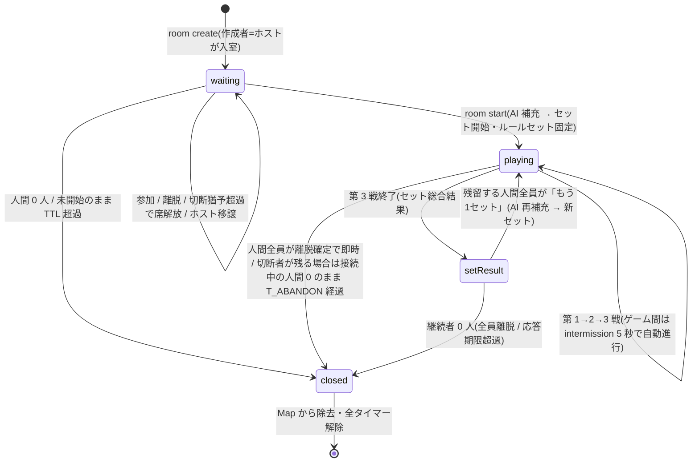

# E3: マルチプレイ・ルーム 詳細設計

> **改訂反映ノート(2026-07-25、E12 改訂による)** — 矛盾する記述は E12 を正とする。
> - **部屋のライフサイクルに「draining」を追加する必要**(E12 §4.5): サーバーは SIGTERM で draining に入り、新規ゲームの開始(次戦への進行・新規セット開始)を止め、進行中のゲームは完走させて exit する(kill_timeout=300 が保険)。
> - **セット途中打ち切りの遷移**: 打ち切り時はそこまでの結果でセットリザルト(5b)へ遷移し評価に進む(打ち切り理由の表示文言は実装時に決定)。ゲーム間の簡易リザルト(5a)からの自動次戦は draining 中は行わない。
> - ルールの反映はデプロイ(サーバー再起動)で行われるため、「ルールセットはセット開始時に固定」の意味は不変だが、再起動をまたぐ部屋は消滅する(既存の切断・破棄設計の範囲で扱える)。

- 作成日: 2026-07-24
- 状態: 承認済み(2026-07-27 開発者レビュー。前提だった TS-01(スタック承認)は 2026-07-25 に解消済み。§5 の未決事項は本 Epic の着手をブロックしない)
- 一次情報源: `docs/企画書.md`(§3.2, §3.4, §9-7)/ `docs/product-backlog.md`(MP-01, MP-02)
- 前提文書: `docs/epics/E12-tech-stack.md`(§3 authoritative server、§4.3 Socket.IO・全量スナップショット・部屋はプロセス内 Map・ルール KV 非配信、§4.9 匿名 ID)
- 画面参照: `docs/design/wireframes.html`(画面 2a / 2b / 3、および 5a / 5b の進行部分)

---

## 1. Epic 概要

### 1.1 目的

「部屋を作って人を招き、4 人固定の卓で 3 戦 1 セットを最後まで遊び切れる」リアルタイム対戦基盤を作る。人間が 4 人揃わなくても、開始時点の不足枠を AI が自動で埋めることで、AI 対戦・人間対戦・混合対戦の 3 形態(企画書 §3.2)を単一の仕組みで成立させる。

マルチプレイで本質的に難しいのは分散状態の一貫性である。本 Epic の設計は次の 3 つの不変条件をすべての仕様判断の基準に置く(§4 のテスト観点と対応)。

1. **手札の漏えいゼロ** — 他人の手札(カードの中身)がクライアントに届く経路が存在しない。
2. **二重手番なし** — 同一の手番に対して受理される操作は常に 1 つ。同時操作・タイマー競合・再送のいずれでも破れない。
3. **再接続後の状態一致** — 復帰したクライアントの画面は、切断しなかった場合と同じ状態に必ず収束する。

### 1.2 担当ストーリー

| ID | 概要 | フェーズ | 依存 |
|---|---|---|---|
| MP-01 | 部屋作成・招待コード参加・待機画面・開始・リアルタイム同期・離脱処理 | 1 | GE-03 |
| MP-02 | 開始時の AI 自動補充・AI 手番の進行と同期・AI/人間の表示区別 | 1 | MP-01, AI-01 |

### 1.3 スコープ外(フェーズ 1〜3 でやらないこと)

- **公開マッチング・野良対戦**: 企画書 §9-7 で未決。参加は招待コードのみで先行する(バックログ §5 の方針)。決定材料は本書 §5.1 に整理した。
- **観戦**: 引き続きスコープ外。
- **対局中の途中参加**: community 部屋ではAI席を引き継ぐ方式で実装する。席数は4席固定の
  まま増やさない。詳細は `docs/specs/2026-08-07-midgame-join-design.md`。
- **チャット等の対人コミュニケーション機能**: 企画書・ワイヤーフレームに存在しない。§5.1 の野良解禁判断にも関わる(対人接点が表示名のみ、という前提)。
- **サーバー複数台・部屋の分散管理**: E12 §3 の単一プロセス方針に従う。進行中の対局がサーバー再起動で失われる割り切りも E12 §4.4 のとおり。
- **対局状態の永続化**: しない。セット/ゲームの「結果」のみ終了時に DB へ書く(E12 §4.4)。

### 1.4 他 Epic との接続

| Epic | 接続点 |
|---|---|
| E1(ゲームエンジン) | 部屋(Room)はエンジン(`packages/core`)の**ホスト**である。ゲームの状態遷移・合法手判定・セット進行はすべて core の純粋関数が担い、Room は「アクションを直列に適用し、結果をプレイヤー別ビューに変換して配る」だけを担う。本書 §2.3 の `PlayerRoomView` の中の `Card`・プレイ履歴・順位の型は E1 の定義に従う。GE-01 でゲーム間のカード交換(大貧民→大富豪)等が採用された場合も、同期機構はイベント種別の追加のみで吸収できる構造にする(§3.1(e))。 |
| E2(対戦 AI) | MP-02 の AI 補充席と、切断・離脱した人間席の「AI 代行」(§2.4)は、どちらも `packages/ai` の同じ意思決定関数を呼ぶ。E3 は呼び出しタイミングとレート制御(人間らしい間)だけを持ち、手の選択ロジックは持たない。AI の CPU 予算(平常 50ms・上限 200ms)は E12 §6 のとおり。 |
| E11(ルールの閲覧) | RV-01「待機画面と対局中から有効ルール一覧を開ける」ためのデータ(ルール名のみの一覧)を、本書のスナップショット(§2.3 `activeRules`)が供給する。人気度・優先度・都道府県は配信しない(§4.5 のラフ表示方針と、図鑑は HTTP API の領分という E12 の分担)。 |
| E12(技術基盤) | Socket.IO・全量スナップショット・プロセス内 `Map<roomId, Room>`・匿名 ID を前提として具体化した。E12 の記述との差分(セッショントークンの一本化、切断猶予の扱い)は §5.2 に修正提案としてまとめた。 |

---

## 2. Epic 横断の技術仕様

### 2.1 部屋のライフサイクル

部屋は次の 4 状態を持つ。状態はサーバーのみが遷移させ、クライアントはスナップショットで知る。



- `playing` の内部は core(E1)のセット進行(第 N 戦 → ゲーム間リザルト → 次戦)がそのまま入る。部屋レベルでは「ゲーム間リザルト(intermission)」を `playing` の内部状態として扱い、画面 5a の「5 秒後に自動で進む」をサーバータイマーで駆動する。
- **セット開始時にルールセットを固定する**(E12 §4.3・§4.6(4))。`waiting` 中の有効ルール一覧はグローバルの現在値(新ルールのリリースで増えうる)、`playing`/`setResult` 中はセット開始時に固定した一覧を配る。
- セットをまたぐ持ち越し(順位・都落ち系の状態)はない(GE-05 はセット内引き継ぎのみ)。したがって**セット間のメンバー変動(離脱者の席を AI が埋める)はルール整合性を壊さない**。セット中のメンバー変動は「席の維持 + AI 代行」で吸収する(§2.4)。

#### 状態遷移の詳細

| 遷移 | トリガー | サーバー処理 |
|---|---|---|
| (新規)→ waiting | `room:create` | roomId・招待コードを発行し `Map` に登録。作成者をホストとして着席待ちメンバーに追加 |
| waiting → waiting | `room:join` / `room:leave` / 切断猶予超過 / ホスト移譲 | メンバーリスト更新 → 全員へ `room:state` 配信。ホストが抜けたら参加順で次の人間へ移譲 |
| waiting → playing | ホストの `room:start` | (1) 人間数を確定 (2) 不足分の AI を生成(MP-02) (3) 席順を決定 (4) 有効ルールを読み込み固定 (5) core にセット開始を指示(配札) (6) 各人へフィルタ済みスナップショット配信 |
| playing 内 | `game:play` / `game:pass` / 手番タイマー / AI 手番 | §2.2・§3 のとおり。1 アクション = 1 回の状態遷移 + 全員への配信 |
| playing → setResult | 第 3 戦(`gamesPerSet` 戦目)の決着 | セット総合結果を確定し、**この時点で対局結果を DB へ書く**(E12 §4.4)。切断中のまま到達した人間メンバーはここで離脱確定(§2.4) |
| setResult → playing | 残留人間全員の `room:continue` | 離脱者を除いたメンバーで waiting → playing と同じ開始処理(AI 補充・ルール再固定・新セット) |
| 各状態 → closed | §2.5 の破棄条件 | `room:closed` を配信 → ソケットを部屋から外す → タイマー全解除 → `Map` から除去 |

#### タイマー定数(すべて 1 箇所の設定オブジェクトに集約し、調整可能にする)

| 定数 | 初期値 | 意味 |
|---|---|---|
| `TURN_LIMIT` | 60 秒 | 接続中の人間の手番制限。超過で AI がその 1 手を代打ち |
| `TURN_LIMIT_DISCONNECTED` | 15 秒 | 切断中の人間に手番が回ってきたときの復帰待ち。超過で AI 代打ち |
| `LOBBY_DISCONNECT_GRACE` | 60 秒 | waiting 中の切断猶予。超過で席解放 |
| `INTERMISSION` | 5 秒 | ゲーム間リザルトの自動進行(画面 5a) |
| `SET_RESULT_TIMEOUT` | 120 秒 | setResult での継続意思表示の期限。無応答は離脱扱い |
| `LOBBY_TTL` | 30 分 | waiting のまま開始されない部屋の寿命 |
| `ABANDON_TIMEOUT` | 5 分 | playing 中に接続中の人間が 0 になってからの部屋維持時間(切断中=復帰可能性ありの人間が残る場合のみ。全員が離脱確定なら待たず即破棄 §2.5) |
| `AI_DELAY_MIN` / `AI_DELAY_MAX` | 0.8 / 2.5 秒 | AI の 1 手の演出遅延(§3.2) |
| `gamesPerSet` | 3 | 1 セットのゲーム数(§3.4 の調整余地。GE-05 と共有する定数) |

手番制限 60 秒は「接続しているが操作しない(AFK)人間が卓を永久に止める」ことを防ぐための値で、企画書に規定はなく本書の設計判断である。子供メインのターゲット(§2.3)を考慮して長めに置き、遊びテストで調整する(§5.3)。

### 2.2 Socket.IO イベント定義

#### 接続とハンドシェイク

- クライアントは Socket.IO の `auth` に匿名ユーザートークンを載せて接続する: `io({ auth: { userToken } })`。トークンが無い・無効な場合、サーバーは新規匿名ユーザーを発行する(E12 §4.9)。クライアントはトークンを localStorage に保存する。
- 接続確立後、サーバーは `session:ready` を送る。**このユーザーが生存中の部屋に席を持っていれば、この時点で自動的に部屋へ再アタッチし、最新の全量スナップショットを同梱する**(§2.4 の再接続はここで完結する。明示的な「再入室イベント」は無い)。離脱確定済み(`departed`)の席は再アタッチ対象外(§2.4 の共通処理)。
- 同一ユーザーの多重接続(複数タブ)は**後勝ち**とする。新しい接続が席を取り、古い接続へ `session:superseded` を送って以後の操作を拒否する。二重手番の入口を接続レベルで塞ぐ。
- サーバー設定: `pingInterval: 10_000` / `pingTimeout: 8_000`(切断検知を最悪 20 秒以内に)/ `serveClient: false` / `maxHttpBufferSize: 16 * 1024`(ペイロードは数 KB 以下のため)。SPA と同一オリジン配信(E12 §4.5)なので CORS 設定は不要。

#### イベント表: クライアント → サーバー

すべてのイベントは Socket.IO の ack コールバックで `Ack<T>`(成功値またはエラーコード)を返す。**サーバーからの肯定応答は原則スナップショット配信(`room:state`)で行い、ack は成否とエラー理由の伝達に使う**。

| イベント名 | ペイロード型 | ack 成功値 | タイミング・意味 |
|---|---|---|---|
| `room:create` | `{}` | `{ roomId, inviteCode }` | 画面 2a「ルームをつくる」。作成者はホストとして入室し、直後に `room:state` が届く |
| `room:join` | `{ inviteCode: string }` | `{ roomId }` | 画面 2a「このコードではいる」。waiting 中の部屋のみ可 |
| `room:leave` | `{}` | `{}` | 待機画面の「←」/ setResult の「ホームへ」。playing 中は離脱確定(席は AI 代行に恒久切替。§2.4) |
| `room:start` | `{}` | `{}` | 画面 2b「開始する」。**ホストのみ**。AI 補充を経てセット開始 |
| `room:continue` | `{}` | `{}` | 画面 5b「もう1セットあそぶ」。setResult 中のみ |
| `game:play` | `{ turnSeq: number, cards: CardId[] }` | `{}` | 手番でカードを出す。`turnSeq` 不一致は `STALE_TURN` で拒否 |
| `game:pass` | `{ turnSeq: number }` | `{}` | 手番でパス。リード(場が空)ではエンジンが `ILLEGAL_PLAY` を返す |
| `sync:request` | `{}` | `{}` | 全量スナップショットの再送要求(復旧ハッチ。応答は `room:state` で届く) |
| `user:rename` | `{ displayName: string }` | `{}` | 表示名変更(1〜10 文字にサーバー側で正規化)。UI 配置は §5.3 |

- 全ペイロードは `packages/core` に置く zod スキーマで受信時に検証し、不正形は `BAD_PAYLOAD` で拒否する(型は下の共有型定義参照)。
- `room:join` は IP 単位でレート制限する(例: 10 回/分。招待コードの総当たり対策。E12 §4.9 の方針の適用)。

#### イベント表: サーバー → クライアント

| イベント名 | ペイロード型 | 宛先 | タイミング |
|---|---|---|---|
| `session:ready` | `{ userId, userToken, displayName, room: PlayerRoomView \| null }` | 当該ソケット | 接続確立直後。席があれば `room` に復帰用全量スナップショット |
| `room:state` | `PlayerRoomView`(§2.3) | 部屋の各人間メンバーへ**個別に**送信 | 部屋・ゲームの状態が変わるたび(参加/離脱/接続変化/開始/各手/場流れ/ゲーム・セットの区切り)。**プレイヤーごとに中身が違うため、Socket.IO の room ブロードキャストは使わずソケット単位で emit する**(最大 4 通/遷移で問題にならない) |
| `room:closed` | `{ reason: RoomCloseReason }` | 部屋の全人間メンバー | 部屋破棄時(§2.5)。クライアントはホーム(画面 1b)へ誘導 |
| `session:superseded` | `{}` | 旧接続 | 同一ユーザーの新接続が席を取ったとき。旧接続の UI は「別のタブで開かれています」を表示して操作停止 |

#### エラーコード

| コード | 意味 | 発生イベント |
|---|---|---|
| `ROOM_NOT_FOUND` | 招待コードに該当する部屋がない(破棄済み含む) | join |
| `ROOM_FULL` | 人間参加者が既に 4 人 | join |
| `ROOM_IN_GAME` | 対局中の部屋への参加(フェーズ 1 は不可) | join |
| `ALREADY_IN_ROOM` | 別の部屋に参加中(1 ユーザー 1 部屋) | create, join |
| `NOT_IN_ROOM` / `NOT_HOST` / `NOT_WAITING` | 前提状態を満たさない操作 | leave, start, continue |
| `NOT_ENOUGH_PLAYERS` | 開始条件未満(MP-01 単体時のみ。§3.1(e)) | start |
| `NOT_YOUR_TURN` | 手番ではない(競合の遅着側で手番が他席へ移っていた場合を含む) | play, pass |
| `STALE_TURN` | 席は現手番だが `turnSeq` が不一致(再リード等で同一席に手番が残った競合の遅着側) | play, pass |
| `ILLEGAL_PLAY` | エンジン判定で出せない手(リードでのパス含む) | play, pass |
| `BAD_PAYLOAD` | スキーマ検証エラー | 全イベント |
| `RATE_LIMITED` | レート制限 | join ほか |
| `INTERNAL` | サーバー内部エラー(ログに記録) | 全イベント |

#### 共有型定義(`packages/core/src/protocol.ts` の骨子)

```ts
// ---- E1(packages/core)から借用する型。表現の確定は E1 ----
type SeatId = 0 | 1 | 2 | 3;
type CardId = string;                      // 例: "S03"。カードの安定 ID(E1 で確定)
interface Card { id: CardId; suit: "S"|"H"|"D"|"C"|"JOKER"; rank: number }
type PublicPlay = unknown;                 // 公開プレイ履歴の 1 件(席・出したカード・パスの別)。定義は E1 で確定
type GameResultView = unknown;             // 1 ゲームの結果(席ごとの順位・称号)。定義は E1 で確定

// ---- Socket.IO 型付きイベント ----
type Ack<T> = { ok: true; value: T } | { ok: false; code: ErrorCode; message?: string };

interface ClientToServerEvents {
  "room:create":   (p: {},                                    ack: (r: Ack<{ roomId: string; inviteCode: string }>) => void) => void;
  "room:join":     (p: { inviteCode: string },                ack: (r: Ack<{ roomId: string }>) => void) => void;
  "room:leave":    (p: {},                                    ack: (r: Ack<{}>) => void) => void;
  "room:start":    (p: {},                                    ack: (r: Ack<{}>) => void) => void;
  "room:continue": (p: {},                                    ack: (r: Ack<{}>) => void) => void;
  "game:play":     (p: { turnSeq: number; cards: CardId[] },  ack: (r: Ack<{}>) => void) => void;
  "game:pass":     (p: { turnSeq: number },                   ack: (r: Ack<{}>) => void) => void;
  "sync:request":  (p: {},                                    ack: (r: Ack<{}>) => void) => void;
  "user:rename":   (p: { displayName: string },               ack: (r: Ack<{}>) => void) => void;
}

interface ServerToClientEvents {
  "session:ready":      (p: { userId: string; userToken: string; displayName: string;
                              room: PlayerRoomView | null }) => void;
  "room:state":         (p: PlayerRoomView) => void;
  "room:closed":        (p: { reason: RoomCloseReason }) => void;
  "session:superseded": (p: {}) => void;
}

type RoomCloseReason = "noHumans" | "lobbyExpired" | "abandoned" | "setEndedNoContinue";
```

#### 順序と競合の制御

- **`v`(stateVersion)**: 部屋単位で単調増加する版番号。すべての `room:state` に付く。クライアントは受信済み最大 `v` 以下のスナップショットを破棄する(再接続直後の順序乱れ対策)。
- **`turnSeq`**: **適用されたゲームアクション(play / pass。人間・AI 代打ち・タイムアウトの別を問わない)ごとに 1 増える、部屋単位の単調増加番号**。「手番が移るたび」ではない — 8切りのような場流れで**同一席が続けてリードする(再リード)場合も、直前のアクション適用で必ず増える**。ゲーム・セットをまたいでもリセットしない。`game:play` / `game:pass` は現在の `turnSeq` を必ず添える。サーバーは (1) 送信者が現手番の席か (2) `turnSeq` が一致するか (3) エンジン判定で合法か、の順に検証する。ダブルタップによる二重送信・手番タイマーとの競合は、先に適用された方で `turnSeq` が進むため、遅着側は手番が他席へ移っていれば (1) の `NOT_YOUR_TURN`、同一席に手番が残っていれば (2) の `STALE_TURN` で機械的に落ちる。(3) の合法性判定を二重適用の防衛線として当てにしない(手札にカードが戻る系の提案ルールが入ると、同じ手が再び「合法」になりうるため)。
- Node.js は単一スレッドであり、**1 アクションの「検証 → エンジン適用 → 版更新 → 配信キュー投入」を同期処理(await を挟まない)で書く**ことで、アクション適用の直列性を言語レベルで保証する(§3.1(e))。

### 2.3 per-player スナップショットのフィルタリング仕様

同期方式は E12 §4.3 のとおり**全量スナップショット + イベント列**。手が指されるたびに、各プレイヤーへ「そのプレイヤーから見える状態」を丸ごと送る。ここでは「配信してよい情報」を確定する。

#### 配信可否の確定表

| 情報 | 配信 | 備考 |
|---|---|---|
| 自分の手札(カードの中身) | **本人にのみ** | `you.hand`。他人のビューには一切含めない |
| 他人の手札 | **枚数のみ** | `handCount`。並び・中身は本人以外に存在しない |
| 場のカード・当該ゲームの公開プレイ履歴 | 全員 | 出されたカードは公開情報。履歴はゲーム単位で全量(数 KB 以下)を含め、復帰時のログ再構築を自明にする |
| 手番・パス状態・上がり順位・称号 | 全員 | 進行の公開情報 |
| セット内の過去ゲーム結果(順位推移) | 全員 | 画面 5a/5b の表示元。ゲームまたぎルール(都落ち等)の発動根拠でもあり公開してよい |
| メンバーの表示名・AI/人間の別・ホスト・接続状態・AI 代行中フラグ・離脱確定フラグ(departed) | 全員 | 画面 2b/3 の表示に必要(切断中/退出の表示区別を含む) |
| 有効ルール一覧 | **ルール ID と名前のみ**全員へ | RV-01 のラフ表示用。人気度・優先度数値・都道府県は非配信(§4.5。図鑑は HTTP API の領分) |
| ルール発動イベント | ルール ID・名前・メッセージキーのみ | CX-06(フェーズ 2)用のイベント枠。Effect の内部表現は配信しない |
| **ルールの KV メモリ** | **非配信** | E12 §4.3 の決定。ルールはサーバー側で秘匿情報を含む状態ビューを読めるため、KV を配れば悪意あるルールが秘匿情報(他人の手札など)をクライアントへ持ち出す口になる |
| 乱数シード・配札の内部情報・AI の思考過程 | 非配信 | サーバー内部 |
| 他メンバーの `userId`(匿名 ID)・トークン | **非配信** | 匿名 ID は提案・イエローカード等に紐づく永続識別子であり、他人に配ると追跡・なりすまし報告の材料になる。部屋内では使い捨ての `memberId` を使う |
| 自分の `userId`・`userToken` | 本人にのみ(`session:ready`) | |
| 合法手集合(いま出せる手の一覧) | フェーズ 1 は非配信 | クライアントは共有 core でプレビュー判定(E12 §4.1)。提案ルール増加後にサーバー同梱方式へ移行する判断は E1/E11(E12 §4.1 の引き継ぎ)。`GameView` に optional フィールド `legalPlays?` を**予約だけ**しておく |

#### ビュー型定義

```ts
interface PlayerRoomView {
  v: number;                          // stateVersion(部屋単位で単調増加)
  roomId: string;
  inviteCode: string;
  phase: "waiting" | "playing" | "setResult";
  members: MemberView[];              // waiting: 参加順 / playing 以降: 席順
  you: { memberId: string; seatId: SeatId | null };
  activeRules: { ruleId: string; name: string }[];  // waiting: グローバル現在値 / playing 以降: セット固定値
  game: GameView | null;              // phase === "playing" のとき
  setResult: SetResultView | null;    // phase === "setResult" のとき
  events: GameEvent[];                // 直前の遷移で起きたこと(演出用)。再送・復帰時は常に []
}

interface MemberView {
  memberId: string;                   // 部屋ローカルの使い捨て ID(userId は配信しない)
  seatId: SeatId | null;
  displayName: string;
  isAI: boolean;                      // MP-02 の補充 AI なら true
  isHost: boolean;
  connected: boolean;                 // AI は常に true
  aiActing: boolean;                  // 人間席を AI が代行中(切断 or 離脱確定)
  departed: boolean;                  // 離脱確定(§2.4)。true なら復帰しない(「切断中」と「退出」の表示区別に使う)
  handCount: number | null;           // playing 中のみ
  finishedRank: number | null;        // 上がり済みなら 1..4
  wantsNextSet: boolean | null;       // setResult 中のみ(画面 5b の待ち合わせ表示用)
}

interface GameView {
  gameNo: number;                     // 1..gamesPerSet
  status: "playing" | "intermission"; // intermission = ゲーム間リザルト(画面 5a)
  field: { cards: Card[]; playedBySeat: SeatId | null; passedSeats: SeatId[] };
  turn: { seat: SeatId; turnSeq: number; deadlineAt: number | null } | null;
                                      // deadlineAt: 手番締切の epoch ms(表示用。判定は常にサーバー)
  history: PublicPlay[];              // 当該ゲームの公開プレイ履歴の全量
  previousResults: GameResultView[];  // セット内の終了済みゲームの結果(順位推移)
  yourHand: Card[];                   // 自分の手札のみ(昇順ソート)
  legalPlays?: CardId[][];            // 予約フィールド。フェーズ 1 では送らない
}

interface SetResultView {
  standings: { memberId: string; totalRank: number; title: string; ranks: number[] }[];
  respondBy: number;                  // epoch ms(SET_RESULT_TIMEOUT の締切)
}

type GameEvent = { seq: number } & (
  | { t: "memberJoined" | "memberLeft" | "memberDisconnected" | "memberReconnected"
      | "hostChanged" | "aiFilled" | "aiTakeover" | "humanReturned"; memberId: string }
  | { t: "setStarted"; setNo: number } | { t: "gameStarted"; gameNo: number }
  | { t: "played"; seat: SeatId; cards: Card[] }
  | { t: "passed"; seat: SeatId }
  | { t: "turnTimeout"; seat: SeatId }                     // AI 代打ちの理由表示用
  | { t: "fieldCleared"; reason: "allPassed" | "rule" }
  | { t: "playerFinished"; seat: SeatId; rank: number }
  | { t: "gameEnded" } | { t: "setEnded" }
  | { t: "ruleFired"; ruleId: string; name: string; messageKey: string }  // フェーズ 2(CX-06)用の枠
);
```

#### フィルタリングの実装規約

- ビュー生成は **`viewFor(state, memberId): PlayerRoomView` の単一関数**に集約する(`packages/server`)。権威状態から必要なものだけを**拾って組み立てる(allow-list 方式)**。権威状態オブジェクトを複製してから秘匿情報を削る deny-list 方式は、状態形状の拡張時に消し忘れで漏えいするため禁止する。
- `GameEvent` にも秘匿情報を載せない。配札(`gameStarted`)は事実のみをイベントで伝え、手札の中身は各人のスナップショット `yourHand` だけが運ぶ。
- `events` は演出の再生専用で、状態の構築には使わない(状態は常にスナップショット全量から作る)。クライアントは `seq` で再生済みを管理し、復帰時の全量再送(`events: []`)で演出が二重再生されないようにする。
- サイズ感: 4 人・手札 13 枚・履歴込みで数 KB。毎手全量送信でもターン制の頻度(毎秒数メッセージ以下)では帯域・CPU とも無視できる(E12 §6)。

### 2.4 再接続設計

#### 識別子の整理

| 識別子 | 発行 | 保存場所 | 用途 |
|---|---|---|---|
| 匿名ユーザー ID(`userId`)+ トークン(`userToken`) | 初回アクセス時にサーバーが発行(E12 §4.9)。DB に永続化 | トークンをクライアントの localStorage | 本人確認のすべて。**部屋の席はこの `userId` に紐づく**ため、席復帰の資格情報を兼ねる |
| `memberId` | 部屋参加時に部屋が発行 | サーバーのメモリ(部屋オブジェクト内) | 他プレイヤーへ配ってよい部屋ローカル ID(§2.3) |

E12 §4.3 の「サーバーが発行するセッショントークン」は、匿名ユーザートークンと**一本化**する。席が `userId` に紐づく以上、別トークンを重ねても防御は増えず、管理物が増えるだけだからである(E12 への修正提案として §5.2 に記載)。

#### 切断の検知と扱い

切断(ソケット切断・ping タイムアウト)を検知したら、メンバーを `connected: false` にして全員へ配信する。**席・手札・順位はセット終了まで保持する**。その後の扱いは部屋の状態で分岐する。

| 状況 | 挙動 |
|---|---|
| waiting 中の切断 | `LOBBY_DISCONNECT_GRACE`(60 秒)以内の復帰で何事もなく継続。超過で席解放(離脱と同じ)。ホストなら復帰待ちの間もホストのまま、席解放時に参加順で次の人間へ移譲 |
| playing 中の切断 | 席は保持。**手番が回ってきたら `TURN_LIMIT_DISCONNECTED`(15 秒)だけ復帰を待ち、戻らなければ AI がその 1 手を代打ちする**。切断が続く限り手番ごとに AI が代打ちし、ゲームは止まらない。メンバー表示は「切断中(AI 代行)」 |
| setResult 到達時に切断中 | その時点で離脱確定(継続意思を確認できないため)。次セットの補充対象になる |
| playing 中の明示的離脱(`room:leave`・ホームへ) | 離脱確定。席は当該セット終了まで AI が代行し(下記「AI 代行 vs 没収」)、セット終了時にメンバーから除去。**同一ユーザーがセット途中に同じ席へ戻ることはできない**(フェーズ 1 の割り切り。§5.3) |

#### 離脱処理の設計判断: AI 代行を採用する(没収ではなく)

離脱・長期切断した席の扱いには「AI 代行(残った手札を AI が打ち続ける)」と「没収(手札を場から除いて即最下位扱い)」の 2 案がある。**本書は AI 代行を採用する**。

| 観点 | AI 代行(採用) | 没収 |
|---|---|---|
| ゲームの整合性 | 手札 54 枚が最後まで場に生きる。エンジンに特殊処理が不要 | カードがゲームから消えるため「残り札を数える」系の提案ルールや枚数前提の進行と衝突する。没収札の処分(捨てる/配る)の仕様が別途必要 |
| 残った 3 人の体験 | 対戦相手が減らず、混合戦(§3.2)として自然に続く | 3 人大富豪に縮退し、セット内の順位計算・都落ち等のゲームまたぎルールの前提が崩れる |
| 実装コスト | MP-02 の AI 補充・手番タイムアウト代打ちと**同一機構の再利用**(席→コントローラの付け替えだけ) | 没収専用の状態遷移とエンジン改修が必要 |
| 悪用・公平性 | 切断したプレイヤーが AI の打ち回しで上位になる可能性がある(許容する。順位に賞罰がないフェーズ 1〜3 では実害がない) | 切断=即最下位は回線事故に過酷で、子供メインのターゲットに合わない |

なお切断を「猶予経過で自動的に離脱確定」にはしない(E12 §4.3 の「例: 60 秒」からの変更。§5.2)。離脱確定の条件は **(1) 明示的な離脱操作 (2) セット終了時に切断中 (3) waiting 中の猶予超過** の 3 つに限定する。理由: 対局中の席は AI 代行で進行を止めないので、急いで没収・除名する理由がなく、「トンネルで 3 分切れたが戻れた」を救えるほうが体験がよい。

**離脱確定時の共通処理(再アタッチ防止)**: 離脱確定(上記 3 条件のいずれか)の時点で、必ず次の 2 点を行う。

1. `RoomManager.byUser` 索引から当該ユーザーを**即時削除**する。これにより離脱者は直ちに別部屋の作成・参加ができ(`ALREADY_IN_ROOM` にならない)、再接続しても部屋が引かれないため自動再アタッチは起きない。
2. 席に残る `Member` に離脱確定フラグ(`departed: true`)を立てる。再アタッチ処理は `departed` の席を対象外とする。これは索引の消し忘れ・張り直しに備えた二重ガードである。

playing 中の離脱確定席は、このフラグを立てたまま AI 代行でセット終了まで残り、セット終了時にメンバーから除去される。この 2 点を怠ると「離脱したはずの席へ自動再アタッチで復帰してしまう」か「`byUser` が残り続けて他部屋に入れない」のどちらかの不具合になるため、離脱確定の実装はこの共通処理 1 関数に集約すること。

#### 復帰フロー(全量再送)

1. クライアントの Socket.IO が自動再接続する(`auth` に保存済み `userToken`)。
2. サーバーは `userId` → 部屋の索引(`RoomManager.byUser`)を引き、生存中の席があれば再アタッチする: ソケットを部屋に関連付け、`connected: true` に戻し、進行中の復帰待ちタイマーを解除する。**離脱確定済みのユーザーは索引から削除済みのため引かれず、部屋側でも `departed` の席は再アタッチ対象外**(上記「離脱確定時の共通処理」の二重ガード)。
3. `session:ready` の `room` フィールドで**最新の全量スナップショット**(`PlayerRoomView`、`events: []`)を渡す。クライアントはローカル状態を破棄してこれで置き換える(差分適用はしない。全量方式の利点)。
4. 他メンバーへ `memberReconnected` イベント付きの `room:state` を配る。
5. 復帰時に自分の手番だった場合、スナップショットの `turn.deadlineAt` から残り時間を表示してそのまま操作できる(切断中タイマー 15 秒が動いていた場合は解除し、`TURN_LIMIT` で張り直す)。

サーバー再起動後の再接続は、`userId` は DB で解決できるが部屋がメモリごと消えているため `room: null` になる。クライアントは「部屋が見つかりませんでした」を表示してホームへ誘導する(E12 §4.4 の割り切りの UX 側の受け皿)。

### 2.5 部屋の破棄条件

以下のいずれかで `closed` に遷移し、`room:closed` を配信してから `Map` を除去する。判定はイベント駆動(離脱・切断処理の中)+ 1 分周期の掃除タスク(タイマー漏れの保険)の二重にする。

| # | 条件 | reason |
|---|---|---|
| 1 | waiting 中に人間メンバーが 0 人になった(全員離脱・猶予超過) | `noHumans` |
| 2 | waiting のまま `LOBBY_TTL`(30 分)経過 | `lobbyExpired` |
| 3 | playing 中に人間メンバー全員が離脱確定した — **即時破棄**(復帰経路が存在しないため待たない)。切断中(復帰可能性あり)の人間が残る場合のみ、接続中の人間が 0 人のまま `ABANDON_TIMEOUT`(5 分)経過で破棄(AI だけの無人対局を続けない) | `abandoned` |
| 4 | setResult で継続者が 0 人(全員が「ホームへ」または `SET_RESULT_TIMEOUT` 無応答) | `setEndedNoContinue` |
| 5 | サーバープロセスの終了(暗黙。E12 §4.4) | — |

破棄時の必須処理: 部屋が保持する全タイマー(手番・AI 遅延・intermission・猶予・TTL)の `clearTimeout`、招待コード索引と `byUser` 索引の削除。**破棄後に発火する遅延コールバックが残らないこと**をテストで保証する(§4)。3 と 4 の場合、セットが終わっていれば結果は既に DB へ書かれている(§2.1)。途中破棄されたゲームの結果は記録しない。

---

## 3. ストーリー別詳細仕様

### 3.1 MP-01: 部屋作成・招待・待機・開始・同期・離脱

#### (a) 原文引用

> **[MP-01]** プレイヤーとして、部屋を作って他の人を招き、人間同士で対戦したい。それは仲間内で遊ぶのが大富豪の原点だからだ。
> - 受け入れ条件:
>   - 部屋を作成でき、作成後は待機画面で参加者が集まるのを待てる(対戦人数は 4 人固定 §3.2)
>   - 他のプレイヤーがその部屋に参加でき、待機画面の「開始」でゲームが始まる
>   - 全参加者に同じ進行がリアルタイムで同期される
>   - 対局中の離脱でゲームが破綻しない(離脱時の扱いは着手時に決定し文書化する)
> - フェーズ: 1 / 依存: GE-03 / 関連未確定事項: §9-7(マッチング方式)

#### (b) 挙動仕様

**正常系**

1. 作成: `room:create` → 部屋生成、招待コード発行、作成者がホストとして入室、待機画面(画面 2b)へ。
2. 招待: 待機画面の招待コードを口頭・コピーで共有する。招待コードは `01234` のような ASCII 数字 5 桁とし、先頭の `0` も許容する。空間は 10^5 = 10 万通り。発行時にプロセス内で衝突チェックし、部屋破棄で即失効する。総当たり対策として join の IP 単位レート制限(§2.2)を必須とする。
3. 参加: `room:join` → メンバー追加、全員の待機画面が即時更新(人数バッジ、メンバー行)。
4. 開始: ホストの `room:start` → §2.1 の開始処理 → 全員が対戦画面(画面 3)へ。
5. 対局: 手番のプレイヤーが `game:play` / `game:pass` → サーバー検証 → エンジン適用 → 全員へ 1 秒以内に反映(E12 判断基準 4)。
6. 進行: ゲーム決着 → intermission(画面 5a、全員準備完了または 15 秒)→ 次戦 → 第 3 戦終了で setResult(画面 5b)→ 全残留者の `room:continue` で次セット、いなければ破棄。

**切断・離脱系**(§2.4 に準拠。ここでは MP-01 として確定する点のみ)

- 待機中の離脱(明示・猶予超過とも): 席を解放し、人数バッジとメンバー行を全員の画面から即時更新する。**これが企画書 §9-7 のうち「待機中の離脱の扱い」への決定である**(§5.1)。
- ホスト離脱: waiting 中は参加順で次の人間へ移譲(`hostChanged` イベントで通知)。playing 以降のホストの意味は「なし」(開始操作が済んでいるため。setResult の継続判定はホストに依存しない)。
- 対局中の切断: AI 代行方式(§2.4)。ゲームは止まらず、破綻しない。
- 対局中の明示離脱: 離脱確定 + AI 代行。セット終了時に除去。離脱確定と同時に `byUser` 索引から外れ `departed` フラグが立つため(§2.4)、席への自動再アタッチは起きず、別部屋の作成・参加も妨げられない。

**同時操作・タイムアウト系**

| ケース | 挙動 |
|---|---|
| 5 人目の同時参加 | アクション直列適用(§2.2)により到着順で 4 人目までが成功、以降は `ROOM_FULL` |
| `room:start` の二重押し・連打 | 1 回目で `playing` へ遷移済みのため 2 回目以降は `NOT_WAITING` |
| 参加と開始の競合 | 先に適用された方が勝つ。開始が先なら join は `ROOM_IN_GAME` |
| 同一手番への二重送信(ダブルタップ) | 先着のみ適用。後着は、手番が他席へ移っていれば `NOT_YOUR_TURN`、同一席に手番が残っていれば(場流れ直後の再リード等)`STALE_TURN`(§2.2 の検証順) |
| 手番でない席からの play | `NOT_YOUR_TURN`(クライアント UI 上は起きないが、サーバーは常に検証する) |
| 手番タイマー発火と本人の play の競合 | 到着順で直列化。タイマーコールバックは発火時に「予約時と同じ `turnSeq` か」を再確認してから代打ちする。`turnSeq` はアクション適用ごとに必ず進む(§2.2)ため、本人の手が先に適用されていれば発火側は no-op になる |
| 接続中プレイヤーの放置 | `TURN_LIMIT`(60 秒)で AI が 1 手代打ち(`turnTimeout` イベントで理由を表示)。没収・除名はしない |
| 待機画面の放置 | `LOBBY_TTL`(30 分)で部屋破棄 |
| setResult の放置 | `SET_RESULT_TIMEOUT`(120 秒)で無応答者は離脱扱い。継続者が 1 人でもいれば次セット(不足は AI 補充)、0 人なら破棄 |
| 別部屋参加中の create/join | `ALREADY_IN_ROOM`。クライアントは「参加中の部屋にもどる」導線を出す(下記 (c)) |

#### (c) 画面仕様(wireframes.html 画面 2a / 2b / 3 / 5a / 5b)

**画面 2a(ルーム作成・参加)**

- 「ルームをつくる」→ `room:create`。ack 成功で画面 2b へ。
- 「このコードではいる」→ 数字キーボード向けの入力欄を使い、ASCII 数字以外を取り除いて最大 5 桁に制限する。5 桁揃うまで参加ボタンは無効。`room:join` もサーバー境界で ASCII 数字 5 桁だけを受理する。エラー表示: `ROOM_NOT_FOUND`「部屋が見つかりません。コードをたしかめてください」/ `ROOM_FULL`「この部屋は満員です」/ `ROOM_IN_GAME`「この部屋は対戦中です」。
- 追補(ワイヤーフレーム未記載): 接続時の `session:ready.room` が非 null(=参加中の部屋がある)場合、画面上部に「参加中の部屋にもどる」バナーを出す。再入室の UX はこれで完結する。

**画面 2b(待機画面)**

- リアルタイム更新項目: アプリバーの「n / 4 人」、メンバー行(表示名・「人間」タグ・ホスト表記・切断中表示)、空き枠の「開始時に AI が入ります」ヒント(MP-02)。すべて `room:state` の受信で再描画する。
- 追補(ワイヤーフレーム未記載): 「開始する」は**ホストのみ活性**。非ホストには同じ位置に「ホストの開始を待っています」を表示する(誤爆と競合を UI 段階で減らす。最終判定はサーバーの `NOT_HOST`)。
- 「コピー」は招待コード文字列をクリップボードへ。
- アプリバー「←」= `room:leave`。確認ダイアログ(「部屋から出ますか?」)を挟む。
- 「いまのルール」ボックスの件数は `activeRules.length`。「一覧を見る」→ 画面 4(E11 RV-01。データは本スナップショットで供給済み)。

**画面 3(対戦画面)**

- スナップショット反映: 相手 3 人の残り枚数・手番ハイライト・AI/人間タグ、場のカード、ログ(`history` + `events`)、自分の手札、手番時のみ「出す/パス」活性。
- 追補(ワイヤーフレーム未記載、実装時に画面へ追加する): (1) 切断中メンバーの席に「切断中(AI 代行)」バッジ (2) 手番の残り時間表示(`turn.deadlineAt` からのカウントダウン。表示のみで判定はサーバー) (3) 自分自身が切断中のときの全画面オーバーレイ「接続が切れました。再接続しています…」(Socket.IO の `disconnect` / `connect` イベントで開閉)。
- パスは場にカードがあるときのみ活性(リードでのパス不可はエンジン仕様。E1)。

**画面 5a / 5b(進行のみ E3 の担当)**

- 5a: `status: "intermission"` の描画。「5 秒後に自動で進む」はサーバータイマー駆動で、クライアントは次のスナップショットを待つだけ(ボタンはフェーズ 1 では飾り。押しても進行は変わらない旨を実装メモに残す)。
- 5b: 「評価を送信してもう1セットあそぶ」はフェーズ 1 では「もう1セットあそぶ」(評価 UI は E8 で追加)。押下で `room:continue`、`wantsNextSet` の待ち合わせ表示(「プレイヤーB を待っています…」)を出す。「ホームへ」= `room:leave`。

#### (d) イベント・データ定義

§2.2〜§2.3 で定義済み。MP-01 が使うのは `room:create` / `room:join` / `room:leave` / `room:start` / `room:continue` / `game:play` / `game:pass` / `sync:request` と、`session:ready` / `room:state` / `room:closed` / `session:superseded` の全量。

#### (e) 実装方針

```ts
// packages/server/src/room/room-manager.ts(骨子)
class RoomManager {
  private rooms = new Map<string, Room>();
  private byInvite = new Map<string, string>();   // inviteCode -> roomId
  private byUser = new Map<string, string>();     // userId -> roomId(1 ユーザー 1 部屋。離脱確定・メンバー除去で即時削除 §2.4。削除は byUser.get(userId) === 当該 roomId のときのみ行う — 早期削除後に別部屋へ参加した正当なエントリを部屋破棄処理が消さないため)
  // create / join / findByUser / sweep(1 分周期の破棄条件チェック §2.5)
}

// packages/server/src/room/room.ts(骨子)
class Room {
  phase: "waiting" | "playing" | "setResult" = "waiting";
  members: Member[] = [];                  // Member = { memberId, userId, seatId, socket, ... }
  engine: SetState | null = null;          // packages/core の権威状態(純粋データ)
  fixedRules: RuleRef[] | null = null;     // セット開始時に固定(E12 §4.6(4))
  v = 0;
  private timers = new TimerBag();         // 破棄時に全解除できる集中管理

  /** すべての状態変更はこの 1 本を通す。同期処理(await 禁止)で直列性を保証 */
  private apply(action: RoomAction): void {
    const result = reduce(this.snapshotState(), action);   // core + 部屋ロジックの純粋関数
    this.commit(result);                                   // 状態置換・v++・タイマー再設定
    this.broadcast(result.events);                         // 各人間メンバーへ viewFor() を emit
  }
  viewFor(memberId: string): PlayerRoomView { /* §2.3 allow-list 方式 */ }
}
```

- **席とコントローラの分離**: 席(SeatId)ごとに `controller: "human" | "ai"` を持つ。人間の切断・離脱・タイムアウト時は席の所属を変えず、**その手番の意思決定だけを `packages/ai` に委ねる**。MP-02 の補充 AI は最初から `controller: "ai"` の席にすぎない。この一元化が「AI 代行」「AI 補充」「タイムアウト代打ち」を 1 つのコードパスにする。
- エンジン(core)は純粋関数なので、Room の単体テストは Socket.IO なしで `apply` の入出力として書ける。ソケット層は「イベント → apply 呼び出し + ack」の薄い変換に徹する。
- **実装順序**: MP-01 単体の時点では開始条件を「人間 4 人」とし(`NOT_ENOUGH_PLAYERS`)、切断時の AI 代行は「手番 15 秒待ち → **自動パス(リード時は最小の単騎出し)**」の暫定ロジックで代替してよい。MP-02(AI-01 完了後)で開始条件を「人間 1 人以上」に緩め、代行ロジックを `packages/ai` に差し替える。
- 表示名はユーザー作成時にサーバーが自動生成する(例: 形容詞+動物の 2 語)。`user:rename` で変更可能(UI 配置は §5.3)。

#### (f) 受け入れ条件の精緻化

1. 部屋を作成すると待機画面に遷移し、招待コードと「1 / 4 人」が表示される。
2. 別ブラウザ(別ユーザー)が招待コードで参加でき、**双方の待機画面が 1 秒以内に「2 / 4 人」へ更新される**。5 人目の参加は満員エラーになる。
3. ホストの「開始する」で全参加者が対戦画面へ遷移する。非ホストの開始操作はサーバーで拒否される。
4. 手番の操作(出す・パス)が他の全クライアントに 1 秒以内に反映され、第 3 戦のセットリザルトまで完走できる。
5. **サーバーがクライアントへ送出する全ペイロードに、受信者以外の手札のカード情報が含まれない**(§4 の検査方法で確認)。
6. 対局中に 1 クライアントを強制切断しても残りの 3 人はプレイを継続でき、切断者の手番は 15 秒後に代打ちされる。切断者が復帰すると手札・場・ログが切断しなかった場合と一致する。
7. 対局中の明示離脱後もゲームがセット終了まで完走する。待機中の離脱・切断(60 秒超過)では席が解放される。
8. 離脱時の扱いが文書化されている — **本書 §2.4・§3.1(b) がその文書である**。

#### (g) 未解決事項

- 招待コードのディープリンク(`/join/01234` を開くと参加)の採否。コピー共有(LINE 等)の UX 向上として有力だが、フェーズ 1 必須ではない。→ §5.3
- setResult の「もう1セット」成立条件を全員一致(タイムアウト付き)としたが、「押した人だけで即開始(残りは離脱扱い)」の方がテンポは良い。遊びテストで見直す。→ §5.3
- 手番制限 60 秒の妥当性(同上)。

### 3.2 MP-02: AI 自動補充・AI 手番の進行・表示区別

#### (a) 原文引用

> **[MP-02]** プレイヤーとして、人間が 4 人に満たなくても開始したら残り枠を AI が埋めて対戦したい。それは人数を気にせずいつでも卓を立てるためだ。
> - 受け入れ条件:
>   - 開始を押した時点の人間の人数を確認し、4 人に足りない分だけ AI プレイヤーが自動で追加される(人間/AI の枠指定 UI は設けない §3.2)
>   - 人間 1 人での開始は AI 対戦、4 人なら人間対戦、その間は混合対戦として成立する(3 形態 §3.2)
>   - AI の手番も人間の手番と同様にリアルタイム同期される
> - フェーズ: 1 / 依存: MP-01, AI-01

#### (b) 挙動仕様

**開始時の AI 自動補充**

1. ホストの `room:start` 受理時点の人間メンバー数 `h`(1〜4)を確定する。**このとき切断中(猶予内)の人間も頭数に含める**(席を用意して開始し、以後は AI 代行で扱う。開始を押した瞬間の回線揺れで席を失わせない)。
2. `4 - h` 体の AI メンバーを生成する。AI メンバーは `memberId` を持つが `userId` を持たない(`isAI: true`)。
3. 表示名は AI 名プール(重複なしで抽選。トーン・命名は E4 と調整、暫定は「AIプレイヤーA」等の機械名)から与える。
4. 席順(SeatId 0..3)は人間・AI を混ぜてシャッフルする(人間が常に先手になる偏りを避ける)。
5. 以後のゲーム進行において、AI 席は人間席と完全に同型(手札を持ち、順位が付き、`MemberView` に載る)。エンジン(E1)はどの席が AI かを知らない。

3 形態の成立は自動的な帰結である: h=1 → AI 対戦、h=2,3 → 混合、h=4 → 補充ゼロの人間対戦。コードパスは分岐しない。

**AI の手番の進行とレート制御(人間らしい間)**

1. 状態遷移の適用・配信後、次手番の席の `controller` が AI(補充 AI・AI 代行の切断/離脱席・タイムアウト代打ち)であれば、遅延タイマーを 1 本セットする。
2. 遅延は `AI_DELAY_MIN`〜`AI_DELAY_MAX`(0.8〜2.5 秒)の範囲で決める: `delay = clamp(0.8s, 1.2s + gauss(0, 0.4s) + bonus, 2.5s)`。`bonus` は場が流れた直後のリード時 +0.3 秒(人間が「考える」局面で少し長く)。定数は §2.1 の設定オブジェクトで調整可能。
3. タイマー発火時に (1) 部屋が生存しているか (2) `turnSeq` が発火予約時と同じか、を再確認してから `packages/ai` の意思決定関数を**同期呼び出し**し(E12 §6 の予算: 平常 50ms・上限 200ms)、返った手を通常の play/pass と同じ `apply` 経路に流す。つまり **AI の手も人間の手と同一の検証・配信コードを通る**(受け入れ条件「同様にリアルタイム同期」の実装的な意味)。
4. AI が連続手番でも 1 手ごとに遅延+配信を挟むため、クライアントには 0.8 秒以上の間隔で 1 手ずつ届き、演出(カード移動・ログ)が追従できる。追加のペーシング機構は不要。

**エッジケース**

| ケース | 挙動 |
|---|---|
| AI 遅延タイマー中に部屋が破棄された | `TimerBag` の全解除(§2.5)で発火しない。発火側でも部屋生存を再確認する二重ガード |
| AI 遅延タイマー中に(AI 代行中の)人間が復帰した | 席の `controller` を human に戻し、予約済みタイマーを解除。手番なら `TURN_LIMIT` を張り直して本人の操作を待つ(§2.4) |
| `packages/ai` が例外を投げた/不正手を返した | フォールバック: 場が空でなければパス、リードなら最小の単騎を出す。発生をログ(E10 の観測対象)に記録し、ゲームは止めない |
| AI の意思決定が上限 200ms を超過 | AI-01/E2 側の責務(予算内打ち切り)だが、E3 側でも遅延タイマーと合算して体感が壊れないことだけ確認する(遅延 0.8 秒に対し 0.2 秒は誤差) |
| 人間 0 人での開始 | 起きない(`room:start` はホスト=人間のみ発行できる) |

**AI と人間の表示区別**

- `MemberView.isAI` を根拠に、待機画面(画面 2b)・対戦画面(画面 3)・リザルト(5a/5b)で「AI」バッジ(ワイヤーフレームの `tag dark`)を表示する。
- 人間席の AI 代行(`aiActing: true` かつ `isAI: false`)は補充 AI と**区別して**表示する: バッジは「切断中(AI 代行)」(`departed: false`)/「退出(AI 代行)」(`departed: true`。§2.3 の `MemberView.departed` が根拠)。「この人は本来人間で、戻ってくるかもしれない」ことが残りのプレイヤーに伝わるようにする。
- 待機画面の空き枠は「(あき)開始時に AI が入ります」(ワイヤーフレームどおり)。
- 追補(ワイヤーフレーム未記載): AI の手番中は当該席に「考え中…」の小表示を出す(遅延 0.8〜2.5 秒が「固まった」と誤解されないため)。

#### (c) 画面仕様

- 画面 2b: 空き枠ヒント(上記)。人数バッジは人間数のみ数える(「2 / 4 人」)。
- 画面 3: AI バッジ・「考え中…」・AI 代行バッジ(上記)。AI の手もログ・場に人間と同様に反映される。
- 画面 5a / 5b: 順位行に AI バッジ(ワイヤーフレームどおり)。5b の継続待ち合わせでは **AI は常に継続扱い**(`wantsNextSet` は人間のみ意味を持つ)。次セット開始時に人間の増減へ合わせて AI 数を取り直す(継続人間が 3 人なら AI 1 体、というように毎セット再補充)。

#### (d) イベント・データ定義

新規イベントはない。§2.3 の `MemberView.isAI` / `aiActing`、`GameEvent` の `aiFilled` / `aiTakeover` / `humanReturned` / `turnTimeout` を使う。AI の着手は人間と同じ `played` / `passed` イベントで配信される(受信側は区別不要)。

#### (e) 実装方針

- §3.1(e) の「席とコントローラの分離」がそのまま MP-02 の実装である。追加するのは (1) 開始処理内の AI メンバー生成と席シャッフル (2) `scheduleAiTurnIfNeeded()`(遅延計算とタイマー予約。`apply` の末尾から毎回呼ぶ) (3) AI 名プール、の 3 点のみ。
- AI の意思決定は同期関数呼び出し(プロセス内・E2)。フェーズ 1 はルールなしなので QuickJS サンドボックスは経由せず、フェーズ 2 以降もサンドボックス呼び出しはエンジン経由で隠蔽される(E12 §4.8)。E3 のコードは E2 の内部を知らない。
- レート制御のテスト容易性のため、遅延の乱数と時計は注入可能にする(Vitest の fake timers で決定的にテストする)。

#### (f) 受け入れ条件の精緻化

1. 人間 1 人で開始すると AI が 3 体追加され、最後まで対局が完走する(AI 対戦)。人間 2〜3 人では不足分のみ追加され(混合)、4 人では追加されない(人間対戦)。**枠指定 UI が存在しない**ことを画面 2a/2b で確認できる。
2. AI の各着手が全クライアントに配信され、人間の着手と同じ画面更新(場・ログ・残り枚数)が起きる。
3. AI の連続手番が 1 手ずつ 0.8 秒以上の間隔で届き、即時に複数手がまとめて反映されることがない。
4. 待機画面・対戦画面・リザルトで AI バッジにより人間と区別でき、切断・離脱による AI 代行席は補充 AI と異なる表示になる。
5. 対局処理を通じて LLM 等の外部 AI API を呼ばない(AI-01 と共通。ネットワーク呼び出しが無いことをコードレビュー+統合テストのネットワークモックで確認)。
6. セットリザルトで人間が減って継続した場合、次セットで AI が再補充されて 4 人が維持される。

#### (g) 未解決事項

- AI の表示名・アバターのトーン(E4 のトーンガイドと調整。機能仕様には影響しない)。
- AI 遅延のパラメータ(0.8〜2.5 秒)の体感調整。「テンポが悪い」との評価が出たら下限を詰める。

---

## 4. テスト観点

E12 判断基準 1(高速なテスト)に従い、ネットワーク・実 DB に依存しない層を厚くする。Room の `apply` は純粋関数 + タイマー注入で書かれるため、大半は Vitest 単体で決定的に検証できる。

### 4.1 不変条件(最重要。回帰スイートとして常設)

| 不変条件 | 検証方法 |
|---|---|
| **手札の漏えいゼロ** | (1) 単体: `viewFor(state, m)` の出力を再帰走査し、受信者以外の席の手札に属する `CardId` が一切現れないことを、ランダム生成した多数の局面(プロパティテスト)で確認する。公開情報(場・履歴)に出たカードは除外して判定する。(2) 統合: 実 Socket.IO 接続(`socket.io-client`)で 1 セットを自動対局し、各クライアントが受信した**全ペイロードのログ**に対して同じ走査を行う。`GameEvent` も対象に含める(配札イベントに手札が載っていないこと) |
| **二重手番なし** | (1) 同一 `turnSeq` に対する 2 席からの play・同一席からの二重送信・手番タイマー発火との三つ巴を同時投入し、**適用が常に 1 件**でエンジン状態のカード総数が保存されることを確認。(2) fake timers で「タイマー発火予約 → 本人 play → 発火」の順序を作り、発火側が no-op になることを確認。(3) 単体(reducer レベル)で「プレイ直後に同一席が再リードする」遷移(8切り相当の場流れを模擬)を作り、アクション適用で `turnSeq` が必ず進み、同一ペイロードの再送が `STALE_TURN` で拒否されることを確認(§2.2 の定義の回帰テスト) |
| **再接続後の状態一致** | 対局中の任意時点で 1 クライアントを切断 → 数手進行(AI 代打ち含む)→ 再接続し、`session:ready.room` のスナップショットが、切断しなかった参照クライアント視点の `viewFor` と(`you` 系フィールドの違いを除き)一致すること。`v` の単調性(古いスナップショットの破棄)も確認 |

### 4.2 ライフサイクル・破棄

- 状態遷移表(§2.1)の全遷移を網羅するシナリオテスト(waiting→playing→setResult→playing→closed など)。
- 破棄条件 1〜4(§2.5)それぞれの発火。破棄後、`TimerBag` に未解除タイマーが 0 本であること(fake timers を全消化しても副作用が起きないこと)でタイマー漏れを検出する。
- 招待コード: 衝突時の再生成、破棄後の `ROOM_NOT_FOUND`、レート制限の発動。

### 4.3 同時操作・競合(§3.1(b) の表の再現)

- 満員時の同時 join、join と start の競合、start 二重押し、`ALREADY_IN_ROOM`。
- setResult での continue / leave / タイムアウトの全組み合わせ(全員継続・一部継続・全員離脱)。

### 4.4 AI 進行(MP-02)

- h=1/2/3/4 での補充数と 3 形態の成立。席シャッフルの分布(偏りの smoke test)。
- fake timers で AI 連続手番の間隔が `AI_DELAY_MIN` 以上であること。
- AI 例外時のフォールバックでゲームが完走すること。
- 全席 AI 相当(人間 1 人が全手番タイムアウト)でも N ゲームが必ず終了すること — E1 のシミュレーションハーネス(E12 §4.7 CI 項目)を Room 層込みで再利用する。

### 4.5 テスト種別の割り当て

| 層 | 手段 | 対象 |
|---|---|---|
| 純粋ロジック | Vitest 単体(fake timers・注入乱数) | `apply` の全遷移、`viewFor`、タイマー、AI スケジューラ |
| ソケット統合 | Vitest + 実 Socket.IO(in-process listen) | ハンドシェイク、再接続、多重接続の後勝ち、ペイロード漏えい走査、ack エラーコード |
| E2E(任意) | Playwright 2 コンテキスト | 画面 2a→2b→3 の目視系スモーク。フェーズ 1 では必須にしない(統合テストで代替可能) |

---

## 5. 未決事項・E12 への修正提案

### 5.1 §9-7(マッチング方式)— 未決のまま、決定に必要な材料の整理

企画書 §9-7 の 3 論点のうち、**「待機中の離脱の扱い」は本書で決定した**(§2.4・§3.1(b): 待機中は明示離脱または切断 60 秒で席解放、ホストは参加順で移譲)。残る「部屋の公開範囲」「見知らぬ人同士のマッチングの有無」は未決のままとし、決定材料を整理する。

**選択肢**

| 案 | 内容 | 追加実装 |
|---|---|---|
| A. 招待コードのみ継続(現方針) | 知り合い同士+AI 補充で完結 | なし |
| B. クイックマッチ | 「だれかとあそぶ」ボタン → 待機中の公開希望部屋へ自動合流(なければ新規作成) | RoomManager にマッチングキュー 1 本と部屋の公開フラグ。小 |
| C. 公開部屋リスト | 待機中の部屋を一覧から選んで参加 | 一覧 UI・部屋名・更新配信。中 |

**判断材料(フェーズ 1 リリース後に実測して決める)**

1. **需要データ**: 同時接続人数、部屋成立率(作成→開始に至った割合)、開始時平均人間数、1 人開始(AI 3 体)率。**AI 自動補充がある限り「相手がいなくて遊べない」は発生しない**ため、野良マッチングの緊急度は本質的に低い。1 人開始率が高くかつ「人と遊びたい」要望が観測されたときに初めて B を検討すればよい。
2. **安全面**: フェーズ 1〜3 の対人接点は表示名のみ(チャットなし)。野良解禁時の対人リスクは (a) 不適切な表示名 (b) 放置・妨害的プレイ、に限られる。(b) は手番タイムアウト+AI 代打ち(§2.1)で既に無害化されている。したがって**野良解禁の前提条件は表示名の不適切語フィルタ(+通報の最小導線)のみ**であり、これが B/C 採用時の追加コストの本体になる。
3. **方式の推奨**: 採用するなら B(クイックマッチ)。C(公開リスト)は部屋名という新たな自由入力(=不適切文言の口)を増やし、UI も重い。B は既存の待機画面にそのまま合流するため、本書の設計(部屋のライフサイクル・イベント)を一切変えずに足せる。
4. **決定期限**: フェーズ 1 リリース後、上記データが揃った時点。本書の設計は A のままフェーズ 3 まで成立する。

### 5.2 E12 への修正提案

1. **セッショントークンの一本化**(E12 §4.3 / §4.9): §4.3 の「接続時にサーバーが発行するセッショントークン」と §4.9 の匿名ユーザートークンを別物と読める記述になっている。本書 §2.4 のとおり匿名ユーザートークン 1 本に統合したので、E12 §4.3 の該当文を「席は匿名ユーザー ID に紐づき、再接続時は匿名ユーザートークンで同じ席へ復帰する」に更新することを提案する。
2. **切断猶予の精緻化**(E12 §4.3): 「猶予時間(例: 60 秒)を置き、手番が来たら AI が代打ちする案」を本書が次のとおり確定・変更した — 対局中は**猶予経過による自動離脱を設けず**、セット終了まで席保持+AI 代行。60 秒の猶予は waiting 中の席解放にのみ適用。手番時の復帰待ちは 15 秒。E12 の当該行を本書参照に差し替えることを提案する。
3. **スナップショット公開情報の確定**(E12 §4.3 末尾「スナップショットに含める公開情報の確定は E1/E3 で行う」): 本書 §2.3 で確定した。E1 側は `Card` / `PublicPlay` / 順位型の定義時に §2.3 の `PlayerRoomView` と整合させること(特に「他人の手札は枚数のみ」「履歴はゲーム単位全量」の前提)。
4. **部屋ライフサイクルへの状態追加**(E12 §4.3): 「ロビー → 対局 → 解散」に、継続可能な「セットリザルト(setResult)」状態が入った(§2.1)。軽微だが E12 の記述更新を提案する。

### 5.3 E3 内の未決事項(実装をブロックしない)

| # | 事項 | 既定値(決まるまで) | 決定時期 |
|---|---|---|---|
| 1 | 表示名の入力・変更 UI の置き場所(メニュー画面 or 待機画面。ワイヤーフレーム未記載) | サーバー自動生成名 + `user:rename` イベントのみ実装 | E4 のトーンガイド適用時 |
| 2 | 手番制限 60 秒・AI 遅延 0.8〜2.5 秒・各種タイマー値 | §2.1 の初期値 | フェーズ 1 の遊びテスト |
| 3 | 「もう1セット」の成立条件(全員一致+120 秒 か、希望者のみで即開始か) | 全員一致+タイムアウト | 同上 |
| 4 | 招待コードのディープリンク対応 | なし(コード手入力+コピー) | フェーズ 1 リリース後 |
| 5 | 離脱確定した本人のセット途中復帰(同じ席への再入室) | 不可 | 要望が観測されたら |
| 6 | 合法手集合のスナップショット同梱への移行(E12 §4.1) | 非同梱(クライアントは共有 core でプレビュー)。`legalPlays?` を予約 | E1/E11(提案ルール増加後) |
