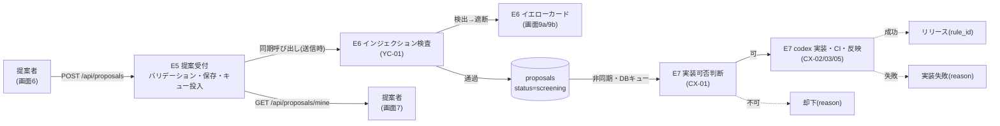
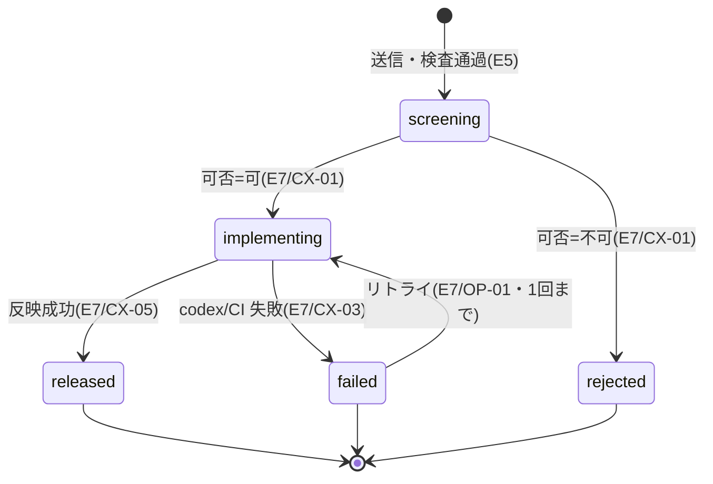

# E5: ルール提案受付

> **改訂反映ノート(2026-07-27、E07 改訂・decision-log C-2/C-3/C-5/C-6/E-18 による)** — 矛盾する記述はこのノートと改訂版 E07 を正とする。本文の書き直しは RP-01 実装着手時に該当節単位で行う。
> - **送信フローの変更(E-18)**: 検査(E6)は送信時同期でなくなり、送信時はレート制限なし(C-3)・形式検証 + 正規化 + 保存 + L0〜L2 シグナル記録のみ。応答は「受け付けました(審査中)」だけで、**受理不受理・イエローカードは非同期**に確定する。§3.1 の手順 3(レート制限)・6(同期検査)、200 判別 union の遮断分岐、「遮断投稿は行を作らない」前提(§2.1 ほか)はすべて読み替え。遮断は非同期に `rejected` へ落ちる(行は存在する)。
> - **文字数上限(C-3 決定)**: 名前 40 / 内容 **1000** 文字(仮値 400 から変更)。E-14(ルール名 12 文字のリボン制約)との整理は RP-01 実装時に確定(提案タイトルと表示名の分離が候補)。
> - **リトライモデル(C-5 決定)**: E7 内包モデル。`failed → implementing` の遷移辺は削除。`failed` 遷移時に `attempt_count=1` を書いて再提案を解禁(§2.3 の取り決めを確定)。
> - **`reason_code` の最終セット(C-6 決定)**: 却下系 = `infeasible_technical` / `breaks_game` / **`inappropriate`(新設。E6 遮断もここ)** / `duplicate_rule` / `out_of_scope` / `other`。実装失敗 = **`implementation_failed` の 1 値のみ**(§3.3 の候補 `codex_failed` / `ci_failed` / `retry_exhausted` は廃止。内部区分は E7 の `pipeline_jobs.error_code` に分離し、ユーザーには見せない)。
> - RP-03 の文言は「反映まで数時間〜数日」の期待値で設計する(E07 §2.1)。

- 作成日: 2026-07-24
- 状態: 提案(開発者レビュー待ち)
- 一次情報源: `docs/企画書.md`(§4.1・§4.2)/ `docs/product-backlog.md`(RP-01〜03)/ `docs/epics/E12-tech-stack.md`(§4.4・§4.7・§4.9)/ `docs/design/wireframes.html`(画面6・7)
- 対象フェーズ: 2 / 依存: GE-04(ルール差し替え構造)

---

## 1. Epic 概要

### 1.1 目的

「みんなでつくろう 大富豪」のコア体験は「自分の提案でゲームが変わる」ことである(企画書 §2.2)。E5 はその **入り口** を作る。すなわち、

1. ルールを **ローカル / オリジナルの 2 区分**(+ ローカルは都道府県を任意で)付けて投稿できるフォームと送信 API(RP-01・RP-02)、
2. 投稿された提案を **後続パイプライン(検査 E6 → 可否判断・実装 E7)へ渡すための保存とキュー投入**(RP-01)、
3. 提案者が自分の提案の **現在状態(審査中 → 実装中 → リリース / 却下 / 実装失敗)を追える** マイ提案一覧(RP-03)、

の 3 つを提供する。**提案の可否判断・実装そのものは E5 の範囲外**であり、E5 は「提案データの受け皿」と「状態機械の定義・所有」に責務を絞る。

### 1.2 担当ストーリー

| ID | 概要 | 本書での主担当節 |
|---|---|---|
| RP-01 | ローカル/オリジナル区分付きで提案を投稿し、保存して後続処理へ渡す | §3.1 |
| RP-02 | ローカルルールに「遊んでいた都道府県」(任意)を紐づける | §3.2 |
| RP-03 | 自分の提案の状態を追う。却下理由・実装失敗通知 | §3.3 |

### 1.3 他 Epic との接続(ハンドオフ点)

E5 は提案パイプライン(企画書 §7)の最上流であり、**下流のトリガーを引くが下流の処理は持たない**。境界を明確にする。



| 接続先 | ハンドオフの向き・方式 | E5 が持つもの / 持たないもの |
|---|---|---|
| **E6 検査(YC-01)** | 送信時に **同期呼び出し**。E5 は正規化済みの提案文を E6 の検査関数に渡す。検出時は E6 が遮断・検査ログ記録・イエローカード処理を行い、E5 はその結果を受けて呼び出し元へ「遮断」を返す(画面9a/9b は E6 の演出) | E5 は検査ロジック・検査ログ・イエローカードを **持たない**。E5 が持つのは「検査を挟む位置(拡張点)」と「通過した提案だけを保存する」責務 |
| **E6 提案停止(YC-03)** | 送信時に **同期ゲート**。E5 は `users.proposal_suspended_until` を読み、停止中なら送信を拒否する | 停止判定・カウント・解除は E6 所有。E5 は列を読むだけ |
| **E7 可否判断(CX-01)** | **非同期**。E5 は `status='screening'` の提案を保存・キュー投入するだけ。可否判断は E7 のワーカーが行い、`screening → implementing`(可)または `screening → rejected`(不可・理由付き)へ遷移させる | 可否の線引き(企画書 §9-5)・理由文の生成は E7。E5 は状態機械と理由格納列を定義・所有し、**遷移用リポジトリ関数を E7 に提供する**(§2.2) |
| **E7 実装・反映(CX-02/03/05)** | **非同期**。E7 が `implementing → released`(成功・`rule_id` 付与)/ `implementing → failed`(失敗・理由付き)へ遷移させる | codex 実行・CI・バンドル登録は E7。E5 は遷移を受けて表示するだけ |
| **E11 図鑑・E9 人気度** | **前方参照**。リリース済み提案の `rule_id` から `rules`(ルールメタ)を join し、画面7 に人気度・優先度を出す | `rules` テーブルは E7/E9/E11 所有(E12 §4.4)。E9/E11 未完成の間は `rule_id` とリリース日のみ表示 |
| **匿名 ID 基盤(§4.9)** | E5 は `users.id` を `author_id` として参照する | 匿名 ID の発行・トークン・表示名はフェーズ 1 のマルチプレイ基盤で既に存在する前提(§4.9)。E5 は消費するだけ(§2.1 で最小前提を明記) |

**着手順の含意(バックログ §4 と整合)**: RP-01 は E6(YC-01 は RP-01 依存)・E7(CX-01 は RP-01・YC-01 依存)より先に着手される。したがって E5 は、**検査ゲート・可否判断キュー消化がまだ存在しない状態でも単独で成立**するよう設計する。具体的には、検査ゲートと停止ゲートは「後で E6 が中身を埋める拡張点(初期は素通り)」として実装し、E5 単独時は全提案が `screening` に入り、そのまま滞留する(それを消化する E7 は後続)。この段差を許容できる構造にすることが E5 設計の要点である。

---

## 2. Epic 横断の技術仕様

技術基盤は E12 に従う: TypeScript(strict)/ `packages/server` の HTTP API / SQLite(better-sqlite3)+ Drizzle ORM / 匿名 ID + トークン認証。提案受付 API には IP ベースのレート制限を併設する(E12 §4.9)。

### 2.1 データモデル

#### proposals テーブル(E5 所有)

提案 1 件 = 1 行。**検査で遮断された投稿は行を作らない**(§3.1・RP-03 の「インジェクション検査は表示上の状態として持たない」の帰結。遮断された内容は E6 の検査ログに残る)。

TypeScript 型(Drizzle スキーマの骨子。確定は実装時):

```ts
export type ProposalKind = "local" | "original";

export type ProposalStatus =
  | "screening"     // 審査中: 検査通過後、可否判断(CX-01)待ち/実行中
  | "implementing"  // 実装中: 可否=可。codex キュー待ち〜実装〜CI〜反映(CX-02/03)
  | "released"      // リリース: 反映済み・全卓で有効(CX-05)
  | "rejected"      // 却下: 可否=不可(CX-01)
  | "failed";       // 実装失敗: codex/CI 不合格(CX-03)

export interface Proposal {
  id: string;                 // ULID(時系列ソート可能な一意 ID)
  authorId: string;           // → users.id(匿名 ID)
  kind: ProposalKind;
  prefectureCode: string | null; // "01".."47"。出自の記録(§3.2)。null=未申告/オリジナル
  name: string;               // ルール名(正規化・検証済み)
  body: string;               // ルールの内容(正規化・検証済み)
  status: ProposalStatus;
  reasonCode: string | null;  // 却下/失敗の区分。終端時のみ。E7 が書く(§3.3)
  reasonText: string | null;  // 表示用の理由文。E7(CX-01/CX-03)が書く
  ruleId: string | null;      // リリース後に rules と紐づく(E7/E11)。前方参照
  attemptCount: number;       // codex 実装の試行回数。E7 が更新(リトライは 1 回まで)
  contentHash: string;        // 正規化後 (kind+name+body) のハッシュ。重複/冪等判定
  createdAt: number;          // epoch ms
  statusChangedAt: number;    // 状態が最後に変わった時刻(未読バッジ算出用)
  updatedAt: number;
}
```

DDL 案(SQLite):

```sql
CREATE TABLE proposals (
  id                TEXT PRIMARY KEY,
  author_id         TEXT NOT NULL REFERENCES users(id),
  kind              TEXT NOT NULL CHECK (kind IN ('local','original')),
  prefecture_code   TEXT CHECK (prefecture_code IS NULL OR prefecture_code GLOB '[0-4][0-9]'),
  name              TEXT NOT NULL,
  body              TEXT NOT NULL,
  status            TEXT NOT NULL DEFAULT 'screening'
                    CHECK (status IN ('screening','implementing','released','rejected','failed')),
  reason_code       TEXT,
  reason_text       TEXT,
  rule_id           TEXT,          -- → rules(id)(E7/E11 で作成。前方参照のため FK 制約は付けない)
  attempt_count     INTEGER NOT NULL DEFAULT 0,
  content_hash      TEXT NOT NULL,
  created_at        INTEGER NOT NULL,
  status_changed_at INTEGER NOT NULL,
  updated_at        INTEGER NOT NULL,
  -- オリジナルは都道府県を持てない(§3.2)
  CHECK (kind = 'local' OR prefecture_code IS NULL)
);

-- マイ提案一覧(著者・新しい順)
CREATE INDEX idx_proposals_author ON proposals(author_id, created_at DESC);
-- パイプラインのキュー取り出し(status ごと・古い順)
CREATE INDEX idx_proposals_status ON proposals(status, created_at);
-- 進行中 + リトライ可能な失敗の、同一著者・同一内容を一意化(部分ユニーク)。
-- リトライ(failed→implementing)で同一行が索引を出入りしないよう、リトライ枠が
-- 残る failed(attempt_count=0)も索引に含める(§2.2 の衝突回避の要)。
CREATE UNIQUE INDEX idx_proposals_inflight_dedupe
  ON proposals(author_id, content_hash)
  WHERE status IN ('screening','implementing')
     OR (status = 'failed' AND attempt_count = 0);
```

補足:
- `prefecture_code` は JIS X 0401 の都道府県コード(2 桁、`01`=北海道 〜 `47`=沖縄県)。表示名はコードからマスタで解決する(§3.2)。GLOB は簡易な形式ガードで、値域(01〜47)の厳密検証はアプリ層で行う。
- 部分ユニークインデックスは **進行中(screening/implementing)+ リトライ可能な失敗(`failed` かつ `attempt_count=0`)** を一意化する。リトライで対象行が索引を出入りしないため、**再提案とリトライが同一 `(author_id, content_hash)` で衝突しない**(§2.2・§2.3)。却下・リリース後、およびリトライ枠を使い切った失敗(`attempt_count=1`)後の同一内容の再提案は許可する。
- `reason_code` / `reason_text` は却下・実装失敗で共用する(提案は同時に 1 つの終端状態にしかならないため)。区分は `reason_code` の名前空間で判別する(§3.3)。

#### users テーブルへの追加(基盤所有、E5 が 1 列追加)

匿名 ID 基盤(§4.9)が定義する `users`(id・表示名・トークン・イエローカード枚数・提案停止期限)に、E5 はマイ提案の既読基準を 1 列足す。

```sql
ALTER TABLE users ADD COLUMN proposals_seen_at INTEGER; -- 画面7 を最後に開いた時刻(未読バッジ用・E5 所有)
-- NULL=画面7 を一度も開いていない(未訪問)。未読判定は COALESCE(proposals_seen_at, 0) で扱う(§3.3)
-- yellow_card_count / proposal_suspended_until は E6(YC-03)所有。E5 は読むだけ
```

### 2.2 提案の状態機械



**遷移表(担い手と冪等性)**。`released`・`rejected` は最終終端で、そこからの遷移はない。`failed` からはリトライ(E7 主導・最大 1 回)でのみ `implementing` に戻せる。

| From | To | トリガー | 担い手 | 付随して書く列 |
|---|---|---|---|---|
| (新規) | `screening` | 提案送信・検査通過 | **E5**(送信ハンドラ) | 全列(INSERT) |
| `screening` | `rejected` | 実装不可判断 | **E7**(CX-01) | `reason_code`, `reason_text` |
| `screening` | `implementing` | 実装可判断 | **E7**(CX-01) | — |
| `implementing` | `released` | codex+CI 成功・反映 | **E7**(CX-05) | `rule_id` |
| `implementing` | `failed` | codex/CI 不合格 | **E7**(CX-03) | `reason_code`, `reason_text` |
| `failed` | `implementing` | リトライ | **E7**(OP-01) | `attempt_count += 1`(`attempt_count=0` のときのみ・関数内ガード) |

**冪等性の担保**。状態機械の不変条件を 1 か所に閉じ込めるため、E5 が **遷移用リポジトリ関数を提供し、E6/E7 はそれを呼ぶ**(直接 UPDATE させない)。

```ts
// packages/server(E5 所有)。E6/E7 が import して使う
export function transitionProposal(
  id: string,
  from: ProposalStatus,          // 期待する現在状態(ガード)
  to: ProposalStatus,
  patch?: { reasonCode?: string; reasonText?: string; ruleId?: string }
): "transitioned" | "noop" | "forbidden";
// 実装:
//  1. (from,to) が §2.2 の許可表にあるか検証。なければ "forbidden"
//  2. リトライ辺(failed→implementing)は「リトライは 1 回まで」(E12 §4.7)を
//     関数内の attempt_count ガードで担保する(不変条件を本関数に集約する方針と一致)
//  3. UPDATE proposals
//       SET status=to, status_changed_at=now, updated_at=now,
//           attempt_count = attempt_count
//             + CASE WHEN from='failed' AND to='implementing' THEN 1 ELSE 0 END,
//           <patch>
//     WHERE id=? AND status=from
//       AND (from<>'failed' OR attempt_count=0)   -- リトライ枠ガード(関数内)
//  4. 更新行数 1 → "transitioned" / 0 → "noop"(既に別状態 or 枠切れ=再実行の空振り)
```

- **ガード付き UPDATE**(`WHERE status=from`)により、同じ遷移をワーカーが再実行しても 2 回目は `noop` になり副作用が起きない。パイプラインの at-least-once 実行(再クラッシュ・再キュー)に耐える。
- **リトライ枠ガードも関数内**に置く。`failed→implementing` は `attempt_count=0`(リトライ未使用)のときだけ成功し、成功時に `attempt_count` を 1 にする。枠切れ(`attempt_count=1`)の再リトライは `noop`(WHERE 不一致)で弾かれ、「不変条件は transitionProposal に集約」の言明どおり `attempt_count` ガードが関数の外に漏れない。
- 終端状態を `from` に指定する遷移は許可表にないので `forbidden`。「一度リリースした提案を却下に戻す」等の不正遷移が構造的に起きない。
- **リトライ辺で UNIQUE 違反は起きない**。部分ユニーク索引(§2.1)がリトライ可能な `failed`(`attempt_count=0`)も含むため、リトライで `implementing` へ再入場する行は索引を出ないまま推移する = 同一 `(author_id, content_hash)` の別の進行中行が割り込めない。再提案とリトライの競合は §2.3 の重複抑止が入口(INSERT)で防ぐので、この UPDATE が索引衝突で未捕捉例外を投げる経路は塞がれている。
- 送信(新規 INSERT)の冪等性は状態機械ではなく **§2.3 の重複抑止**で担保する。

**表示状態と内部状態の対応**。画面7 は 5 状態をそのまま見せる(§3.3)。可否判断待ちのキュー滞留は `screening` に、codex キュー(OP-01)滞留は `implementing` に含める(利用者にはキュー待ちと実処理を区別して見せない。「審査中」「実装中」の 2 段で十分)。

### 2.3 提案文の制約

**文字数**(コードポイント数=`Array.from(str).length` で数える。UTF-16 単位ではないので絵文字・サロゲートペアも公平に 1〜数文字で数わる)。上限は「codex に渡すプロンプトのトークン予算」と「インジェクションの攻撃面積」を抑える目的で、下流(E6・E7)と整合させる。数値は初期値であり調整可(§5)。

| 項目 | 下限 | 上限 | 補足 |
|---|---|---|---|
| ルール名 | 1(トリム後・非空) | 40 文字 | 改行不可 |
| ルールの内容(body) | 1(トリム後・非空) | 400 文字 | 改行可。コードポイント上限(400)がバイト長も ≤1600B(1 コードポイント最大 4B)に抑えるため、別途のバイト上限は設けない |

- **「意味のある内容か」は E5 が判定しない**。極端に短い提案(例:「8で流れる」)も受け付け、実装可否は CX-01(E7)に委ねる。E5 の検証は形式(長さ・文字種・区分整合)に限る。

**形式(正規化と文字種)**。

- **保存用正規化**: 前後の空白をトリム / Unicode 正規化 NFC(見た目を変えない標準形。**NFKC は使わない** — 全角数字を半角に畳むなど利用者の意図した表記を壊すため)。
- **文字種ハイジーン**: C0 制御文字は body の改行(`\n`)以外を除去(タブは空白へ)。ゼロ幅文字・双方向制御文字(BiDi override)は除去する(表示崩し・なりすまし対策の最低線。意味的なインジェクション判定は E6)。
- **プレーンテキスト扱い**: HTML/マークアップは解釈せず、そのまま保存。表示側でエスケープする(React の既定エスケープに委ねる。XSS 防止)。
- **絵文字**: 許可する。正規化で除去しない。文字数カウントはコードポイントで数え、UI のカウンタ表示はより体感に近い書記素クラスタ(`Intl.Segmenter`)を使ってよい。

**重複提案の扱い**。

- 重複判定キー = 正規化後の `(kind + name + body)` のハッシュ(`content_hash`)。ここでの正規化は保存用より強め(NFKC + 小文字化 + 連続空白の圧縮)にして、些細な表記ゆれを同一視する。
- **同一著者で、進行中(screening/implementing)またはリトライ可能な失敗(`failed` かつ `attempt_count=0`)の同一内容**は二重投稿とみなし、新規行を作らず既存提案を返す(部分ユニークインデックス §2.1 が構造的にも防ぐ)。二重タップ・ネットワークリトライによる連投を吸収する(冪等な送信)。
- **別の著者が似たルールを出す**のは許可する(「8切り」は全国で提案されうる)。**ルールレベルの重複排除**(実質同一ルールを 1 本化するか)は CX-01(E7)の可否判断の領分であり、E5 は投稿レベルの重複抑止に留める。
- **再提案とリトライの優先順**: リトライ枠が残る失敗提案(`attempt_count=0`)が索引に居座る間、同一内容の再提案はその失敗提案(リトライ予定)を返す = **自動リトライが再提案に優先**する。これにより同一 `(author_id, content_hash)` の進行中 2 行が生じず、リトライの `failed→implementing` が UNIQUE 違反を起こさない(§2.2 の未捕捉例外の解消)。却下・リリース後、およびリトライ枠を使い切った失敗(`attempt_count=1`)後は再提案を許可する(新規行を作る)。運用上 E7 がリトライを行わない方針に切り替える場合は、失敗時に `attempt_count=1` を書いて即座に索引から外し再提案を解禁する、と E7 と取り決める(§5)。
- **送信の冪等性は二段**: (i) 事前の重複 SELECT(上記予定行を含む)、(ii) それでも並行送信で INSERT が UNIQUE 違反した場合は、既存の該当行を再 SELECT して返す(TOCTOU 競合の敗者側も冪等成功)。

---

## 3. ストーリー別詳細仕様

### 3.1 RP-01: 区分付きの提案投稿

**(a) 原文引用**

> **[RP-01]** ルール提案者として、新しいルールをローカル/オリジナルの区分付きで提案したい。それは自分のルールでゲームを変えるコア体験の入り口だからだ。
> - 受け入れ条件:
>   - 提案フォームで区分(ローカル/オリジナル)とルール内容を入力して送信できる
>   - 提案が保存され、後続処理(検査・可否判断)に渡る
>   - ローカル区分でも都道府県(RP-02)は任意入力で、未入力のまま提案を送信できる(§4.1)

**(b) 挙動仕様**

送信 API は次の順のパイプラインで処理する。**早く落ちるものを前に**置く(認証・停止・レート制限で高コストな検査を無駄打ちしない)。

1. **認証**: 匿名トークン必須。無ければ 401。
2. **提案停止ゲート**(E6/YC-03): `users.proposal_suspended_until` が未来なら 403(停止中)。E5 単独時は列不在=素通り。
3. **レート制限**(§4.9): IP 単位 + 匿名 ID 単位。超過は 429。連投対策の一次防衛線(下記エッジ参照)。
4. **バリデーション**(§2.3 + 区分整合): 不正は 400(フィールド別エラー)。
5. **重複抑止**(§2.3): 同一著者で、進行中またはリトライ可能な失敗(`attempt_count=0`)の同一内容があれば新規作成せず既存を返す(冪等)。並行送信で INSERT が UNIQUE 違反した場合は既存の該当行を再取得して返す(敗者側も冪等成功)。
6. **インジェクション検査**(E6/YC-01・同期): 検出なら遮断応答(下記)。E5 単独時は素通り。
7. **保存 + キュー投入**: `status='screening'` で INSERT。パイプライン(E7)から可視になる。`accepted` を返す。

エッジケース:

| ケース | 挙動 |
|---|---|
| **連投**(短時間の多数送信) | レート制限(429)で抑える。加えて同一内容の二重タップは重複抑止で 1 件に集約(既存提案を返す)。異なる内容の高速連投は 429 に当たるまで受理される |
| **空のルール名 / 内容** | トリム後に空なら 400(必須) |
| **長文**(上限超過) | 400。クライアントは残り文字数カウンタで送信前に抑止する |
| **絵文字・多言語** | 許可。コードポイントで文字数計上。保存は UTF-8(SQLite TEXT) |
| **オリジナルなのに都道府県付き** | サーバーで無視 or 400(§3.2 で確定: 400 とする)。クライアントは原則そもそも送らない |
| **制御文字・ゼロ幅・BiDi 混入** | body の改行を除き除去(§2.3)。除去後に空になれば 400 |
| **HTML/スクリプト片** | プレーンテキストとして保存。表示時にエスケープ |
| **インジェクション疑い文** | E5 は判定せず E6 に渡す(§1.3)。検出時は遮断応答 |

**(c) 画面仕様(画面6: ルール提案フォーム)**

- **区分**: セグメント選択「ローカルルール / オリジナルルール」(既定ローカル)。
- **都道府県(任意)**: **ローカル選択時のみ表示**。オリジナルに切り替えると非表示にし、選択値をクリアする(§3.2)。
- **ルール名**: 単一行入力。
- **ルールの内容**: 複数行テキストエリア。
- **予告ボックス**: 「提案は AI が実装可否を審査し、実装可能なら自動で組み込まれる」「不正な命令(プロンプトインジェクション)は検出されイエローカードの対象」(§4.2・§5)を明記。
- **送信ボタン**: 正常受理 → 画面7(マイ提案)へ。検出時 → 画面9a(1 枚目)/ 画面9b(2 枚目、E6 の演出)。
- クライアント側でも §2.3 のバリデーション(必須・文字数)を鏡写しで行い即時フィードバック。**ただし権威はサーバー**(クライアント検証は UX 用)。

**(d) API・データ定義**

```ts
// POST /api/proposals  ── リクエスト
interface CreateProposalRequest {
  kind: "local" | "original";
  prefectureCode?: string | null; // local のときのみ有効・任意(§3.2)
  name: string;
  body: string;
}

// 200 応答(受理 or 遮断のどちらも「送信は成立した」ため 200 + 判別union)
type CreateProposalResponse =
  | { outcome: "accepted"; proposal: ProposalListItem } // → 画面7
  | { outcome: "blocked"; yellowCard: YellowCardInfo };  // → 画面9a/9b(中身は E6 が供給)
// エラー: 400 バリデーション / 401 未認証 / 403 提案停止中 / 429 レート超過
```

- `outcome: "blocked"` を 200 にするのは、遮断が「エラー」ではなく **企画上の演出(イエローカード, §5.2)**であり、クライアントが `yellowCard` ペイロードで画面9a/9b を描くため。停止(403)・レート超過(429)は通常のエラー応答とする。
- 保存される列は §2.1。`status='screening'`, `reason_*=null`, `rule_id=null`, `attempt_count=0`。

**(e) 実装方針**

- 配置: `packages/server`。HTTP API とバリデーション、`proposals` リポジトリ(create / transition / listByAuthor)。
- **検査ゲート・停止ゲートは差し込み可能な関数**として定義し、E6 未実装時は「常に通過」のスタブを注入する。E6 着手時に実体へ差し替える(§1.3 の段差吸収)。
- キュー投入は「`proposals` テーブルそのものをキューとする」で足りる(E7 が `status='screening'` を古い順に取り出す)。専用キューテーブルは OP-01(E10)が必要とすれば導入する — E5 では作らない(過剰設計回避)。
- ULID 生成・NFC/NFKC 正規化・ハッシュは小さなユーティリティに切り出し、クライアント検証と共有可能な純粋関数(文字数・区分整合)は `packages/core` に置くことを検討(E12 §4.1 の共有方針)。

**(f) 受け入れ条件の精緻化**

- [ ] 区分(local/original)と名前・内容を送信でき、`proposals` に `screening` で 1 行保存される。
- [ ] 保存された提案は `status='screening'`・`created_at` 昇順で E7 のキュー取り出しクエリに現れる(「後続処理に渡る」の検証可能な定義)。
- [ ] ローカル区分で都道府県未指定でも送信・保存できる(`prefecture_code IS NULL`)。
- [ ] オリジナル区分では都道府県を送っても保存されない(400 または無視 — §3.2 で 400 に確定)。
- [ ] 認証・停止・レート制限・バリデーション・重複抑止・検査の各ゲートが規定順に働く(それぞれ単体テストで確認)。

**(g) 未解決事項**

- レート制限の具体値(IP/匿名 ID あたり毎分・毎時の上限)は運用開始時に暫定値を置き、OP-02 の計測で調整(§5)。
- 検査で遮断された投稿を `proposals` に残さない設計で確定してよいか(E6 の検査ログに一本化する。§5・E12 修正提案)。

---

### 3.2 RP-02: ローカルルールへの都道府県紐づけ(任意・出自の記録)

**(a) 原文引用**

> **[RP-02]** ルール提案者として、ローカルルールに「遊んでいた都道府県」を紐づけたい。それは「うちの地元ではこうだった」という地域性をゲームの資産にするためだ。
> - 受け入れ条件:
>   - ローカル区分の提案時に 47 都道府県から任意で選択できる(未選択でも提案できる §4.1)
>   - ルールと都道府県の対応が保存され、参照できる(都道府県は提案者の出自の記録として扱う §4.1)
>   - オリジナル区分では都道府県を要求されない

**(b) 挙動仕様**

- ローカル区分でのみ都道府県を受け付ける。**任意**(未選択で提案可)。
- オリジナル区分では都道府県を **持てない**(送られたら 400)。
- **「出自の記録」という意味論のデータへの反映**(§4.1)。この列は「提案者がそのルールを遊んでいたと自己申告した都道府県」であり、「そのルールが実在する地域」ではない。E5 はこの意味を **データ層の規約として固定**し、下流に契約として渡す:
  - 1 提案 = 最大 1 件の都道府県(複数県の分布ではない)。`null` は「未申告」。
  - この値から **「〜県のルール」と断定する表示を導出してはならない**。表示は「報告: 〜県」「〜で遊ばれていた報告」に限定する(§4.1。表示実装は E11/RV-02、E5 は意味論を保証する側)。
  - 集計(都道府県カバー数, 企画書 §11 / OP-03)は「**報告の分布**」であって「ルールの実在地域の分布」ではない、という注記付きで扱う。

エッジケース:

| ケース | 挙動 |
|---|---|
| **空都道府県(ローカル・未選択)** | 許可。`prefecture_code=NULL`。画面8/図鑑では「ローカル(県の記載なし)」表示(E11) |
| **不正なコード**(01〜47 外・非数字) | 400。値域はマスタで厳密検証 |
| **オリジナル + 都道府県** | 400(§2.1 の CHECK 制約でも DB 層で拒否) |
| **区分をローカル→オリジナルに変更** | クライアントが選択値をクリア。サーバーは kind に基づき判定 |

**(c) 画面仕様(画面6)**

- 都道府県セレクト「遊んでいた都道府県(任意)」はローカル選択時のみ表示。既定は未選択(プレースホルダ「選択しない」)。
- 補足文で「入力は任意」「提案者がその土地で遊んでいた記録」を明示(§4.1、断定を避ける文言)。

**(d) API・データ定義**

- リクエストの `prefectureCode`(§3.1(d))。保存は `proposals.prefecture_code`。
- **都道府県マスタ**: JIS X 0401 に基づく固定 47 件。DB テーブルではなく **TS 定数**として持つ(不変の参照データ。過剰設計回避)。図鑑のフィルタ(E11)もこの定数を共有する。

```ts
// packages/core（クライアント・サーバー・E11 で共有）
export const PREFECTURES = [
  { code: "01", name: "北海道" },
  { code: "02", name: "青森県" },
  // … JIS X 0401 順に 47 件（47: 沖縄県）
] as const;

export type PrefectureCode = typeof PREFECTURES[number]["code"];
export function prefectureName(code: string | null): string | null;
```

**(e) 実装方針**

- コードのみを永続化し、表示名は都度マスタ解決(表示名の変更・多言語化に強い)。
- 区分整合(local のみ都道府県可)はバリデーション層と DB CHECK 制約の二重で担保。
- 意味論(出自の記録)は列コメント + 本書 + `rules` へ引き継ぐ際のフィールド命名(例: 図鑑側で `originPrefecture`)で明示し、集計 API(OP-03)には「報告分布」である旨のドキュメントを添える。

**(f) 受け入れ条件の精緻化**

- [ ] ローカル + 都道府県選択で `prefecture_code` が保存され、`GET /api/proposals/mine` で `prefectureCode`/`prefectureName` として参照できる。
- [ ] ローカル + 未選択で送信でき、`prefecture_code IS NULL` で保存される。
- [ ] オリジナルでは都道府県を送っても 400(または保存されない)。UI ではそもそも項目が出ない。
- [ ] 47 コードすべてが妥当と判定され、01〜47 外は拒否される(マスタの網羅テスト)。

**(g) 未解決事項**

- 「県の記載なし」ローカルと「オリジナル」を図鑑でどう描き分けるかは E11 の表示課題(E5 はデータ上区別できる: `kind` と `prefecture_code` の組で判別可能)。
- 将来「市区町村」や「複数地域」への拡張要望が出た場合の列拡張は本 Epic のスコープ外(現状は単一都道府県で固定)。

---

### 3.3 RP-03: マイ提案一覧・状態表示・却下理由・実装失敗通知

**(a) 原文引用**

> **[RP-03]** ルール提案者として、自分の提案が今どうなっているか(審査中・実装中・リリース・却下・実装失敗)を知りたい。それは提案しっぱなしにならず、結果まで見届けるためだ。
> - 受け入れ条件:
>   - 自分の提案ごとに現在の状態が表示される(インジェクション検査は送信時に同期処理されるため、表示上の状態としては持たない)
>   - 却下時に理由の区分(実装不可など)が示される
>   - 実装失敗時に提案者へ通知される(通知方法は着手時に決定する)

**(b) 挙動仕様**

- マイ提案一覧は **自分(認証中の匿名 ID)の提案のみ**を新しい順で返す。**検査で遮断された投稿は含まない**(そもそも行がない。RP-03 の括弧書きの帰結)。
- 各提案の状態は §2.2 の 5 値。状態は E7 が遷移させ、E5 は現在値を表示するだけ。
- **却下理由の区分**(`reason_code`)は E7/CX-01 が確定・記録する。E5 は列を用意し、区分 → 表示文のマッピングを持つ。候補区分(CX-01 が最終確定 — 企画書 §9-5 の線引き):

| reason_code | 意味 | 画面7 表示文(例) |
|---|---|---|
| `infeasible_technical` | 技術的に実装不能(Effect 語彙で表現不可・追加入力を要する等。E12 §4.6(2)) | この提案は現在のしくみでは実装できませんでした。 |
| `breaks_game` | 技術的には可能だがゲームの成立を損なう(例: 手札全公開) | ゲームの成立を損なうため実装できませんでした。 |
| `out_of_scope` | ルールとして解釈できない/ゲームと無関係 | ルールとして解釈できませんでした。 |
| `duplicate_rule` | 既存ルールと実質同一 | 似たルールが既にあります。 |
| `other` | その他(自由文は `reason_text`) | (reason_text をそのまま表示) |

- **実装失敗の区分**(同じ `reason_code` 名前空間、E7/CX-03 が記録):`codex_failed`(生成失敗)/ `ci_failed`(型・テスト・シミュレーション・サンドボックス不合格)/ `retry_exhausted`(リトライ上限)。

**実装失敗通知の方式(要決定 → 本書で推奨を確定)**。RP-03 は「通知方法は着手時に決定」とする。候補を比較する。

| 案 | 仕組み | 長所 | 短所 |
|---|---|---|---|
| **A. 一覧内バッジ + メニューバッジ**(推奨) | `proposals.status_changed_at > users.proposals_seen_at` を「未読」とし、画面7 の各行に未読印、画面1b「マイ提案」に未読件数バッジ | 追加インフラ不要。匿名 ID・子供向けターゲットと相性良(権限プロンプト無し)。**リリース(手応え, CX-05)・却下・失敗すべての状態変化に一様に効く** | プル型(利用者が画面を見に来ないと気づかない)。ホームに来ない離脱ユーザーには届かない |
| B. アプリ内通知センター(ベル + 一覧) | 状態変化を通知エンティティ化し、ベルアイコンに未読数 | 変化履歴を辿れる | 通知テーブル・既読管理の実装増。A 以上の価値がフェーズ 2 では薄い |
| C. Web Push(ブラウザ通知) | Service Worker + Push 購読 + VAPID | 離脱中でも届く | 最重量。**匿名 ID にはメール等の恒久チャネルが無く**、購読許諾は子供向けで摩擦大。個人開発の運用負荷も高い |
| D. メール等 | — | — | 匿名運用でアドレスを持たないため **不可** |

**推奨: A**(一覧内バッジ + メニューバッジ)。理由: 匿名 ID 前提(§4.9)ではプッシュ系の恒久チャネルが無く、C/D は構造的に弱い。A は追加インフラ・許諾なしで、しかも実装失敗だけでなく **リリース(コア体験の手応え)や却下にも同じ仕組みで効く**。B は将来エンゲージメントが要れば拡張余地として残す。Web Push はフェーズ 3 以降で必要になったら再検討する(匿名 ID の制約を併記)。

未読の算出は **単一の既読タイムスタンプ**(`users.proposals_seen_at`)で足りる:
- メニューバッジ(画面1b): `count(proposals WHERE author=me AND status_changed_at > COALESCE(proposals_seen_at, 0))`。
- 各行の未読印(画面7): `item.status_changed_at > COALESCE(proposals_seen_at, 0)`。
- **未訪問ユーザーにこそ点く**: `proposals_seen_at` が NULL(画面7 を一度も開いていない)は `0` とみなすため、初めての状態変化でも必ず未読になる。`COALESCE(..., 0)` を使わず素で比較すると NULL 比較が偽になり、まさに「一度も見に来ていない利用者」にバッジが点かない罠にはまる(ユーザー作成時に `0` で初期化してもよい)。
- 画面7 を開いたら `proposals_seen_at = now` に更新(専用 API)。一覧取得(GET)自体は既読化しない(メニューバッジを別画面で正しく出すため)。

**(c) 画面仕様(画面7: マイ提案/ステータス)**

- 各提案カード: ルール名 + 区分タグ(「ローカル(報告: 埼玉県)」/「ローカル(県の記載なし)」/「オリジナル」)+ 状態ステップ(審査中 → 実装中 → リリース、または 審査中 → 却下 / 審査中 → 実装中 → 実装失敗)。
- リリース時: リリース日 + 図鑑(画面8)への導線。人気度・優先度は E9/E11 完成後に `rule_id` 経由で表示(未完成時はリリース日のみ)。
- 却下時: 理由文(`reason_text`、無ければ `reason_code` のマッピング文)を破線ボックスで表示。
- 実装失敗時: 案 A の未読印 + 理由文。画面7 に「実装失敗の通知欄を足す余地」を残す(ワイヤーフレーム画面7 注記 mk2 と整合)。
- 未読バッジ: 前回閲覧以降に状態が変わった提案に印。

**(d) API・データ定義**

```ts
// GET /api/proposals/mine  ── 自分の提案一覧(新しい順)
interface ProposalListItem {
  id: string;
  kind: "local" | "original";
  prefectureCode: string | null;
  prefectureName: string | null; // null=「県の記載なし」(ローカル)/ オリジナルは region 非該当
  name: string;
  body: string;
  status: ProposalStatus;
  reason: { code: string; text: string } | null; // rejected/failed のみ
  releasedRuleId: string | null;                  // released 時。図鑑導線
  popularity: number | null;                      // rules から join(E9/E11 完成後)
  priorityRank: number | null;                    // 同上
  unread: boolean;                                // status_changed_at > COALESCE(seen_at, 0)
  createdAt: number;
  statusChangedAt: number;
}
interface MyProposalsResponse {
  items: ProposalListItem[];
  unreadCount: number; // メニューバッジ用
}

// POST /api/proposals/seen  ── 画面7 を開いた/閉じたときに既読化
//   → users.proposals_seen_at = now、204
```

- 一覧は認証中の `author_id` で絞る。**他人の提案は返さない**(検証項目)。
- `popularity`/`priorityRank` は `rules` が無い段階では常に `null`(前方参照)。

**(e) 実装方針**

- 一覧は `proposals` + `rules`(LEFT JOIN、存在すれば)で構成。E9/E11 未完成時は JOIN 対象なしで `null`。
- 未読は §(b) の単純比較。通知エンティティを作らない(案 A)。
- 状態表示文・区分タグ・ステップ描画はクライアントのマッピングテーブルで(`status`・`reason_code` → 表示)。

**(f) 受け入れ条件の精緻化**

- [ ] `GET /api/proposals/mine` が自分の提案のみを新しい順で返し、各件の `status` が現在値である。
- [ ] 検査で遮断された投稿は一覧に一切現れない(遮断されても行が作られないことの確認)。
- [ ] 却下提案に `reason.code`/`reason.text` が入り、画面7 に理由が表示される。
- [ ] 実装失敗が案 A(未読バッジ)で通知され、画面7 を開くと既読化してメニューバッジが消える。
- [ ] 画面7 を一度も開いていない(`proposals_seen_at IS NULL`)利用者でも、初回の状態変化でメニューバッジが点く(`COALESCE(..., 0)` 境界)。
- [ ] リリース提案に `releasedRuleId` が入り、図鑑への導線が出る。

**(g) 未解決事項**

- `reason_code` の最終的な区分セットは CX-01(却下)・CX-03(失敗)の確定に従属する。E5 は列と表示マッピングの受け皿を用意し、コードの追加に開いておく。
- 案 A で「離脱ユーザーに届かない」問題が成功指標(採用率・再訪)に効くと判明したら、案 B/C を後日追加(フェーズ 3 の検討)。
- リトライ(`failed → implementing`)時の画面7 表示(「再挑戦中」等の中間文言)は E7 のリトライ運用確定後に詰める。

---

## 4. テスト観点

**バリデーション(純粋関数・高速)**
- ルール名/内容: 空・空白のみ(トリム後空)→ 拒否。下限・上限の境界(40/400 文字ちょうど=許可・+1=拒否)。400 文字ちょうどが上限内(バイト長で二重に弾かれない)。
- 文字数カウントが **コードポイント基準**で、絵文字(サロゲートペア・ZWJ 連結)・結合文字を UTF-16 長で誤計上しない。
- 制御文字・ゼロ幅・BiDi 制御の除去。body の改行は保持。除去後空 → 拒否。
- 正規化: NFC が見た目を保つ / dedup 用 NFKC が表記ゆれを畳む。

**区分・都道府県整合(RP-02)**
- local + 都道府県 / local + 未選択 / original + 都道府県(拒否)/ original + 未選択 の 4 組。
- 都道府県コード 01〜47 全件が妥当、`00`/`48`/`4A`/空 が拒否。DB CHECK 制約でも original+県が弾かれる。

**送信パイプライン(RP-01)**
- ゲート順序: 未認証(401)→ 停止中(403)→ レート超過(429)→ 不正(400)が、それぞれ先行ゲートで止まる。
- 重複抑止: 同一著者・進行中の同一内容の連投 →1 件・既存を返す。別著者の同一内容 → 別々に受理。却下・リリース後の同一内容再提案 → 受理。
- **並行同一送信**: 2 本を同時 INSERT した敗者側が UNIQUE 違反を捕捉し、既存の該当行を再取得して返す(冪等成功・行は 1 件)。
- **再提案 × リトライの索引衝突(回帰)**: 失敗(`attempt_count=0`)提案がある状態で同一内容を再提案 → 既存(リトライ予定)を返し新規行を作らない → その後のリトライ `failed→implementing` が UNIQUE 違反にならず成功する。一方、リトライ枠切れ(`attempt_count=1`)の失敗後は同一内容の再提案が新規受理される。
- 検査ゲート(E6 スタブ/実体): 通過 → `screening` で行作成。遮断 → 行を作らず `outcome:"blocked"` + yellowCard、`proposals` に痕跡なし。
- 停止ゲート・検査ゲートが未注入(E5 単独)でも全経路が成立する。

**状態機械(§2.2)**
- 許可遷移が成功し `status_changed_at` が更新される。非許可遷移(終端からの遷移・飛び越し)は `forbidden`。
- ガード付き UPDATE の冪等性: 同じ遷移の 2 回目が `noop`(副作用なし)。並行実行で二重適用されない。
- **リトライ枠ガード(関数内)**: `failed→implementing` は `attempt_count=0` のときだけ `transitioned`(成功後 `attempt_count=1`)。`attempt_count=1`(枠切れ)では `noop`。ガードが transitionProposal の外に漏れない。
- 各終端で `reason_*`/`rule_id` が正しく入る(rejected→reason、released→ruleId、failed→reason)。

**マイ提案・通知(RP-03)**
- 自分の提案のみ・新しい順。他人の提案が漏れない。遮断投稿が現れない。
- 未読ロジック: `status_changed_at > COALESCE(proposals_seen_at, 0)` の境界、`seen` 更新でメニューバッジと行印が消える。
- **未訪問ユーザー**: `proposals_seen_at IS NULL` の利用者で、初回の状態変化がメニューバッジ・行印に反映される(COALESCE 境界の回帰)。
- `rules` 未存在時に `popularity/priorityRank/releasedRuleId` が破綻なく `null`。

**永続化**
- 絵文字・多言語・改行入り body の round-trip(保存 → 取得で不変)。
- 部分ユニークインデックスが「進行中 + リトライ可能失敗(`attempt_count=0`)」に効き、却下・リリース・枠切れ失敗(`attempt_count=1`)後の同一内容再提案を妨げない。

---

## 5. 未決事項・E12 への修正提案

**E5 内の未決(着手時に確定)**
1. **文字数上限の確定値**(名前 40 / 内容 400 文字)。E6(検査コスト・攻撃面積)と E7(codex プロンプトのトークン予算)と突き合わせて確定。→ E6/CX-02 の設計と整合させる。
2. **レート制限の具体値**(IP/匿名 ID あたりの毎分・毎時上限)。暫定値で開始し OP-02 の計測で調整。
3. **オリジナル + 都道府県送信時の応答**を 400(明示エラー)で確定(本書の採用)。無視する案もあるが、クライアントの実装ミスを早期に露見させる 400 を推す。
4. **実装失敗通知は案 A(一覧内バッジ + メニューバッジ)で確定**(§3.3 の推奨)。Web Push はフェーズ 3 以降の拡張余地として保留。
5. **再提案とリトライの優先順を E7 と共有**(§2.1・§2.3 で本書は「自動リトライ優先」で確定)。E7 のリトライ運用(自動/手動・回数・失敗時に `attempt_count` をどう書くか)が変わると部分ユニーク索引の predicate(`failed AND attempt_count=0`)の前提が動くため、E7(CX-03/OP-01)着手時に `attempt_count` の意味と「リトライを行わない場合は失敗時に `attempt_count=1` を書いて索引から外す」取り決めを固定する。

**E12 への修正提案**
1. **検査ログの所有を明記**。E12 §4.4 は「ルール提案(…)…検査ログ(YC-01)含む」と書き、検査ログが `proposals` の一部のように読める。しかし RP-03 の「インジェクション検査は表示上の状態として持たない」= **遮断された投稿は `proposals` に行を作らない**設計と整合させるには、**検査ログは E6 所有の別テーブル**である旨を明記すべき。E5 は検査ログを持たない。
2. **`users` テーブルの列の所有分担を明記**。§4.9 は `users` に匿名 ID・表示名・イエローカード枚数・提案停止期限を挙げるが、(a) E5 が未読基準 `proposals_seen_at` を 1 列追加すること、(b) イエローカード枚数・提案停止期限は E6(YC-03)所有で E5 は読むだけであることを、列の所有分担として補記すると Epic 間の境界が崩れにくい。
3. **`proposals.rule_id` の前方参照を明記**。§4.4 のルールメタ(`rules`)と提案(`proposals`)の関係で、リリース時に `proposals.rule_id → rules.id` が張られること、`rules` は E7/E9/E11 で作られるため E5 着手時点では前方参照(FK 制約なし・null 許容)になることを補記。
4. **匿名 ID 基盤の担い手の明確化**(軽微)。§4.9 は「フェーズ 1 は A で開始」とするが、`users` と匿名 ID 発行を実際に立てるストーリー(フェーズ 1 のマルチプレイ/表示名まわり)が背番号として特定されていない。E5 はこれを前提に載るため、匿名 ID 基盤の担い手ストーリーをバックログ上で 1 つ特定しておくと依存が明示になる。
