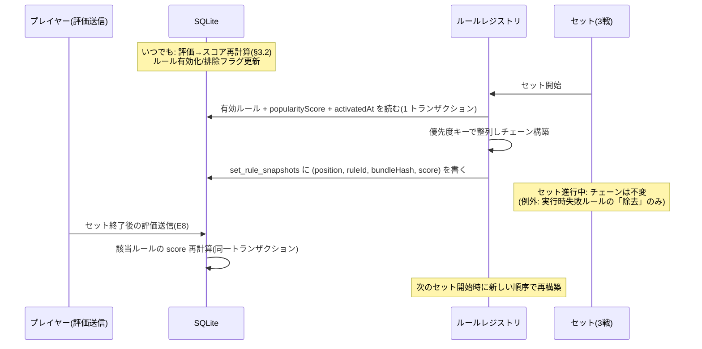

# E9: ルールの優先順位・人気度

- 作成日: 2026-07-24
- 状態: 承認済み(2026-07-27 開発者レビュー。§5 の決定待ち事項(decision-log D-2 等)を除き確定)
- 一次情報源: `docs/企画書.md`(§4.3・§4.4・§9-1)/ `docs/product-backlog.md`(PR-01, PR-02)/ `docs/epics/E12-tech-stack.md`(§4.6(3)(4)・§4.8)/ `docs/design/wireframes.html`(画面 4・7・8)

---

## 1. Epic 概要

### 1.1 目的

複数のユーザー提案ルールが同時に有効になったとき、**どのルールの作用が生き残るかを機械的・決定的に解決する**仕組み(優先順位)と、**その順位をプレイヤーの評価(人気度)で決める**仕組みを設計する。企画書 §4.3 の言葉では:

> - **人気度によって優先度が変わる**方式を採用する。人気のあるルールほど、競合時に優先して適用される。
> - 具体的なアルゴリズム(人気度の算出方法、優先度への変換式、同点時の扱い)は未確定(「9. 未確定事項」参照)。

この「未確定」(企画書 §9-1)を本書で解消する。E12 §4.6(3) が方針として先に決めた 2 点 — **変換系フックは高優先度が後勝ち**、**Effect の矛盾は最高優先度のみ採用** — を実装レベルの意味論に具体化し、矛盾の定義・同点時の扱い・ログ仕様・人気度の算出式までを確定させる。

### 1.2 担当ストーリー

| ID | 内容 | フェーズ | 依存 |
|---|---|---|---|
| PR-01 | 優先順位機構: 競合・矛盾の機械的解決、同点時の扱い、競合解決ログ | 3(ルールが 2 つ以上共存した時点で必要。バックログ §4 のとおりフェーズ 2 末尾への前倒し可) | CX-03 |
| PR-02 | 人気度算出: 評価(高評価/低評価)からのスコア算出、優先度への変換、反映タイミング | 3 | PR-01, EV-02 |

### 1.3 他 Epic との接続

| Epic | 関係 | 本書が前提にする/提供するもの |
|---|---|---|
| E12(技術選定) | 前提 | §4.6(3) の適用規則(高優先度後勝ち・矛盾は最高優先度採用・同点暫定は登録の古い順)、§4.6(4) のセット開始時固定、§4.8 の実行時無効化。本書はこれらを具体化する。修正提案は §5.2 |
| E1(ゲームエンジン) | 相互 | エンジンが Effect を状態に適用する側。本書 §2.4 の解決アルゴリズムは `packages/core` の純粋関数として E9 が仕様を定め、E1 のフック発火・Effect 適用と組み合う。E1 への引き継ぎ要求は §5.3 |
| E7(codex パイプライン) | 入力 | ルールの有効化時刻(`activatedAt`)が同点タイブレークの鍵。バンドルハッシュはセットのスナップショットに固定される |
| E8(評価と淘汰) | 入力 | EV-02 のルール単位高評価/低評価が人気度の唯一の入力(v1)。「そのセットで発動したルール」の判定基準(§2.4(7))を本書が定義し E8 が使う。排除済みルールはチェーンから外れる |
| E2(対戦 AI) | 間接 | AI はエンジン経由でルール適用後の合法手集合を見る。優先順位の決定性は AI の再現テストの前提になる |
| E11(ルール閲覧) | 出力 | 画面 4(有効ルール一覧)の並び順、画面 8(図鑑)の人気度・優先度表示、画面 7(マイ提案)の「人気度 87・優先度 1 位」表示のデータ源 |
| E10(運用・観測) | 出力 | 競合解決ログは「常に上書きされ続けるルール」の検出材料。人気度パラメータ(§3.2)は OP-04 のチューニングノブ |

### 1.4 段階導入 — PR-01 は PR-02 なしで動く

人気度スコアの**初期値を 0.5 に固定**する(§3.2)ため、PR-02 完了前は全ルールが同点になり、優先順位は同点タイブレーク(= 有効化の古い順)だけで決まる。つまり:

- **PR-01 単独稼働時**: 優先順位 = ルール導入順(古いほど高優先)。E12 §4.6(3) の暫定案とそのまま一致し、決定的に動く。
- **PR-02 稼働後**: 評価が入ったルールから順に 0.5 を離れ、人気度順に組み変わる。

この連続性により、PR-01 をフェーズ 2 末尾へ前倒ししても仕様の手戻りがない。

---

## 2. Epic 横断の技術仕様 — 「優先順位」の意味論の確定

### 2.1 用語

| 用語 | 定義 | 誰が持つか |
|---|---|---|
| **人気度スコア** `popularityScore` | 評価から算出する実数(0 < score < 1)。§3.2 の式で決まる | DB(`rules` 行) |
| **人気度(表示値)** | `round(popularityScore × 100)`。図鑑・マイ提案で見せる 0〜100 の整数 | 表示時に導出 |
| **優先度キー** `PriorityKey` | `(popularityScore 降順, activatedAt 昇順, ruleId 辞書順昇順)` の 3 つ組。有効ルール集合上の**全順序**を定める | DB の列から導出 |
| **チェーン(優先順位)** | セット開始時に有効ルールを優先度キーで整列した列。`position` 0 が最高優先度 | ルールレジストリ(メモリ)+ スナップショット(DB) |
| **優先度(表示値)** | 有効ルール中の現在順位(1 位〜)。図鑑の「1 優先」表示 | 表示時に導出 |

重要な設計判断: **DB に「優先度」という独立の数値列は持たない。** 優先順位はつねに `(popularityScore, activatedAt, ruleId)` から導出する。順位を整数で永続化すると、ルールの追加・排除・評価のたびに全行の順位を書き換える更新問題を抱える上、導出値との二重管理になる。E12 §4.6(3) の「優先度の数値は DB から来る」は、この 3 列で満たす。

### 2.2 優先度キーによる全順序と同点時の扱い

```ts
// packages/core/src/priority/key.ts
export type PriorityKey = {
  score: number;        // popularityScore(チェーン固定時点の値)
  activatedAt: number;  // 初回有効化時刻(epoch ms)。小さい = 古い = 優先
  ruleId: string;       // 最終タイブレーク(辞書順)
};

/** 負なら a が高優先。決定的な全順序を保証する */
export function comparePriority(a: PriorityKey, b: PriorityKey): number {
  if (a.score !== b.score) return b.score - a.score;          // スコア降順
  if (a.activatedAt !== b.activatedAt) return a.activatedAt - b.activatedAt; // 古い順
  return a.ruleId < b.ruleId ? -1 : a.ruleId > b.ruleId ? 1 : 0;            // 辞書順
}
```

- **同点の第 1 タイブレークは「有効化の古い順」**。E12 §4.6(3) の暫定案(登録の古い順)を、より曖昧さのない「初回有効化時刻 `activatedAt` の昇順」として確定する(「登録」は提案受付・マージ・バンドル登録など複数の時点に読めるため)。根拠: 先に場に定着したルールほどプレイヤーの共通認識になっており、同点なら既存の体験を優先する方が驚きが少ない。
- `activatedAt` まで同時刻の場合(バッチ有効化などで起こりうる)に備え、**`ruleId` の辞書順**を最終キーに置く。これで比較関数は数学的な全順序になり、ソートの安定性に依存しない。
- `activatedAt` は**初回有効化の時刻で固定**する。無効化 → 再有効化(排除からの復活を含む)でも更新しない。更新すると復活のたびに順位が動き、決定性の説明が難しくなる。
- スコアの同点判定は浮動小数の完全一致でよい。スコアは `(up, down)` の決定的な関数(§3.2)なので、同じ集計値なら必ず同じビット列になる。

### 2.3 「セット開始時に固定」とルール読み込みの整合

E12 §4.6(4) の「レジストリはセット開始時に有効ルール一覧とバンドルを読み込んで固定する」を、優先順位を含めて次のライフサイクルに確定する。



確定事項:

1. **チェーンの構築はセット開始時に 1 回**。読み取り(有効フラグ・スコア・`activatedAt`・バンドル参照)は単一トランザクションで行い、途中の書き込みと混ざらない。
2. **構築結果を `set_rule_snapshots` に永続化する**(§3.1(c))。目的は 3 つ: (a) 競合解決ログの再現性(あとから「そのセットの順序」を正確に復元できる)、(b) E8 の「評価をそのとき有効だったルールに紐づける」(EV-01)の紐付け先、(c) 対局中の画面 4 の並び順の情報源。
3. **セット進行中、チェーンは順序変更も挿入もされない**。人気度の更新・新ルールのリリース・手動有効化はすべて「次に始まるセットから」反映される(E12 §4.6(4) と一致)。同時に走っている複数の卓は、それぞれのセット開始時点のスナップショットを使うため、卓ごとに順序が異なってよい(どちらも決定的)。
4. **唯一の例外は「除去」**: E12 §4.8 の実行時上限超過・ルール内例外による「当該セットで無効化」は、チェーンからの**除去のみ**を許す。残るルールの相対順序は変わらない(配列から抜くだけで再ソートしない)。除去はログに記録し、以後そのセットの競合解決は除去後のチェーンで行う。
5. ゲーム間(セット内の第 1〜3 戦の間)でもチェーンは引き継がれ、再構築しない。「ゲームをまたいで効くルール」(都落ち等)と同じスコープで順序も固定される。

### 2.4 フック実行の意味論

E12 §4.6(2) の契約(`RuleHooks` / `Effect`)を前提に、優先順位が効く箇所を確定する。以降「高優先」は `comparePriority` で前に来る(= `position` が小さい)ことを指す。

#### (1) 変換フック(`modifyLegality` / `modifyStrength`)— 合成順

値を変換するフックは、**優先度の昇順(チェーンの末尾 = 最低優先から先頭 = 最高優先へ)に畳み込む**。各ルールは直前のルールの出力を入力として受け取り、最高優先のルールが最後に変換して**最終決定権**を持つ(E12 §4.6(3) の「高優先度が後勝ち」)。

```ts
// packages/core/src/priority/transform.ts(純粋関数)
export function applyTransformChain<T>(
  chain: RuleChain, hook: TransformHookName, ctx: RuleContext, initial: T,
): { value: T; influenced: RuleId[] } {
  let value = initial;
  const influenced: RuleId[] = [];
  // position の大きい順 = 優先度の低い順に適用
  for (const rule of [...chain.rules].reverse()) {
    if (rule.disabledInSet || !rule.hooks[hook]) continue;
    const next = invokeSandbox(rule, hook, ctx, value); // サンドボックス越し(E12 §4.8)
    if (!deepEqual(next, value)) influenced.push(rule.ruleId); // §2.4(7) の発動判定に使う
    value = next;
  }
  return { value, influenced };
}
```

直感: 変換チェーンはパイプラインであり、「後から塗る人ほど強い」。低優先ルールの変換は、高優先ルールが上書きしない部分だけが生き残る(§3.1(b) トレース 2 で具体化)。

#### (2) Effect フック(`afterPlay` / `afterFieldClear` / `onGameStart` / `onGameEnd`)— 収集

- 同一フックポイントで、実装している全ルールを**優先度の降順に呼ぶ**。呼び出し順は意味論には影響しない設計とする: **バッチ内の全ルールは同一の(不変の)状態ビューを受け取り、互いの Effect や `setMemory` を見ることはできない**(`setMemory` の適用は解決後)。順序を固定するのはログの安定性のためだけである。
- 各ルールの返した Effect 配列を `(ruleId, position, effectIndex, effect)` として収集し、(3)(4) の解決にかける。

#### (3) 「矛盾」の定義 — 競合キー表

E12 §4.6(3) が E9 に委ねた「矛盾の定義」を、**Effect 種別ごとの競合キー(その Effect が書き込む資源の識別子)**で定義する。**同じ競合キーに複数ルールの Effect が集まったとき、それらは競合している**。ペイロード(内容)が同一なら「重複」、異なれば「矛盾」として扱いを分ける。

| Effect | 競合キー | 同一ペイロード時 | ペイロード相違時 |
|---|---|---|---|
| `clearField` | `"field"` | 重複除去(場は 1 回だけ流れる) | (ペイロードなし。常に同一) |
| `skipTurns` | `"turn:{player}"` | 重複除去(同じ人を同回数) | 矛盾 → 最高優先採用(回数は**合算しない**) |
| `reverseTurnOrder` | `"turnOrder"` | 重複除去(**反転は 1 回だけ**) | (ペイロードなし) |
| `forceRank` | `"rank:{player}"` | 重複除去 | 矛盾 → 最高優先採用 |
| `moveCards` | 動的(下記) | — | 具象カード集合が重なれば矛盾 |
| `setMemory` | `"memory:{ruleId}:{key}"` | ルール専用 KV なので**ルール間衝突は構造上起きない**。同一ルール内の同キー重複は配列の後者が勝つ(逐次文のセマンティクス) | 同左 |
| `announce` | なし | 競合しない。(5) の抑制規則のみ適用 | — |

- **`skipTurns` を合算しない理由**: 種別ごとに「合算」「最大値」などの合成ポリシーを持ち込むと、ルールごとの挙動予測が難しくなる。「矛盾したら最高優先だけが通る」という単一の原則(E12 §4.6(3))で統一し、プレイヤーへの説明可能性を優先する。異なるプレイヤーへのスキップは競合キーが異なるため両方適用される(カオスとして正しい)。
- **`reverseTurnOrder` を重複除去にする理由**: 2 ルールが同時に反転を宣言したとき、パリティ累積(2 回反転 = 元通り)にすると「2 つのルールが発動したのに何も起きない」という、バグにしか見えない体験になる。両者の意図(逆回りにしたい)は同一なので、1 回の反転に重複除去するのが意図に合う。
- **`moveCards` の競合キーは静的に決まらない**。エンジンはまず全 `moveCards` の `CardSelector` を(バッチ共通の状態ビューに対して)**具象カード集合へ解決**し、集合が推移的に重なるものを 1 つの競合グループにまとめる(union-find)。グループ内は最高優先ルールの `moveCards`(同一ルールの複数 move は配列順にすべて)を採用し、他ルール分を棄却する。重ならなければ全部適用する。ログ・`conflict_events` に記録する競合キーは `cards:{グループの具象カード ID を昇順で連結}` とする(動的キーにも再現可能な表記を与える)。※セレクタの具象化 API はエンジン(E1)への要求事項(§5.3)。

#### (4) 解決アルゴリズム

```
resolveEffectBatch(chain, hook, emissions):
  入力: emissions = [(ruleId, position, effectIndex, effect)](除去済みルールは含まない)
  1. moveCards のセレクタを具象化する(状態ビューはバッチ共通の 1 枚)
  2. ルール内前処理: 静的競合キーの Effect が同一ルール内で同キー重複していたら、
     effectIndex の大きい方を残し、小さい方を "superseded"(ルール内上書き)にする
  3. 競合キーごとにグループ化(moveCards は (3) の重なりグループ)
  4. 各グループ:
     - winner = グループ内で position 最小(= 最高優先)のルールの Effect
     - 他の Effect: ペイロードが winner と正規化 JSON で完全一致 → "deduped"
                    不一致 → "rejected"
     - グループが 1 件だけなら "adopted"(ログ上も競合なし)
  5. announce の抑制((5) 参照)
  6. 採用 Effect の適用順を確定: (position 昇順, effectIndex 昇順) に整列
  出力: ResolvedBatch(全 emission に resolution ステータスが付く)
```

- 解決は **(チェーン順序, emissions) のみの純粋関数**。乱数・時刻を参照しないため、同じ入力からは常に同じ結果が出る(リプレイ再現の前提)。`packages/core` に置き、サンドボックスにもネットワークにも依存しないユニットテストで検証する(E12 判断基準 1 の「高速なテスト」)。
- 解決の粒度は **Effect 単位**(E12 §4.6(3) の文言どおり)。1 つのルールの複数 Effect のうち一部だけが棄却されることがある。「複数 Effect をパッケージとして全採用/全棄却したい」というルール側の要求(アトミックグループ)は現契約では表現できない — 契約拡張の候補として §5.1 に記載。

#### (5) `announce` の扱い

`announce` は発動演出(CX-06)への通知であり状態を変えないが、**中身の Effect が棄却されたのに「発動!」と表示される**と嘘になる。次の規則で抑制する:

> あるルールがそのバッチで返した `announce` は、**同バッチ内にそのルールの「採用または重複除去された非 announce Effect」が 1 つ以上あるとき、または そのルールの返却が announce のみだったとき**に採用する。それ以外(非 announce がすべて棄却)のときは `"suppressed-announce"` として棄却する。

- 重複除去(deduped)を採用側に数える理由: 意図した作用は(他ルール経由であれ)実現しているので、「発動した」と見せてよい(§3.1(b) トレース 3)。
- announce のみのルール(演出専用)は常に通す。
- 抑制もログに残す。「上書きされた」事実は演出素材になりうる(§5.1 の提案参照)。

#### (6) 採用 Effect の適用順とカスケード

- エンジンは採用 Effect を `(position 昇順, effectIndex 昇順)` で逐次適用する。異なる競合キー間の相互作用(例: `clearField` と `skipTurns` の順)はこの決定的順序で一意に定まる。Effect 語彙の設計(E1)は、可能な限りキーが異なる Effect 同士を順序非依存にすることを目標とする。
- Effect 適用の結果が次のフックを誘発する場合(例: `clearField` 適用 → `afterFieldClear` 発火)、エンジンは**現在のバッチの適用を完了してから**次のバッチを発火する(交互実行しない)。連鎖の深さに上限(暫定 8。E1 で確定)を置き、超過時は連鎖を打ち切ってログに `cascade_limit` を記録し、ゲームは続行する。無限連鎖(A が場を流す → B が場に積む → A が…)への停止保証である。

#### (7) 「発動した」の定義(E8・E11 との契約)

EV-02(評価対象は「そのセットで発動したルール」)と CX-06(発動一覧)が参照する述語を、優先順位の意味論とセットで定義する:

> ルール R がゲーム G で**発動した** ⇔ 次のいずれか
> 1. G のいずれかの Effect バッチで、R の非 announce Effect が **adopted または deduped** になった
> 2. R の返却が announce のみのバッチで、その announce が adopted になった
> 3. G 中の**実際に行われたプレイの権威判定**において、R の変換フックの出力が入力と異なった(= `applyTransformChain` の `influenced` に載った)

- **rejected(棄却)しかないルールは「発動」に数えない**。プレイヤーは作用を目撃していないので評価のしようがない。上書きの事実はログにのみ残る。
- 3 は「縛り」「エターナルエース」のような常時変換系ルールが永遠に評価対象にならない穴を塞ぐ。**AI の探索用の仮評価は含めない**(AI が内部で大量に合法手を照会しても「発動」にしない)。権威判定 = サーバーが実プレイを検証・適用した評価のみ。
- なお 3 は 1・2(採用ベース)より**緩い側に非対称**である: 低優先ルールの変換が高優先ルールの後段変換に上書きされ最終値に残らなくても「発動」に数える。厳密化には反事実検証(そのルール抜きでチェーンを再計算して最終値が変わるか)が要るが、フック呼び出し予算(E12 §6)に見合わない。緩い側に倒しても評価対象がわずかに広がるだけで実害はないため、この非対称は仕様として受け入れる。
- 発動集合はゲーム終了時に対局結果(E12 §4.4 の「発動ルール一覧」)へ書かれ、E8 が評価 UI の対象リストに使う。

---

## 3. ストーリー別詳細仕様

### 3.1 PR-01: 優先順位機構

#### (a) 原文引用

> **[PR-01]** 開発者(運営)として、ルールに優先順位を持たせ、競合・矛盾したときにどちらを適用するかを機械的に決めたい。それは複数ルールの共存でゲーム進行が破綻しないためだ。
> - 受け入れ条件:
>   - 競合するルールの適用順が優先度によって一意に決まる
>   - 同点時の扱いが定義され、そのとおり動く
>   - 競合解決の結果がログで追跡できる
> - フェーズ: 3 / 依存: CX-03 / 関連未確定事項: §9-1

#### (b) 挙動仕様 — 机上トレース

前提となるセットのチェーン(スナップショット)。スコアは §3.2 の式 `(up+5)/(up+down+10)` による:

| position | ルール | up / down | score | 実装フック |
|---|---|---|---|---|
| 0 | 8切り | 152 / 23 | 0.8486 | afterPlay |
| 1 | 都落ち | 96 / 21 | 0.7953 | afterPlay |
| 2 | 革命 | 120 / 30 | 0.7813 | afterPlay, modifyStrength |
| 3 | 5スキップ | 30 / 12 | 0.6731 | afterPlay |
| 4 | エターナルエース | 40 / 18 | 0.6618 | modifyStrength |
| 5 | 素数スキップ | 10 / 8 | 0.5357 | afterPlay |
| 6 | セーフティネット | 8 / 7 | 0.5200 | afterPlay |

(架空ルール: **エターナルエース** = 「A は革命中でも常に最強」/ **素数スキップ** = 「素数のカード 1 枚出しで次の人をスキップ」/ **セーフティネット** = 「前回大富豪が 1 位を逃しても貧民どまりに緩和する」)

**トレース 1: `forceRank` の矛盾(同一競合キー・ペイロード相違)**

セット第 3 戦。前ゲームの大富豪はプレイヤー D。プレイヤー A が手札を出し切り 1 位が確定した瞬間の `afterPlay` バッチ:

1. 収集: 都落ち(position 1)→ `[forceRank(D, 大貧民), announce("miyako-ochi")]` / セーフティネット(position 6)→ `[forceRank(D, 貧民), announce("safety-net")]`
2. 競合キー `rank:D` に 2 件。ペイロード相違(大貧民 ≠ 貧民)→ **矛盾**。
3. 最高優先 = 都落ち(position 1 < 6)。都落ちの `forceRank` を adopted、セーフティネットの `forceRank` を rejected。
4. announce: 都落ちは非 announce が adopted → 採用。セーフティネットは非 announce がすべて rejected → **suppressed-announce**。
5. 結果: D は大貧民。画面には「都落ち発動!」だけが出る。セーフティネットはこのゲームで他に作用がなければ「発動」に数えない(§2.4(7))→ このセットの評価対象に載らない。
6. ログ(conflict_events 1 行 + 構造化ログ):

```json
{ "setId": "s_0042", "gameIndex": 3, "playSeq": 57, "hook": "afterPlay",
  "conflictKey": "rank:D",
  "adopted": { "ruleId": "r0007-miyako-ochi", "position": 1,
               "effect": { "type": "forceRank", "player": "D", "rank": "daihinmin" } },
  "rejected": [ { "ruleId": "r0031-safety-net", "position": 6, "status": "rejected",
                  "effect": { "type": "forceRank", "player": "D", "rank": "hinmin" } } ] }
```

**トレース 2: 変換フックの合成(「高優先度が後勝ち」の具体化)**

革命が発動中(革命ルールの KV メモリに発動状態あり)で、あるプレイの強さ判定 `modifyStrength` を評価する。実装ルールは革命(position 2)とエターナルエース(position 4)。

- 適用は優先度の**昇順**: まずエターナルエース(低優先)が基本順序に「A を最強にピン留め」を適用 → 次に革命(高優先)が全体を反転。
- 結果: **A も反転に巻き込まれて最弱**になる。高優先の革命が最後に変換した = 最終決定権を持ったため。
- 半年後、エースの評価が伸びて up 210 / down 40(score 0.8269)になったとする。これは革命(0.7813)だけでなく都落ち(0.7953)も上回るため、次のセットのチェーンは 8切り(position 0)・**エース(position 1)**・都落ち(position 2)・**革命(position 3)**・5スキップ(position 4)…に組み変わり、エースと革命の適用順が逆になる: 革命が先に全反転 → エースが最後に「A 最強」をピン留め。
- 結果: **革命は生きたまま、A だけは最強のまま**。「人気のあるルールほど競合時に生き残る」(企画書 §4.3)が変換系でどう現れるかの典型例。
- どちらの構成でも、出力が入力と異なった呼び出しがあれば両ルールとも「発動」(§2.4(7) の 3)としてゲームの発動一覧に載り、評価対象になる。

**トレース 3: 同一ペイロードの重複除去と announce**

プレイヤー B が ♠5 を 1 枚出した直後の `afterPlay` バッチ。次の手番は C。

1. 収集: 5スキップ(position 3)→ `[skipTurns(C, 1), announce("five-skip")]` / 素数スキップ(position 5。5 は素数)→ `[skipTurns(C, 1), announce("prime-skip")]`
2. 競合キー `turn:C` に 2 件。ペイロードは正規化 JSON で完全一致 → **重複**。
3. 5スキップ(高優先)の `skipTurns` を adopted、素数スキップの同 Effect を **deduped**(rejected ではない)。
4. announce: 5スキップは adopted があるので採用。素数スキップも **deduped は採用側に数える**ので採用。
5. 結果: C は**ちょうど 1 回**スキップされ、バナーは「5スキップ発動!」「素数スキップ発動!」の 2 枚が出る。どちらのルールも意図した作用(C をスキップ)を実現しているので、両方「発動」= 両方評価対象。プレイヤーの見た目と評価可能性が一致する。

#### (c) データ・API 定義

**DB(Drizzle スキーマ骨子。`packages/server/src/db/schema.ts` に追加)**:

```ts
// rules テーブル(E7/E11 が定義する既存列に追加)
activatedAt: integer("activated_at"),            // 初回有効化時刻(epoch ms)。有効化時に一度だけ設定
// ↓ PR-02 の列だが、PR-01 時点から既定値で持たせる(§1.4)
ratingUp: integer("rating_up").notNull().default(0),
ratingDown: integer("rating_down").notNull().default(0),
popularityScore: real("popularity_score").notNull().default(0.5),
popularityUpdatedAt: integer("popularity_updated_at"),

// セット開始時のチェーン固定結果(§2.3)
export const setRuleSnapshots = sqliteTable("set_rule_snapshots", {
  setId: text("set_id").notNull(),
  position: integer("position").notNull(),       // 0 = 最高優先度
  ruleId: text("rule_id").notNull(),
  bundleHash: text("bundle_hash").notNull(),     // 固定したバンドル(E12 §4.6(4))
  popularityScore: real("popularity_score").notNull(), // 固定時点の値(監査用)
}, (t) => [
  primaryKey({ columns: [t.setId, t.position] }),
  uniqueIndex("snap_set_rule").on(t.setId, t.ruleId),
]);

// 競合解決イベント(競合または重複が実際に起きたバッチのみ記録。全呼び出しは記録しない)
export const conflictEvents = sqliteTable("conflict_events", {
  id: integer("id").primaryKey({ autoIncrement: true }),
  setId: text("set_id").notNull(),
  gameIndex: integer("game_index").notNull(),    // セット内 1..3
  playSeq: integer("play_seq").notNull(),        // ゲーム内のプレイ通し番号
  hook: text("hook").notNull(),
  conflictKey: text("conflict_key").notNull(),
  adoptedRuleId: text("adopted_rule_id").notNull(),
  entriesJson: text("entries_json").notNull(),   // 全 emission + resolution の JSON
  createdAt: integer("created_at").notNull(),
}, (t) => [index("conflict_set").on(t.setId), index("conflict_rule").on(t.adoptedRuleId)]);
```

ログの二層構成: **サーバー構造化ログ(JSONL)には全バッチの解決結果を常に出す**(デバッグ用。ローテーションで消えてよい)。**DB の `conflict_events` には競合・重複・抑制が実際に起きたバッチだけを永続化する**(追跡と観測用。行数が対局数に比例して有界)。

**E8 の `set_rules(set_id, rule_id, was_active, did_fire)`(E08 §2.1)との役割分担**: 両テーブルは重なって見えるが責務が異なる。`set_rules` = 評価・発動の記録(E8 の投票対象・評価紐付けが読む)、`set_rule_snapshots` = **優先度チェーンの再現**(position・bundleHash・固定時スコア)。`set_rules(was_active=true)` の ruleId 集合と `set_rule_snapshots` の ruleId 集合は一致する不変条件を持つ(テストで担保)。どちらもセット開始時に書ける(`did_fire` のみセット終了時確定)ため、実装時に 1 テーブルへ統合する(`set_rules` に position・bundle_hash・popularity_score 列を足す)選択肢もある — E1/E3・E8 との 3 者で実装時に確定する(§5.4)。

**core の型と純粋関数(`packages/core/src/priority/`)**:

```ts
export type ChainedRule = {
  ruleId: RuleId;
  bundleHash: string;
  priority: PriorityKey;   // 固定時点の値
  position: number;        // 0 = 最高優先
  hooks: HookIndex;        // フック別実装インデックス(E12 §6 の緩和策 1)
  disabledInSet: boolean;  // §2.3 の除去(true = 以後呼ばない)
};
export type RuleChain = { setId: SetId; rules: ChainedRule[]; fixedAt: number };

export type EffectEmission = {
  ruleId: RuleId; position: number; effectIndex: number; effect: Effect;
  resolvedCards?: CardId[]; // moveCards のみ(具象化結果)
};
export type Resolution =
  | { status: "adopted" }
  | { status: "deduped"; winnerRuleId: RuleId }
  | { status: "rejected"; winnerRuleId: RuleId }
  | { status: "superseded" }            // 同一ルール内の後勝ち上書き(§2.4(4) 手順2)
  | { status: "suppressed-announce" };
export type ResolvedBatch = {
  hook: EffectHookName;
  entries: (EffectEmission & { resolution: Resolution; conflictKey: string | null })[];
  applyOrder: number[];    // entries のうち採用分のインデックス列(適用順)
};

export function resolveEffectBatch(
  chain: RuleChain, hook: EffectHookName, emissions: EffectEmission[],
): ResolvedBatch;
export function applyTransformChain<T>(/* §2.4(1) */): { value: T; influenced: RuleId[] };
export function comparePriority(a: PriorityKey, b: PriorityKey): number;
```

**サーバー側(`packages/server/src/rules/registry.ts`)**:

```ts
/** セット開始時に呼ぶ。読み取り→整列→スナップショット永続化まで 1 トランザクション */
export async function buildRuleChain(db: Db, setId: SetId): Promise<RuleChain>;
/** 実行時失敗による当該セット除去(§2.3-4)。順序は再計算しない */
export function disableInSet(chain: RuleChain, ruleId: RuleId, reason: string): void;
```

**HTTP API(開発者向け。認証は `Authorization: Bearer ${ADMIN_TOKEN}`(環境変数)を暫定とし、E10 と調整)**:

| エンドポイント | 用途 | 主なレスポンス |
|---|---|---|
| `GET /api/admin/conflict-events?setId=&ruleId=&limit=` | 競合解決の追跡(PR-01 受け入れ条件 3) | `conflict_events` 行の新しい順 |
| `GET /api/admin/sets/:setId/snapshot` | セットのチェーン復元 | `set_rule_snapshots` の position 順 |

**画面との対応(E11 へ提供)**:

- 画面 4(有効ルール一覧)の並び順: **対局中(セット開始後)は当該セットの `set_rule_snapshots` の position 順**。待機画面(セット開始前)と卓の外はスナップショットが存在しないため、現在の優先度キー順のライブ表示とする(開始時に固定される順序と一致するとは限らないが、数値を出さないラフ表示(§4.5・RV-01)なので差異は実害にならない)。
- 画面 8(図鑑)の「1 優先」バッジ: 現在の有効ルールを優先度キーで整列した順位(§3.2(c) の API)。排除済み・無効は「—」。

#### (d) 実装方針

- 解決ロジック(`resolveEffectBatch` / `applyTransformChain` / `comparePriority`)は **`packages/core` の純粋関数**として実装し、I/O・サンドボックス・DB に依存させない。E12 の責務分割(core は純粋関数の集合)にそのまま従う。
- ペイロード同一性判定は「キー順を正規化した JSON 文字列の一致」で実装する(`JSON.stringify` にキーソートを併用)。Effect はすべて JSON 値(E12 契約)なので、これで決定的に判定できる。
- レジストリ(server)は「DB → チェーン構築 → スナップショット書き込み」だけを担い、解決の意味論を持たない。エンジン(E1)はフック発火位置で core の関数を呼ぶ。
- `conflictKey` の算出は Effect 語彙と 1:1 の小さな関数 `conflictKeyOf(effect, resolvedCards): string | null` に閉じ込める。**Effect 語彙を追加するときは競合キー表(§2.4(3))の行を足すことを契約ドキュメントの必須手順にする**(E1 と共同管理。語彙追加 = 人手レビューなので運用可能)。実装は Effect の `type` に対する **exhaustive switch(default 節で `never` 型検査)**とし、競合キー未定義の新 Effect 型が入るとコンパイルエラーで落ちるようにする — 「既定動作に黙ってフォールバックする」経路を型で塞ぐ。
- 実装順: ① `comparePriority` + チェーン構築 + スナップショット → ② `resolveEffectBatch`(競合キー表)→ ③ ログ二層 → ④ 管理 API。①の完了時点で RV-01 の並び順が提供できる。

#### (e) 受け入れ条件の精緻化

バックログの 3 条件を、検証可能な形に展開する:

1. **一意性**: 同一の(有効ルール集合, popularityScore, activatedAt)に対し、チェーン順序が常に同一である。ルールの読み込み順・登録順をシャッフルしても順序が変わらないことをプロパティテストで確認する。
2. **適用規則**: 変換フックが優先度昇順に合成され最高優先が最終値を決めること、Effect の矛盾が §2.4(3) の競合キー表どおりに最高優先採用となること、同一ペイロードが重複除去されることが、トレース 1〜3 を含むユニットテストで確認できる。
3. **同点時**: score 同点 → `activatedAt` 昇順、それも同時刻 → `ruleId` 辞書順で解決される(全ルール score 0.5 の初期状態のテストを含む)。
4. **ログ**: 発生したすべての競合・重複・announce 抑制が `conflict_events` に記録され、`setId` とゲーム番号・プレイ通し番号から当該解決を一意に特定・復元できる。採用のみのバッチは構造化ログに出る。
5. **セット固定**: セット進行中に人気度更新・新ルール有効化を行っても、進行中セットのチェーンとスナップショットが変化しない。実行時失敗による除去は当該ルールの脱落のみで、残るルールの相対順序を変えない。

#### (f) 未解決事項

| # | 内容 | 引き取り先(案) |
|---|---|---|
| 1 | **アトミックグループ**: 複数 Effect を全採用/全棄却の単位として宣言する契約拡張(`{ atomic: true }` 等)。部分採用がルールの意図を壊すケースが実運用でどの程度出るか見てから判断 | E1(契約拡張。運用データは conflict_events から) |
| 2 | **「上書きされた」演出**: rejected / suppressed をプレイヤーに見せる(「都落ちがセーフティネットを上書き!」)のは、カオスを笑う体験(企画書 §2.2)に合いそう。v1 は非表示だがログに素材はすべて残る | E11 / CX-06(演出判断) |
| 3 | 進行中セットへの**緊急手動除去**(運営が今すぐ止めたい場合)。§2.3-4 の除去経路を管理 API に開けば実装は容易だが、要否は運用開始後に判断 | E10 |
| 4 | カスケード深さ上限の値(暫定 8)と超過時の演出 | E1 |

### 3.2 PR-02: 人気度算出と優先度への反映

#### (a) 原文引用

> **[PR-02]** 開発者(運営)として、ゲーム評価から人気度を算出し、優先度に反映したい。それは人気のあるルールほど競合時に生き残る、「みんなの好みが秩序を決めるカオス」にするためだ。
> - 受け入れ条件:
>   - 人気度の算出方法と優先度への変換式が決定・文書化され、そのとおり実装されている
>   - 評価の変動が優先度に反映される(反映タイミングも定義どおり)
>   - 人気度と優先度の現在値を開発者が確認できる
> - フェーズ: 3 / 依存: PR-01, EV-02 / 関連未確定事項: §9-1

#### (b) 挙動仕様 — 企画書 §9-1 の解決案

##### 入力の定義(E8 との契約)

- 入力は **EV-02 のルール単位評価のみ**: E8 の **`rule_evaluations`**`(set_id, user_id, rule_id, vote: 'up' | 'down', created_at)`(E08 §2.2。テーブルの所有は E8。`UNIQUE(set_id, user_id, rule_id)` により同一セット内の二重投票は E8 側で防がれている)。
- **E8 の排除判定(EV-03)とは集計セマンティクスを意図的に変える**: E8 の排除は「セット単位 UNIQUE の下での全票 COUNT(復活歴があるルールは E08 §2.4 の有効化ウィンドウ内の票のみ)」(ユーザー横断の重複除去なし。E08 §2.4・§3.3)で判定する。なお復活ルールでは、排除カウンタはウィンドウでリセットされるが、**人気度は全履歴の latest-wins を保持しウィンドウを掛けない**(復活はプレイヤーの好みの履歴を無効にする理由にならないため)。人気度は「1 人 1 意見」による**現在の好みの推定**なので latest-wins 重複除去(次項)、排除は「露出(遊ばれたセット数)込みで低評価の合意が持続したか」の**累積検定**なので全票、という用途の違いに基づく差異である。帰結として、**本書の管理 API(§3.2(c))が返す up/down と、E8 の排除スナップショット(`rule_eliminations.stats_snapshot`)の up/down は一致しない**のが正常(§5.4)。
- **集計はユーザー単位で重複除去する**: 同一 `(userId, ruleId)` の評価は**最新の 1 件だけ**を数える(latest-wins)。同じ人が何セット遊んで何回評価しても 1 票。根拠: (a) 人気度は「何人が好んでいるか」の推定であって「何回押されたか」ではない、(b) 1 ユーザーの連投で順位を動かせる幅を構造的に 1 票に制限する(匿名認証(E12 §4.9)の下での最低限の防御)。付け直しは意見の更新として尊重される。
- **セット全体評価(EV-01 の「面白かったか」)は v1 では人気度に混ぜない**。セットの面白さを個々のルールに帰属させる方法(そのセットで発動した全ルールに薄く配るなど)はノイズが大きく、ルール単位評価という直接シグナルがある以上、混ぜる理由が弱い。EV-01 は OP-03 の成功指標(「面白かった」率)として使う。将来の再検討は (f)。

##### スコア式の候補比較

up 票 `u`・down 票 `d`(重複除去後)から 0〜1 のスコアを出す関数の候補:

| 方式 | 式 | 長所 | 短所 |
|---|---|---|---|
| 1. 単純比率 | `u / (u + d)` | 最も直感的 | 票が少ないと極端(1 票の up で 1.00)。0 票で未定義。順位が票 1 つで乱高下 |
| 2. **平滑化平均(採用)** | `(u + α) / (u + d + α + β)`、α = β = 5 | 0 票 = 0.5(中位)から始まり、票が集まるほど実比率に漸近。式が説明可能で単調・決定的 | 少票時に「不確かさ」を順位の低さとして表現しない(→ 本件ではむしろ望ましい。下記) |
| 3. Wilson score 下限(95%) | `(p̂ + z²/2n − z·√(p̂(1−p̂)/n + z²/4n²)) / (1 + z²/n)` | 「少なくともこれくらいは支持されている」という統計的に保守的な下限。コメントランキングの定番 | 不確かなもの(新ルール)を**最下位に送る**。0 票で 0 |

**数値で比較**(α = β = 5、z = 1.96):

| ケース | u / d | 単純比率 | 平滑化(採用) | Wilson 下限 |
|---|---|---|---|---|
| 新規(票なし) | 0 / 0 | 未定義 | **0.500** | 0(未定義 → 0 扱い) |
| 1 票だけ | 1 / 0 | 1.000 | 0.545 | 0.2065 |
| 少票で全員高評価 | 3 / 0 | 1.000 | 0.615 | 0.4385 |
| 票が集まった人気ルール | 87 / 13 | 0.870 | 0.836 | 0.7902 |
| 票が集まった不人気ルール | 2 / 10 | 0.167 | 0.318 | 0.0470 |

**採用: 方式 2(平滑化平均、α = β = 5)**。

```
popularityScore = (up + 5) / (up + down + 10)
人気度(表示値) = round(popularityScore × 100)
```

根拠と直感的説明:

1. **直感**: 「どのルールも、最初から高評価 5 票・低評価 5 票の**仮想の 10 票**を持ってスタートする」と読める(ベイズ統計では Beta(5,5) 事前分布の事後平均)。実票が 10 票を超えたあたりから実勢が支配的になり、単純比率に漸近する。中学数学で検算でき、codex にも人間にも説明しやすい(E12 判断基準 1 と同じ思想)。
2. **不確かなものは「中位」に置くのが本件では正しい**。Wilson 下限は「不確か = 下位」に写す設計で、ベストコメント選出のように「上位の椅子が希少な」問題に向く。しかし本件の優先度は椅子の奪い合いではなく競合時の裁定順であり、**票のない新ルールが、みんなに嫌われ続けたルール(2/10 → Wilson 0.047)より下**という Wilson の帰結は明らかに意図に反する。平滑化平均なら新規 0.500 > 不人気 0.318 で、「未知は中立、嫌われたら下」という自然な順序になる。
3. **少票の過大評価は事前分布の強さ(α+β = 10)が抑える**。単純比率や弱い平滑化(α = β = 1)では 3/0 のルール(0.8)が 96/24 の実績ルール(0.795)を追い越すが、α = β = 5 なら 3/0 → 0.615 vs 96/24 → 0.777 で実績が勝つ。Wilson の主要な利点(少票の暴れ抑制)はこの事前分布でほぼ確保できる。
4. **α = β = 5 の選び方**: 1 セットの人間プレイヤーは最大 4 人なので、10 票 ≒「2〜3 セットぶんの満票」。つまり新ルールは 2〜3 セット高評価が続くと明確に中位から浮上し、逆も同様。この応答速度が「毎日どこかで、新ルール。」のテンポ感に合う。なお latest-wins の重複除去(前述)の下では 1 人 1 票なので、10 票には **10 人の別ユーザー**が必要 — 「2〜3 セット」は毎セット別の面子が遊ぶ前提の目安であり、同じ 4 人だけが遊び続ける卓では 4 票で頭打ちになる。α, β は `packages/core/src/priority/constants.ts` の定数とし、OP-04 のチューニングノブにする(変更は全ルール一括再計算 + 文書更新を伴う運用手順にする)。
5. 0 と 1 には到達しない(表示値も 0・100 になりにくい)が、実害はない。むしろ「満点/零点」を出さないことは、評価が常に続いていく余地として自然。

**E8 の排除ゲート(Wilson 下限)との整合**: E8(EV-03)は排除判定に **Wilson スコア下側信頼限界**を採用済みである(E08 §3.3 b-1)。本書が Wilson を順位付けに採らないことと矛盾しない — 用途が異なる。**順位付け**は毎セット全ルールに適用される可逆な裁定順であり、不確かなもの(新ルール)は中立(中位)に置くのが正しい(→ 平滑化平均)。**排除ゲート**はルールを恒久的に外す重い不可逆操作であり、「低評価割合が真に高い」という統計的確信が立つまで動いてはならない(→ 下側信頼限界)。同じ票データに対して、判断の重さ(可逆な順序 vs 不可逆な排除)に応じて統計量を使い分けている、という設計として両 Epic は整合している。

将来の代替: 票操作(複数匿名アカウントでの水増し)が観測されたら、重複除去の強化(アカウント年齢・プレイ実績による重み)や、Wilson 下限に事前分布を併用したハイブリッドへの切り替えを検討する。式は 1 関数に閉じているため差し替えコストは小さい((c) 参照)。

##### コールドスタート(新ルールの初期優先度)

- 新ルールは票 0 で `popularityScore = 0.5` → **有効ルールの中位**に入る。上位(実績ある人気ルール)には競合で負け、下位(嫌われてきたルール)には勝つ。
- **優先度は「発動のしやすさ」には影響しない**ことに注意(優先度が効くのは競合時の裁定だけ。§2.4)。新ルールの露出は発動演出(CX-06)とリリース通知(CX-05)が担うため、露出目的の初期ブーストは不要と判断する。
- 同点(0.5)の新ルール同士は `activatedAt` 昇順 = リリース順に並ぶ(§2.2)。決定的で、説明も容易(「新入りは古参の後ろに並ぶ」)。
- 評価対象は「発動したルール」に限る(EV-02)ため、**まったく発動しないルールは 0.5 に留まり続ける**。これは仕様として受け入れる(発動しないルールの順位は実害を生まない)。変換系ルールの発動判定の穴は §2.4(7)-3 で塞いでいる。

##### 優先度への変換 — 順位化か正規化か

| 案 | 内容 | 評価 |
|---|---|---|
| **A. スコア直使用(採用)** | `popularityScore` をそのまま優先度キーの第 1 成分にする(§2.2)。順位(1 位〜)は表示時に導出 | チェーンに必要なのは全順序だけで、スコア + タイブレークで既に満たす。永続する導出値がなく、更新は評価されたルール 1 行で閉じる |
| B. 順位化(1..N を永続化) | 再計算時に全有効ルールへ順位を振り直して保存 | ルールの追加・排除・評価のたびに全行更新が要る。順位はスコアから常に導出可能で、情報を足さない。棄却 |
| C. 区間正規化(min-max 等) | スコアを分布に応じて 0..1 に再スケール | 順序を変えない単調変換であり、優先順位の観点では**無意味**(順序だけが意味を持つ)。表示の見栄え調整としても人気度 0-100 表示で足りる。棄却 |

採用 A の帰結: **「優先度への変換式」は恒等写像 + タイブレーク**であり、独立した変換式を持たない。ワイヤーフレーム(画面 7・8)の「優先度 1 位」は表示専用の導出値(有効ルールをスコア順に数えた順位)である。

##### 更新タイミング(「セット開始時固定」との整合)

| いつ | 何が起きる |
|---|---|
| 評価送信時(E8 のセット評価保存) | 同一トランザクション内で、評価されたルールの `(ratingUp, ratingDown)` を重複除去付きで再集計し、`popularityScore` を再計算して `rules` 行を更新する |
| セット開始時 | その時点の `popularityScore` でチェーンを構築・固定(§2.3)。**評価の変動が優先順位として観測されるのはここだけ** |
| 進行中のセット | 影響なし(スナップショットが不変) |
| 図鑑・マイ提案の表示 | 読み取り時に最新値を導出表示(ライブ)。対局中の画面 4 だけはセットのスナップショット順(§3.1(c)) |

書き込み頻度は「セット終了時 × 評価した人数」程度で、SQLite の単一ライタで問題にならない(E12 §4.4)。再計算はイベント駆動のみとし、定期バッチは置かない。ただし式や重複除去規則を変えたとき用に全ルール一括再計算 `recomputeAllPopularity()` を管理コマンドとして用意する。

##### 急激な順位変動の抑制の要否 → **v1 では不要**

定量的な根拠: 1 票がスコアを動かせる幅は最大でも `≒ 1/(n + 10)`(n = 既存票数)。

- 新ルール(n = 0)に 1 票: 0.500 → 0.545(表示値 +5)。
- 1 セット満票(4 票 up、n = 0): 0.500 → 0.643(+14)。
- 実績ルール(n = 100)に 1 票: 変動 ≲ 0.01(例: 87/13 に 1 down で 0.8364 → 0.8288、Δ = 0.0075。表示値 ±1 以内)。

つまり**事前分布そのものがダンパーとして機能し**、票が集まるほど動きにくくなる。さらに優先順位がゲームに現れるのはセット開始時のサンプリングだけなので、「対局中に順位が入れ替わる」ことは構造上ない。これ以上の抑制(順位変動のクランプ、EWMA 等)は「順序 = 現在のデータの関数」という単純な不変条件を壊し、状態と説明コストを増やすため導入しない。カオスの秩序が多少揺れるのはむしろ企画の味である。「面白かった」率が下がる等の兆候が出たら、OP-04 の手順で α, β の増量(= ダンパー強化)から試す。

##### 数値トレース(机上)

新ルール「セーフティネット」のライフサイクル:

| 時点 | イベント | up/down(重複除去後) | score | 人気度表示 |
|---|---|---|---|---|
| リリース(CX-05) | `activatedAt` 設定 | 0 / 0 | 0.5000 | 50 |
| セット s_0101 終了 | U1↑ U2↑ U3↓ を保存 → 再計算 | 2 / 1 | 0.5385 | 54 |
| セット s_0102 開始 | チェーン構築: 0.5385 で整列(素数スキップ 0.5357 を上回り 1 つ浮上) | — | — | — |
| セット s_0107 終了 | U1 が付け直し ↓(latest-wins で U1 の票が up → down に変わる) | 1 / 2 | 0.4615 | 46 |
| セット s_0108 開始 | 0.4615 で整列(中位より下へ) | — | — | — |

- s_0102 の進行中に届いた評価は s_0102 のチェーンに影響しない(次の開始から)。
- U1 は何度付け直しても票は常に 1 票分。

#### (c) データ・API 定義

**集計クエリ(重複除去。E8 の `rule_evaluations`(E08 §2.2)を読む)**:

```sql
-- ルール 1 件の再集計(評価保存トランザクション内で実行)
SELECT vote, COUNT(*) AS c FROM (
  SELECT vote,
         ROW_NUMBER() OVER (PARTITION BY user_id ORDER BY created_at DESC, id DESC) AS rn
  FROM rule_evaluations WHERE rule_id = ?
) WHERE rn = 1 GROUP BY vote;
```

※ E8 が提供する `getRuleVoteStats()`(E08 §3.2(d))はウィンドウ非適用・重複除去なしの生集計(観測向け。E08 の排除判定自体もウィンドウ付きの独自クエリを使う)なので**人気度には使わない**。E9 は上記クエリで `rule_evaluations` を直接読む(§5.4)。

**サーバーモジュール(`packages/server/src/rules/popularity.ts`)**:

```ts
// packages/core/src/priority/constants.ts
export const POPULARITY_PRIOR = { alpha: 5, beta: 5 } as const;

// packages/core/src/priority/score.ts(純粋関数)
export function computePopularityScore(up: number, down: number): number {
  const { alpha, beta } = POPULARITY_PRIOR;
  return (up + alpha) / (up + down + alpha + beta);
}

// packages/server/src/rules/popularity.ts
/** E8 の評価保存ハンドラが同一トランザクションで呼ぶ */
export async function recomputePopularity(tx: Tx, ruleIds: RuleId[]): Promise<void>;
/** 式・規則変更時の一括再計算(管理コマンド) */
export async function recomputeAllPopularity(db: Db): Promise<void>;
```

**HTTP API**:

| エンドポイント | 用途 | 主なレスポンス |
|---|---|---|
| `GET /api/rules?sort=popularity&status=&prefecture=&kind=` | 図鑑(E11・画面 8)/ マイ提案(画面 7)の表示元 | ルールごとに `name, kind, prefecture, status, popularity(0-100), priorityRank(有効ルールのみ。他は null)` |
| `GET /api/admin/rules/priority` | PR-02 受け入れ条件 3(開発者の現在値確認) | `ruleId, up, down, popularityScore(生値), priorityRank, activatedAt, popularityUpdatedAt` を優先度順に全件 |

`priorityRank` は `ORDER BY popularity_score DESC, activated_at ASC, id ASC` で数えた席次(SQL ウィンドウ関数 `ROW_NUMBER()`)。永続化しない(§(b) 変換の項)。

#### (d) 実装方針

- スコア関数は core の純粋関数 + 定数に閉じ、server は「集計 → 関数適用 → UPDATE」だけを行う。式の差し替え・α β 調整が 1 ファイルで完結する。
- E8 の評価保存と `recomputePopularity` は**必ず同一トランザクション**にする(評価は保存されたがスコア未反映、という中間状態を作らない)。E8 の実装ストーリー(EV-02)に本関数の呼び出しを組み込む — E8 への連絡事項は §5.4 に集約。
- 排除済み(EV-03)・無効のルールは、スコアと票数を**保持したまま**チェーン構築と `priorityRank` の母集団から除外する(図鑑の「人気度 12・排除済み」表示は保持値。ワイヤーフレーム画面 8 と一致)。復活(E8 §3.3 の解決案: 手動復活のみ)の場合は保持値のまま再参加し、`activatedAt` も初回値を維持する。
- マイグレーション: 既存 `rules` 行には default で `popularityScore = 0.5` が入る。`activatedAt` が null の既存有効ルールにはマイグレーション時に有効化履歴(なければマージ時刻)を埋める。

#### (e) 受け入れ条件の精緻化

1. **式**: `computePopularityScore` が §(b) の式・定数どおりであることを既知値(比較表の 5 ケース)のユニットテストで確認できる。文書(本書)と定数値が一致している。
2. **集計**: 同一ユーザーの同一ルールへの複数評価が最新 1 件のみ集計される(付け直しで票が移る)ことを統合テストで確認できる。評価保存とスコア更新が原子的である。
3. **反映タイミング**: 評価送信 → 次に開始されるセットのチェーンに新順序が反映され、進行中セットには反映されないことを統合テストで確認できる。
4. **コールドスタート**: 新規有効化ルールが score 0.5・人気度表示 50 で、次セットのチェーンに中位(スコア 0.5 相当の位置、同点はリリース順)で入る。
5. **開発者確認**: `GET /api/admin/rules/priority` で全ルールの up/down・score 生値・順位・更新時刻が確認でき、図鑑 API の `popularity`/`priorityRank` と整合する。

#### (f) 未解決事項

| # | 内容 | 引き取り先(案) |
|---|---|---|
| 1 | **セット全体評価(EV-01)の人気度への算入**。v1 は不算入。算入する場合の帰属方法(発動ルールへ重み w で分配等)は OP-03 のデータを見てから設計 | E8/E9 合同(フェーズ 3 後半) |
| 2 | **票の時間減衰**。カオスの進行で「昔は面白かったルール」の評価が古くなる問題。v1 は累積。導入する場合は「直近 N セットの評価のみ」等 + `recomputeAllPopularity` の定期実行が必要 | E9(OP-04 の観測後) |
| 3 | **票操作耐性**。匿名アカウント複製による水増し(E12 §4.9・§7-4 のログイン判断に依存)。latest-wins 重複除去 + 「発動したセットを遊んだ人しか評価できない」(EV-02)が当面の防御。提案時ログイン導入と合わせて再評価 | E6/E12 §7-4 の決定後に E9 |
| 4 | α = β = 5 の妥当性検証(実データでの応答速度)。OP-04 のチューニング手順に「α β 変更 → 一括再計算 → 文書更新」を載せる | E10 |

---

## 4. テスト観点

E12 判断基準 1(高速テスト)に従い、大半を core の純粋関数テスト(Vitest、I/O なし)で担う。

**順序の決定性**:

1. `comparePriority` が全順序であること(反対称・推移・完全)のプロパティテスト(fast-check 等。ランダムな `(score, activatedAt, ruleId)` 組)。
2. チェーン構築が入力配列の並び(DB の返却順)に不変であることのプロパティテスト: 有効ルール集合をシャッフルして `buildRuleChain` 相当の整列を行い、常に同一順序。
3. 全ルール score 0.5(PR-02 稼働前)で `activatedAt` 順に並ぶこと。`activatedAt` 同時刻は `ruleId` 辞書順。

**競合解決の再現性**:

4. `resolveEffectBatch` のゴールデンテスト: §3.1(b) トレース 1〜3 をフィクスチャ化し、resolution・適用順・announce 抑制まで期待値固定で検証。
5. 決定性: 同一 `(chain, emissions)` に対する繰り返し実行・emissions の同順序内シャッフル(同一ルール内は順序保存)で結果が不変。
6. 競合キー表の網羅: Effect 語彙の各型 × (単独 / 同一ペイロード重複 / 相違) の行列テスト。`moveCards` は重なりあり・なし・推移的連結(A∩B, B∩C で A,B,C が同グループ)の 3 例。
7. ルール内上書き(`setMemory` 同キー 2 回 → 後勝ち・superseded 記録)。
8. リプレイ再現: 同一シード・同一入力列・同一スナップショットからゲームを 2 回実行し、`conflict_events` 相当の解決列が完全一致(E1 のシミュレーションハーネスに載せる)。

**セット固定との整合**:

9. セット進行中に `popularityScore` を書き換えても、当該セットのチェーン・スナップショット・以後の解決が不変。
10. 実行時失敗の除去(`disableInSet`)後、残ルールの相対順序が不変で、除去ルールがフック呼び出し・解決から消える。
11. 並行する 2 卓が異なる時点でセットを開始したとき、それぞれのスナップショットが各時点の DB 状態と一致する。

**人気度**:

12. `computePopularityScore` の既知値(比較表 5 ケース)・単調性(up 追加で増、down 追加で減)・値域 (0, 1) のプロパティテスト。
13. latest-wins 集計: 同一ユーザーの up → down 付け直しで票が移動し合計 1 票のままであること(SQL の統合テスト)。
14. 評価保存とスコア更新の原子性(途中失敗でどちらも残らない)。
15. `priorityRank` 導出が排除済み・無効ルールを母集団から除外し、図鑑 API と管理 API で同じ順位を返すこと。

**発動判定(§2.4(7))**:

16. adopted / deduped / announce-only 採用 → 発動に数える。rejected のみ → 数えない。変換フックで出力 ≠ 入力(権威判定時)→ 数える。AI の探索照会では数えない。

---

## 5. 未決事項・提案

### 5.1 本 Epic 内の未決事項(再掲・集約)

- アトミック Effect グループの要否(§3.1(f)-1 → E1)
- 「上書きされた」演出の採否(§3.1(f)-2 → E11/CX-06)
- 進行中セットへの緊急手動除去(§3.1(f)-3 → E10)
- EV-01 の人気度算入・時間減衰・票操作耐性・α β 検証(§3.2(f) → 各所)

### 5.2 E12 への修正提案

いずれも E12 の方針とは矛盾せず、文言の確定・追記に相当する:

1. **§4.6(3) の同点暫定案の確定**: 「同点の暫定案はルール登録の古い順」を「**同点は初回有効化時刻(`activatedAt`)の昇順、同時刻は `ruleId` の辞書順**(E9 §2.2 で確定)」に更新する。「登録」の多義性(提案受付/マージ/バンドル登録)を除去するため。
2. **§4.6(3) への追記(announce の抑制)**: 「矛盾する Effect は最高優先度のみ採用」に加え、「**非 announce Effect がすべて棄却されたルールの announce は抑制する**(E9 §2.4(5))」をログ・演出の前提として 1 行追記することを提案。
3. **§4.8 と §4.6(4) の関係の明文化**: 実行時失敗による「当該セットで無効化」は**チェーンからの除去のみで、順序の再計算・再挿入は行わない**(E9 §2.3-4)ことを追記提案。
4. **§4.4 の永続化対象「優先度」の読み替え**: E12 §4.4 のルールメタデータに列挙される「優先度」は、独立した永続列ではなく **`popularityScore`・`activatedAt`・`ruleId` の 3 列からの導出値**として実装する(E9 §2.1。順位の二重管理と全行更新問題の回避)。E12 §4.4 の表にその旨の注記を追記することを提案。

### 5.3 E1(エンジン契約)への引き継ぎ要求

E9 の意味論が成立するために、E1 の契約設計で満たしてほしい事項:

1. Effect バッチ内の全フックが**同一の不変状態ビュー**を受け取ること(§2.4(2))。
2. `moveCards` の `CardSelector` を解決前に**具象カード集合へ評価する API**(§2.4(3))。
3. 採用 Effect の適用順 `(position 昇順, effectIndex 昇順)` と、**カスケード(適用 → 次フック発火)の非交互実行・深さ上限**(§2.4(6))。
4. Effect 語彙を追加する際、**競合キー表(§2.4(3))への行追加を契約ドキュメントの必須手順**にすること。
5. 変換フックの入出力差分検出(発動判定 §2.4(7)-3)を権威判定経路にのみ仕込むこと。

### 5.4 E8(評価と淘汰)への連絡事項

E08 設計書(`docs/epics/E08-evaluation.md`)との突き合わせで確定した依頼・注意点。E8 側の作業を要するのは 1 のみで、他は認識合わせと文書上の注記。

1. **評価保存と人気度再計算の同一トランザクション化**: EV-01/EV-02 の送信ハンドラ(E08 §3.1(e) 手順 6 の tx)内で、`ruleVotes` の対象ルールについて `recomputePopularity()`(§3.2(c))を呼んでほしい。E08 §2.4 の排除集計(commit 直後)とは起点が同じで関数が別、という並びになる。
2. **集計セマンティクスの差異は意図的**(§3.2(b)): 人気度 = `(user_id, rule_id)` latest-wins 重複除去(全セット通算)/ 排除 = セット単位 UNIQUE 下の全票 COUNT(復活歴があれば E08 §2.4 の有効化ウィンドウ内)。**E9 管理 API の票数と `rule_eliminations.stats_snapshot` の票数は一致しない**のが正常。両設計書にこの注記を残し、運用時の「数字が合わない」問い合わせを予防する。
3. **`getRuleVoteStats()`(E08 §3.2(d))は人気度には使わない**: 重複除去なしの生集計のため。E9 は `rule_evaluations` を §3.2(c) のクエリで直接読む。E8 側の読み取り口追加は不要。
4. **`set_rules` と `set_rule_snapshots` の役割分担**(§3.1(c)): 前者 = 評価・発動の記録、後者 = 優先度チェーンの再現(position・bundleHash・固定時スコア)。`was_active=true` 集合と snapshot の ruleId 集合の一致を共有の不変条件とする。実装時に 1 テーブルへ統合する選択肢あり(E1/E3 を含む 3 者で確定)。
5. **無投票の扱いへの回答**(E08 §3.2(g) の問いに対して): v1 の人気度は明示投票(up/down)のみを使い、「発動したのに無投票」は分母に入れない(§3.2(b))。E8 が担保するとした導出可能性(`set_rules(did_fire)` × `set_participants`)は将来の再検討用に維持で足りる。
