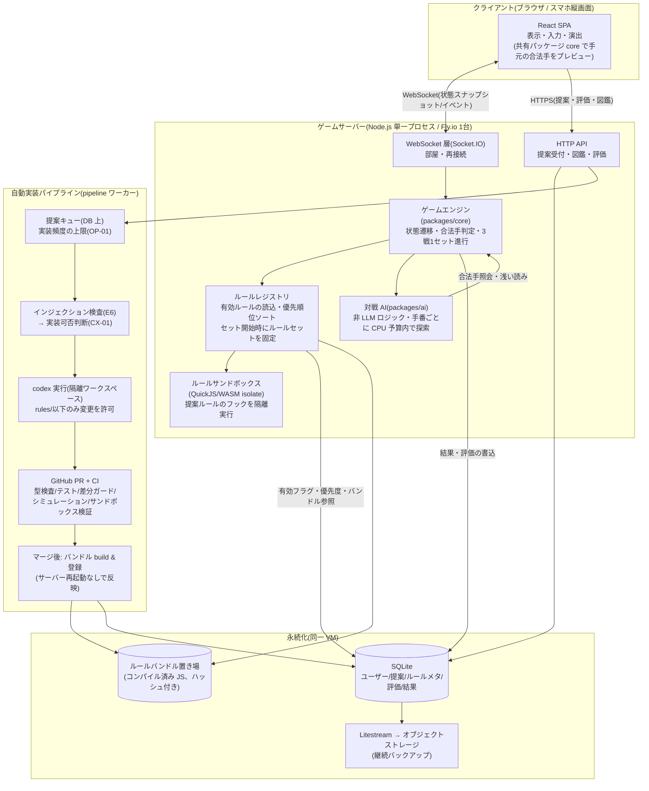

# E12: 技術選定・全体アーキテクチャ

- 作成日: 2026-07-24
- 状態: 提案(開発者の承認待ち。承認により §7 の決定待ち事項を除き確定)
- 一次情報源: `docs/企画書.md` / `docs/product-backlog.md`

---

## 1. この Epic の位置づけ

この Epic は「みんなでつくろう 大富豪」を **Web アプリとして** 作るための、言語・フレームワーク・インフラ・リポジトリ構成・自動実装パイプラインの全体方針を 1 か所で決める。個別機能の Epic ではなく、**他のすべての Epic が前提として参照する土台**である。

他 Epic からの参照のされ方:

| 参照元 | この文書のどこを前提にするか |
|---|---|
| E1(ゲームエンジン) | §4.1 言語・共通基盤、§4.6 ルールプラグイン契約(フック・Effect 語彙・表現限界)、§6 末尾の合法手列挙の未定義事項 |
| E2(対戦 AI) | §3 の AI 実行の置き場所、§6 の CPU 予算と合法手列挙の引き継ぎ事項、§4.6 のルールチェーン参照方法。※§4.6(1) の差分ガード制約により、AI-02 の「codex が AI ロジックも更新する」案は初期運用では採れない前提で方針を決める |
| E3(マルチプレイ) | §4.3 リアルタイム同期・部屋状態管理・再接続 |
| E5/E6(提案受付・検査) | §4.9 認証、§4.7 パイプラインの入口(キュー) |
| E7(codex パイプライン) | §4.7 リポジトリ運用・PR フロー・CI・自動マージ条件、§4.8 サンドボックス |
| E8/E9(評価・優先順位) | §4.4 永続化対象、§4.6 の優先順位適用と有効/無効フラグ |
| E10(運用・観測) | §4.5 ホスティング、§6 コスト見積もり |
| E11(ルール閲覧) | §4.4 のルールメタデータのスキーマ方針 |

本文書で「E1 で確定」等と書いた箇所は、**方針はここで決め、詳細仕様の確定を当該 Epic に委譲する**という意味である。ここで決めた方針を変える場合は、この文書を先に更新する。

## 2. 選定の判断基準

優先順に並べる。以後の全推奨はこの基準に紐づけて説明する。

1. **codex が扱いやすいコードベースであること(自動実装のしやすさ)** — 本企画の中核は「ユーザー提案ルールを codex(開発者 subscription のコーディングエージェント)が自動実装する」ことにある。人間のレビューを最小化して回すには、機械が安全に変更できる構造が必要。具体的には:
   - **単一言語**: 言語をまたぐ変更はエージェントの失敗率を上げる。クライアント・サーバー・ルール・AI・パイプラインを 1 言語に統一する。
   - **単一リポジトリ(モノレポ)**: codex に渡すコンテキストが 1 つで済み、「ルール追加 = 1 ディレクトリの追加」という単純な作業モデルにできる。リポジトリ間の同期という運用負荷も消える。
   - **型による制約**: ルールが実装すべきインターフェースを型で表現しておけば、生成コードの逸脱の多くはコンパイルエラーとして CI で機械的に落ちる。「テストを書かないと検出できない誤り」を減らすほど自動化が安定する。
   - **高速なテスト**: 提案 1 件ごとに CI が全テストを回す。テストが遅いとパイプラインのスループットと codex 利用枠の両方を圧迫する。ネットワークや実 DB に依存しない純粋関数中心の設計にし、全テスト数十秒以内を維持する。
2. **個人開発の運用負荷が最小であること** — サービス・プロセス・リポジトリの数を最小にする。「管理するものが 1 つ増える」こと自体をコストとして数える。
3. **生成コードを安全に実行できること** — codex の生成物はレビューをすり抜けたバグ・暴走・悪意を含みうる前提で、実行時の隔離(サンドボックス)とルール単位のロールバックを最初から構造に組み込む。
4. **リアルタイム性が要件に足りること** — 4 人固定のターン制カードゲームであり、FPS のような低レイテンシ同期は不要。「手番の操作が 1 秒以内に全員へ反映される」程度で十分。過剰なリアルタイム基盤を入れない。
5. **コスト** — 無料〜月額数百〜千円台で開始でき、遊ばれなくても財布が痛まないこと。

判断基準 1 は他のすべてに優先する。たとえば「より高速な言語」「より豪華な描画」があっても、codex の成功率を下げるなら採らない。

## 3. 全体アーキテクチャ

**authoritative server**(権威サーバー: ゲームの正しい状態はサーバーだけが持ち、クライアントは表示と入力のみを担う方式)を前提とする。対戦の公平性(他人の手札を知れない)と、ルールがサーバー側で増えていく本企画の性質上、これ以外の選択肢は実質ない。



### 責務分割の要点

| コンポーネント | 責務 | 持たないもの |
|---|---|---|
| クライアント(SPA) | 描画・入力・演出。共有ロジックで「出せるカード」を手元で判定し UI を即応させる | 権威状態。クライアント判定は UX 用で、最終判定は必ずサーバー |
| ゲームエンジン(core) | 状態遷移・合法手判定・セット進行。**純粋関数の集合**(同じ入力→同じ出力)にする | I/O。DB もネットワークも触らない(テスト高速化と codex 安全性の要) |
| ルールレジストリ | DB の有効フラグ・優先度を読み、セット開始時にルールチェーンを構築・固定 | ルールの中身の解釈(それはサンドボックス内のルールコードの仕事) |
| ルールサンドボックス | 提案ルールのフック関数を隔離実行し、宣言的な Effect を返させる | 直接の状態変更・I/O(能力を一切与えない) |
| 対戦 AI | 手番ごとに合法手を列挙し予算内で選択。エンジン経由でルールチェーンを参照 | LLM 呼び出し(企画書 §3.3)・ルールの独自解釈 |
| pipeline ワーカー | キュー消化・codex 起動・PR 作成・マージ後のバンドル登録 | 本番秘密情報(codex 実行環境には渡さない) |
| DB(SQLite) | ユーザー・提案・ルールメタ・評価・対局結果の永続化 | 進行中の対局状態(メモリのみ。§4.4) |

**対局状態はサーバーのメモリにだけ持つ**(部屋 = プロセス内オブジェクト)。サーバーは 1 プロセス・1 台で運用し、部屋の分散管理をしない。これは規模(§6)に対して十分で、運用物を最小にする(判断基準 2)。サーバークラッシュ時に進行中の対局が失われるトレードオフは、個人開発の初期として受け入れる(結果・評価はセット/ゲーム終了時に DB へ書くので資産は失われない)。

**ルールの反映はサーバー再デプロイを伴わない**(§4.6)。これは「ルールが頻繁に増える」本企画で、デプロイのたびに進行中の対局を落とさないための中核的な設計判断である。エンジン本体の変更(まれ)のみ再デプロイになる。

## 4. 技術選定の提案

各領域で 2〜3 案を比較し、推奨に理由とトレードオフを付ける。

### 4.1 言語・共通基盤

| 案 | 内容 | 評価 |
|---|---|---|
| **A. TypeScript 一本(推奨)** | クライアント・サーバー・ルール・AI・パイプラインすべて TS。ゲームロジックは共有パッケージに置き両側から import | 判断基準 1 を最も満たす。ブラウザと共有可能な唯一の実用的選択。学習データ量が多く codex の生成品質が安定。型でルール契約を強制できる |
| B. サーバー Go/Rust + クライアント TS | 性能と堅牢性は高い | 2 言語になり、ルール自動実装が「2 言語の変更」になる時点で失格。ロジック共有も不可。AI 探索の性能利点は §6 のとおり不要域 |
| C. サーバー Python + クライアント TS | AI・LLM 周辺ライブラリが豊富 | 対戦 AI は非 LLM ロジック(企画書 §3.3)なので Python の利点が薄い。2 言語・ロジック共有不可・型の強制力も TS に劣る |

**推奨: A. TypeScript 一本。** ランタイムは Node.js(LTS)。パッケージマネージャは pnpm + workspaces(モノレポの標準的で軽い選択)。テストは Vitest(高速・TS ネイティブ)。Lint/整形は ESLint + Prettier(codex 生成コードの機械的な検査ゲートを兼ねる)。`tsconfig` は `strict: true` を必須とする — 型の制約が CI の第一防衛線になるため、緩い型設定は判断基準 1 に反する。

**ゲームロジックの共有**: `packages/core` にエンジンと型を置き、サーバーは権威判定に、クライアントは「出せるカードのプレビュー」に同じコードを使う。ただし提案ルール(サンドボックス実行)はサーバーのみで動かし、クライアントには結果だけ配る。クライアント側プレビューが提案ルールを知らないことで「出せるはずのカードがグレーアウトされる(またはその逆)」ズレは起きうるが、サーバー判定が正なので誤動作にはならない。注意点として、このズレは**縛りのような合法性に介入するルールが増えるほど拡大していく**(共有ロジックによるプレビューの価値は逓減する)。代替案として「サーバーが合法手集合(いま出せる手の一覧)を全量スナップショット(§4.3)に同梱し、クライアントは計算せず表示だけする」方式があり、ルール増加後はこちらが正確さで勝る。どちらを採るか(または初期は共有ロジック・ルール増加後に同梱方式へ移行する併用)は E1/E11 で決定する。

**モノレポ構成(案)**:

```
daifugo-together/
├─ packages/
│  ├─ core/        # ゲームエンジン・型・Effect 語彙・ルール契約(共有)
│  ├─ rules/       # ルールプラグイン(1 ルール = 1 ディレクトリ)← codex の作業領域
│  ├─ ai/          # 対戦 AI(非 LLM ロジック)
│  ├─ server/      # WebSocket・部屋・HTTP API・DB・ルールレジストリ
│  ├─ web/         # React SPA
│  └─ pipeline/    # 提案キュー消化・codex 起動・PR・バンドル登録ワーカー
├─ docs/
└─ .github/workflows/
```

### 4.2 フロントエンド

**フレームワーク**:

| 案 | 評価 |
|---|---|
| **A. React + Vite(SPA)(推奨)** | 学習データ量・エコシステム最大で codex 生成が安定(判断基準 1)。Vite の SPA はビルドが速く、サーバーは静的ファイルを配るだけ |
| B. Next.js | SSR・ルーティング等は本ゲームに不要。サーバーランタイムが増え、ゲームサーバーと別物になる(判断基準 2 に反する) |
| C. Svelte | 軽量で良い選択だが、エコシステムと codex の習熟で React に一歩譲る。積極的に選ぶ理由が本件にはない |

**描画方式: DOM/CSS(Canvas は使わない)**。理由: 大富豪の画面は「カード・ボタン・一覧・ダイアログ」で構成され、DOM/CSS の得意領域そのもの。CSS transform/transition でカード移動・発動演出(CX-06)は十分表現できる。DOM はレスポンシブ対応(スマホ縦メイン + PC、企画書 §1)とアクセシビリティが素直で、codex や自分が UI を触るときも普通の Web 開発の知識で済む。トレードオフ: 数百枚のカードが乱舞するような演出は Canvas/WebGL(Pixi.js 等)に劣るが、フェーズ 1〜3 にその要件はない。将来必要なら演出レイヤーだけ Canvas を重ねる拡張余地がある。

**状態管理**: サーバーが権威状態を配るので、クライアントの「ゲーム状態」は**サーバーから受け取ったスナップショットの写し**にすぎない。大げさな状態管理層は不要で、Zustand(小さな store ライブラリ)+ WebSocket ハンドラで足りる。Redux 等の導入は過剰設計として避ける。画面ローカルの UI 状態(選択中のカード等)は React のローカル state。

### 4.3 サーバー・リアルタイム同期

| 案 | 評価 |
|---|---|
| **A. Node.js + Socket.IO(推奨)** | 再接続・ハートビート・部屋(room)・フォールバックが枯れた実装で付いてくる。学習データが豊富で codex も扱い慣れている。ターン制の低頻度メッセージなのでプロトコルのオーバーヘッドは無視できる |
| B. Node.js + 素の ws | 依存最小で見通しは良いが、再接続・生存確認・部屋管理を自作することになる。自作分は A と数百行差で、バグの持ち込み口が増えるだけ |
| C. Colyseus(Node.js のマルチプレイ専用フレームワーク。0.17 系が現役で活発) | 状態の差分同期・マッチメイキング・再接続が組み込み。ただし状態を Colyseus の Schema クラスで定義する制約があり、**提案ルールが状態形状に触れる本企画ではルール契約とフレームワークの結合が生まれる**。差分同期の利点は状態が KB 級の本件では過剰 |

**推奨: A. Socket.IO。** 決め手は「状態モデルを自分の `core` パッケージが完全に所有する」こと。ルールプラグイン(§4.6)が状態へ及ぼす作用を Effect 語彙で統制する設計のため、同期フレームワーク側の状態表現に縛られたくない。

**同期方式は全量スナップショット + イベント**: 手が指されるたびに、各プレイヤーへ「そのプレイヤーから見える状態」(自分の手札 + 公開情報。他人の手札は枚数のみ)を丸ごと送る。大富豪の状態は 54 枚のカードと進行情報で数 KB に収まり、差分同期の複雑さ(とバグ)を持ち込む理由がない。発動演出(CX-06)用に「どのルールが発動したか」のイベント列を添える。全量方式は同期コードが状態の中身に依存しないため、**状態形状が変わっても(エンジン側の拡張や、ルールの KV メモリのような付随データの追加があっても)同期層の変更が不要**になる。差分同期のような「状態形状ごとの同期コード」を保守せずに済む分、変更に強い(判断基準 2)。なお提案ルール自体は差分ガード(§4.6(1))により状態形状を直接拡張できないので、これは主にエンジン進化に対する利点である。ただし**ルールの KV メモリはクライアントへ配信しない**(サーバー内部データ)。ルールはサーバー側で秘匿情報を含む状態ビューを読めるため、KV を配信すると悪意あるルールが秘匿情報をクライアントへ持ち出す口になり得る。スナップショットに含める公開情報の確定は E1/E3 で行う。

**部屋の状態管理**: プロセス内の `Map<roomId, Room>`。部屋はロビー(待機画面)→ 対局(3 戦 1 セット)→ 解散のライフサイクルを持つ。参加は招待コード(バックログ §5 の MP-01 方針)。

**再接続**: 接続時にサーバーが発行するセッショントークンを localStorage に保持し、再接続時に同じ席へ復帰する。切断中は猶予時間(例: 60 秒。E3 で確定)を置き、手番が来たら AI が代打ちする案を推す(進行を止めないため。離脱の確定条件と共に E3 で決定)。

### 4.4 DB・永続化

**何を永続化するか**(スキーマ詳細は各 Epic で確定):

| データ | 永続化 | 備考 |
|---|---|---|
| ユーザー(匿名 ID・表示名・イエローカード枚数・提案停止期限) | する | §4.9 |
| ルール提案(本文・区分・都道府県・状態・却下/失敗理由) | する | E5/E7。検査ログ(YC-01)含む |
| ルールメタデータ(名称・説明・区分・都道府県・**状態(有効/無効/排除済み)・優先度・人気度**・バンドル参照・バージョン履歴) | する | §4.6 の中核。図鑑(E11)もここを読む |
| 評価(セット評価・ルール単位の高/低評価) | する | E8/E9 の入力 |
| 対局結果(セットの順位・発動ルール一覧・観測指標) | する | セット/ゲーム終了時に書く。E10 の集計元 |
| **進行中の対局状態** | **しない**(メモリのみ) | クラッシュで消える割り切り(§3)。デバッグ用の行動ログ出力は任意で残す |

| 案 | 評価 |
|---|---|
| **A. SQLite(better-sqlite3)+ Litestream(推奨)** | サーバーと同居する 1 ファイル DB。運用物ゼロ増・レイテンシ最小・無料。Litestream(SQLite の WAL をオブジェクトストレージへ継続レプリケートするバックアップツール)で消失リスクを塞ぐ。単一サーバー方針(§3)と完全に整合 |
| B. マネージド Postgres(Neon / Supabase の無料枠) | サーバーと DB が分離しスケールの独立性はあるが、管理対象・障害点・レイテンシが増える。無料枠の条件変動という外部リスクも持つ。単一サーバー方針では利点が働かない |
| C. Cloudflare D1 | Workers 前提のエコシステム。§4.5 で Workers を主採用しないため見送り |

**推奨: A. SQLite + Litestream。** 書き込み頻度(提案・評価・結果)は毎秒数件のオーダーにも達しない。ORM は **Drizzle**(スキーマを TS で書く軽量 ORM)を推奨 — スキーマ自体が型になり、codex がルールメタデータを扱うコードを生成する際の制約として働く(判断基準 1)。Prisma は生成器・独自 DSL の分だけ重く、ここでは Drizzle の素直さを取る。

トレードオフ: SQLite は単一ライタでサーバーと運命共同体になるが、これは §3 の単一サーバー方針を選んだ時点で織り込み済み。将来サーバーを複数台にする場合は Postgres への移行が必要になる(Drizzle はどちらも対応しており、移行コストは限定的)。

### 4.5 ホスティング・デプロイ

| 案 | 評価 |
|---|---|
| **A. Fly.io 1 台(推奨)** | 常駐 Node プロセス + WebSocket + 永続ボリューム(SQLite)が素直に動く。shared-cpu の小型マシンで月数ドル(256MB で $2 前後、実用構成で $5〜15/月程度)。`fly deploy` だけの運用。東京リージョン(nrt)あり |
| B. Railway / Render | Railway Hobby $5/月で同等のことは可能。Render の無料 Web サービスはアイドルでスリープするため常駐部屋サーバーに不向きで、有料化すると A と大差ない。どちらも可だが、永続ボリューム + リージョン + 価格の総合で A を推す |
| C. Cloudflare Workers + Durable Objects | 無料枠が厚く(リクエスト 10 万/日など)WebSocket Hibernation もあり魅力的だが、**リクエストあたり CPU 時間制限が AI 探索(§6)と相性が悪く**、常駐プロセス前提の pipeline ワーカーも置けない。実行モデルが特殊で判断基準 1(codex の扱いやすさ)にも不利。見送り(将来、観戦配信など読み取り系のスケールが必要になったときの拡張余地として記録) |

素の VPS(Hetzner 等)は最安だが OS 運用が自分持ちになるため、判断基準 2 で A に譲る。

**デプロイ方式**:
- **フロントエンド**: ビルド済み静的ファイルをゲームサーバー自身が配信する(同一オリジン。CORS・ドメイン設定が消え、運用物が増えない)。CDN 分離は必要になってからでよい。
- **エンジン/サーバー本体**: GitHub Actions から `fly deploy`(main へのマージで自動)。再起動を伴うため進行中セットが落ちる。頻度は低い想定だが、運用上は「深夜帯に実施」+ 将来的に「進行中セット 0 を待つ drain スクリプト」を E10 で用意する。
- **提案ルール**: **デプロイではない**(§4.6。バンドル登録と DB フラグのみで反映)。ここが本設計の肝で、ルールが毎日増えてもサーバーは再起動しない。

### 4.6 ルールプラグインアーキテクチャ(E1/E7/E9 の前提)

本企画で最も重要な構造。まず「ルールをどういう形で実装物にするか」の選択肢から比較する。

| 案 | 評価 |
|---|---|
| **A. サンドボックス実行のプラグイン + 宣言的 Effect(推奨)** | ルール = codex が書く独立 TS モジュール。コードなので表現力が高く、作用の上限は Effect 語彙(後述)で画し、実行の危険はサンドボックス(§4.8)で隔離する。ルール単位の有効/無効・ロールバックがモジュール境界と一致する |
| B. ルール = エンジン本体への直接コードパッチ | codex の表現力は最大だが、安全境界が消える(生成コードがエンジン全体に触れ、差分ガードも機能しない)。ルール同士がコードレベルで絡み合い、**ルール単位の有効/無効・ロールバック(企画の必須要件)が構造的に成立しない**。棄却 |
| C. エンジンが解釈する宣言的 DSL(コード生成なし) | 提案を独自定義のルール記述言語(DSL)に変換してエンジンが解釈実行する。任意コードを実行しないため安全性は最高だが、**表現力が DSL 設計者の想像の範囲に縛られ、「自由発想のオリジナルルール」という企画のコアと衝突**する。DSL の設計・拡張・保守自体が重く、コーディングエージェントを使う意味も薄い。棄却 |

A は「表現力はコードで、安全は Effect 語彙 + サンドボックスの二重境界で」という両取りであり、判断基準 1(codex の自由度)と 3(安全な実行)を同時に満たす唯一の案である。トレードオフとして、Effect 語彙にない作用は実装できない(語彙の拡張は人間の仕事になる)— この限界の扱いは (2) の末尾と §7 で明示する。

以下、採用案 A を具体化する。「ルール 1 件 = 1 モジュール」を、**リポジトリ上の単位・ビルド上の単位・実行時の単位・DB 上の単位**の 4 つで一貫させる。

#### (1) リポジトリ上の単位

```
packages/rules/
└─ r0042-yagiri/          # r{連番}-{slug}。提案 1 件 = 1 ディレクトリ
   ├─ rule.ts             # RuleModule 実装(下記契約)
   ├─ rule.test.ts        # ルール固有のユニットテスト(codex が同時生成)
   └─ meta.json           # id・名称・説明・区分・都道府県・提案 ID
```

codex に許す変更は**このディレクトリ配下の新規追加のみ**(CI の差分ガードで機械的に強制。§4.7)。エンジン(`core`)や他ルールへの変更が必要な提案は、現時点では「実装不可」として却下する(CX-01 の線引きの一部。Effect 語彙の拡張は人間の仕事)。

この制約はバックログ AI-02(対戦 AI の新ルール追従)の選択肢のうち**「ルール追加時に codex が AI ロジック(`packages/ai`)も更新する」案を初期運用では封じる**ことに注意。E2 は「AI は未知ルールの意図を解釈せず、ルール適用後の合法手集合の上でプレーする」方向を第一候補として方針を決めることになる。AI 更新案を採る場合は、差分ガードの対象拡大とそれに見合う検証強化(AI 対局の回帰テスト等)をセットで設計し直す必要がある。

#### (2) エンジンとの契約(インターフェース)

`packages/core` が公開する契約。**ルールは状態を直接変更せず、宣言的な Effect(効果)を返す**。エンジンだけが Effect を状態に適用する。この一方向性が、サンドボックス(§4.8)と並ぶ二重の安全境界になる:ルールにできることの上限は Effect 語彙で決まり、語彙にない作用は書けない。

```ts
// packages/core/src/rule-contract.ts(骨子。確定は E1)
export interface RuleModule {
  meta: RuleMeta;                     // meta.json と同内容(id, name, kind, prefecture, ...)
  hooks: Partial<RuleHooks>;          // 必要なフックだけ実装する
}

export interface RuleHooks {
  /** 合法手判定への介入(出せる/出せないを変える) */
  modifyLegality(ctx: RuleContext, play: Play, base: Legality): Legality;
  /** カードの強さ関係への介入(革命系) */
  modifyStrength(ctx: RuleContext, order: StrengthOrder): StrengthOrder;
  /** プレイ直後(8切り系)。作用は Effect で宣言する */
  afterPlay(ctx: RuleContext, play: Play): Effect[];
  /** 場が流れた直後 */
  afterFieldClear(ctx: RuleContext): Effect[];
  /** ゲーム開始・終了時(セット内履歴 ctx.setHistory を参照できる) */
  onGameStart(ctx: RuleContext): Effect[];
  onGameEnd(ctx: RuleContext, standings: Standings): Effect[];
}

export type Effect =
  | { type: "clearField" }                                  // 場を流す
  | { type: "skipTurns"; player: PlayerId; count: number }  // 手番スキップ
  | { type: "reverseTurnOrder" }                            // 回り順反転
  | { type: "forceRank"; player: PlayerId; rank: Rank }     // 順位の強制(都落ち等)
  | { type: "moveCards"; from: Zone; to: Zone; cards: CardSelector } // カード移動
  | { type: "setMemory"; key: string; value: JsonValue }    // ルール専用 KV への書き込み(革命の発動状態など)
  | { type: "announce"; messageKey: string }                // 発動演出の通知(CX-06)
  // ...初期語彙は E1 で確定。語彙の追加はエンジン本体の変更 = 人手レビュー必須
  ;
```

- `RuleContext` は**読み取り専用の状態ビュー**(手札・場・プレイ履歴に加え、**上がり済みプレイヤーとその確定順位**を含む)+ エンジン提供の乱数(シード付き)+ ルール専用の KV メモリ(読み取りは `ctx.memory`、書き込みは `setMemory` Effect 経由)を持つ。KV メモリは**ゲーム内スコープ**(ゲーム終了で消える。革命の発動状態など)と**セット内スコープ**(ゲームをまたいで残る。「連続で最初にあがったら〜」のようにゲームをまたいで数える系のルール用。なお都落ちが参照する前ゲームの順位は KV でなくエンジン提供の `ctx.setHistory` から読む)の 2 種を想定し、区分の表現(キー接頭辞か Effect のフィールドか)は E1 で確定する。`Date.now` や `Math.random` 等の外界はサンドボックスが遮断し、**ルールは純粋関数**(同じ入力 → 同じ出力)であることを構造で強制する。これによりルールのテストとゲーム再現(リプレイによるバグ調査)が決定的になる。
- 対応例(既知のローカルルール群がこの語彙で書けることを E1 で机上検証しつつ初期語彙を確定する):
  - **8切り**: `afterPlay` で 8 を含むプレイなら `[{type:"clearField"}, {type:"announce",...}]` を返す。
  - **革命**: 4 枚出しを `afterPlay` で検知して `setMemory` で発動状態を記録し、`modifyStrength` が `ctx.memory` を見て強弱を反転する。発動状態を KV に置くか `ctx` のプレイ履歴から都度導出するかの規約は E1 で確定する(本文書の暫定は KV 方式)。
  - **都落ち**: 発火点は**「1 位が確定した瞬間」**である。`afterPlay` で、そのプレイにより手札が尽きて `ctx` の確定順位に 1 位が付いたとき、`ctx.setHistory` の前回大富豪と照合し、1 位が前回大富豪本人でなければ前回大富豪へ `forceRank`(即大貧民)を返す(`onGameEnd` での判定でも成立するが、「その瞬間に発動を演出する」CX-06 の体験は `afterPlay` 側が適う)。**`onGameStart` で判定する書き方は誤り** — 「前回大富豪が今ゲームで 1 位になれなかったら」という条件は開始時点では評価できず、前回大富豪を開幕で無条件降格させる誤実装になる。この種の「発火タイミングの選び間違い」は codex 生成でも起きうるため、契約ドキュメントに各フックの発火タイミングと典型ルールの対応表を載せ、codex のプロンプトに含める(E1)。なお `forceRank` が「即大貧民 = 以降手番なし・残り手札の処分」という退場処理をどう規定するかは、§7-6 の机上検証項目として E1 で確定する。

**現契約の表現限界(要決定)**: 本契約はフックが同期的に Effect を返す前提のため、**プレイヤーの追加入力を要するルールを表現できない**。例: 7渡し(7 を出したら任意の 1 枚を隣に渡す)・10捨てのような「選択要求 → 入力待ち → 再開」の流れは、Effect を返して終わるフックでは書けない。自由発想のオリジナルルールでは「選ぶ」「宣言する」系の提案が頻出すると予想され、放置すると CX-01 の却下率が採用率(成功指標、企画書 §11)を直撃するか、後から契約の破壊的変更(全ルール再検証)を招く。対応は 2 択:

- (A) **choice 機構を E1 の検討スコープに含める**: `requestChoice`(選択肢と対象プレイヤーを宣言する Effect)を語彙に加え、エンジンが「入力待ち」状態へ遷移して応答を次のフック呼び出しで渡す。表現力は上がるが、エンジンの状態機械・同期・AI(選択への応答)・タイムアウト処理が最初から複雑になる。
- (B) **初期は「追加入力を要するルールは実装不可」と CX-01 の線引きに明示する**: フェーズ 2 を単純な契約で立ち上げ、choice 機構は契約バージョンアップとして後日導入する。単純さと引き換えに、それまでの該当提案は却下され続ける。

どちらを採るかは §7-7 の決定待ちとする(本文書の暫定推奨は B — ただし E1 の契約設計時に A への拡張余地(フックの再呼び出し規約)だけは壊さない形にしておく)。

#### (3) 優先順位の適用

- レジストリはセット開始時に有効ルールを**優先度の降順**に並べたチェーンとして固定する。
- `modifyLegality` / `modifyStrength` のような「値を変換する」フックは優先度の**低い順に適用し、高いルールが後から上書きする**(最後に適用された者が勝つ = 高優先度が最終決定権を持つ)。
- `afterPlay` 等の Effect は全ルールから収集後、**矛盾する Effect は最高優先度のルールのものだけを採用**する(矛盾の定義と同点時の扱いは E9 で確定。同点の暫定案はルール登録の古い順)。
- エンジンは「どのルールがどの Effect を出し、何が採用/棄却されたか」を必ずログに残す(PR-01 の受け入れ条件、CX-06 の演出の情報源)。
- 優先度の数値は DB(人気度連動。E9)から来る。ルールコード自身は自分の優先度を知らない・指定できない。

#### (4) ビルドと配布(有効化/無効化/ロールバック)

- CI 通過・マージ後、ルールディレクトリを esbuild で**単一 JS バンドル**(依存を含む自己完結ファイル)にコンパイルし、内容ハッシュ付きでバンドル置き場(サーバーのボリューム or オブジェクトストレージ)へ発行。DB の `rules` にバージョン行(バンドル参照 + エンジン契約バージョン)を追加する。
- サーバーのレジストリは DB を参照し、**セット開始時点の有効ルール一覧とバンドルを読み込んで固定**する。進行中のセットのルール構成は途中で変わらない(「セット単位でルールセットが確定する」ことは E8 の評価の紐付けにも都合がよい)。
- **有効化/無効化 = DB のフラグ 1 つ**。次に始まるセットから反映される。サーバー再起動なし。
- **ロールバック = 2 段階**: 即応は「無効化フラグ」(CX-04・EV-03 が使う)。恒久対応は「前バージョンのバンドルへ参照を戻す」+ リポジトリの revert コミット(リポジトリと DB の対応を崩さないための整合作業。手順は CX-04 で文書化)。
- エンジン契約にはバージョン番号を振り、バンドルに記録する。契約の後方互換を壊す変更をエンジンに入れる場合は既存ルールの再ビルド・再検証が必要になる(頻度は低い想定だが、E1 で契約を安定させることが最重要である理由)。

### 4.7 codex 自動実装パイプライン

**用語**: codex = 開発者が subscription 契約しているコーディングエージェント(OpenAI Codex)。CLI の非対話モード(`codex exec`)でスクリプトから起動できる。

#### フロー(番号は図 §3 と対応)

1. 提案が保存され、インジェクション検査(E6)→ 実装可否判断(CX-01)を通過すると DB 上のキューに入る。キューは直列消化し、単位時間あたりの codex 実行数に上限を設ける(OP-01。subscription 枠の保護)。
2. pipeline ワーカーがキューから 1 件取り、**使い捨ての隔離ワークスペース**(コンテナ)にリポジトリを clone して `codex exec` を起動する。プロンプトはテンプレート固定で、提案本文は「データ」として区切って埋め込む(検査済みとはいえ、命令と提案文を構文的に分離しておく多層防御)。指示内容:「`packages/rules/r{id}-{slug}/` を新規作成し、RuleModule 契約でルールとテストを実装せよ。他のファイルに触れるな」。
3. codex がブランチを push し、PR を作成する(GitHub App のスコープ限定トークン: ブランチ push と PR 作成のみ。**本番の秘密情報はワークスペースに一切渡さない**)。
4. CI(GitHub Actions)が PR を検証する:
   - **差分ガード**: 変更ファイルが `packages/rules/r{id}-{slug}/` 配下のみか(スクリプトで機械判定。違反は即 fail)
   - 型検査(strict)・ESLint・全ユニットテスト(既存ルール含む)
   - **シミュレーションテスト**: 新ルールを有効にした構成で N ゲームを自動対局し、不変条件(ゲームが必ず終了する・カードが増殖/消失しない・不正状態に陥らない)を検査(CX-03 の中身。E1 がハーネスを提供)
   - **サンドボックス検証**: 本番同等の QuickJS isolate 上でバンドルを実行し、メモリ・実行時間の上限内で動くことを確認
5. **自動マージの条件**(段階的運用):
   - **Stage 0(初期)**: CI 全通過 + **人手レビュー承認**で手動マージ。codex の失敗パターンと CI の穴をここで学ぶ。
   - **Stage 1(自動化)**: CI 全通過 + 差分ガード通過で auto-merge。人手はマージ後の通知を見るだけ。移行条件の目安: 「Stage 0 で連続 20 件、人手レビューが CI の検出しない問題を発見しなかったこと」。問題発生時は Stage 0 に戻す(切り替えはリポジトリ設定 1 つで可逆に)。
   - どの Stage でも、CI 失敗 = 「実装失敗」として提案に記録し、提案者へ通知(RP-03)。リトライは 1 回まで(枠の保護)。
6. マージ後、Actions がバンドルを build・発行し、DB へ登録する(§4.6 (4))。有効化は自動(Stage 1)または開発者のワンタップ(Stage 0)。**この時点で人手ゼロで「提案 → 対局で発動」が閉じる**(CX-05 の受け入れ条件)。

#### codex の実行場所(要決定事項を含む)

| 案 | 評価 |
|---|---|
| **A. 常駐 pipeline ワーカー上で `codex exec`(推奨)** | ゲームサーバーと同居する常駐プロセスが、subscription 認証(ヘッドレス環境向けの device auth)済みの codex CLI をコンテナ内で起動する。従量課金 API を使わない企画方針(CX-02)に沿う |
| B. GitHub Actions 上で codex-action | 公式の `openai/codex-action` が存在しCI に自然に統合できるが、**API キー(従量課金)前提の利用が推奨されており**、subscription 枠で回す企画方針と衝突する |
| C. Codex のクラウド実行(GitHub 連携) | subscription に含まれるが、外部からの自動起動の可否・安定性が現時点で不確実。実装時に再調査 |

**推奨: A。** ただし「subscription 認証をヘッドレス自動実行で常用することが OpenAI の利用条件上問題ないか」は開発者による確認が必要(§7)。問題がある場合は C を再調査し、それも不可なら B(小型モデル + 従量課金)へのフォールバックをコスト付きで再提案する。

#### リポジトリ運用

- **単一リポジトリ**(§4.1)。main 保護 + PR 必須。ルール PR はラベルで区別し、エンジン開発の PR と混ざっても運用が破綻しないようにする。
- リポジトリの公開/非公開は決定待ち(§7)。非公開の場合、GitHub Actions の無料枠は月 2,000 分 — テストを速く保てば(判断基準 1)提案 1 件あたり数分 × 月数百件でも収まる。公開なら Actions は無料で、ルール実装が公開されること自体は企画と矛盾しない(攻撃者に CI の構成が見える点だけ留意)。

### 4.8 生成コードのサンドボックス実行方式

前提の整理: 生成コードは (a) CI での検証時と (b) 本番の対局中の 2 か所で実行される。(a) は GitHub Actions の使い捨てランナー(それ自体が隔離環境)で行うため、ここでの主題は **(b) 本番プロセス内でルールコードを安全に実行し続ける方式**である。

| 案 | 評価 |
|---|---|
| **A. QuickJS(WASM)isolate — quickjs-emscripten(推奨)** | 軽量 JS エンジン QuickJS を WebAssembly にコンパイルして Node プロセス内で動かす方式。WASM の性質上ホストの API に一切手が届かず(能力ゼロから始まる)、メモリ上限と実行の中断(CPU 時間制限)を課せる。ネイティブビルド不要で運用が軽い |
| B. isolated-vm(V8 isolate) | V8 本体の isolate を使うため実行速度は速いが、ネイティブモジュールでビルドが重く、**現在メンテナンスモード**(新機能は追加されない)。長期依存には不安が残る |
| C. 別プロセス + OS 隔離(コンテナ/リソース制限) | 隔離強度は最も高いが、手番ごとのフック呼び出しがプロセス間通信になりレイテンシと運用複雑性が跳ね上がる。ターン制ゲームの同期的なフック呼び出しと相性が悪い |

なお Node 標準の `node:vm` は**セキュリティ境界ではない**(公式ドキュメントが明言)ため候補にならない。かつて定番だった vm2 は 2023 年の開発停止後、2025-10 以降メンテナンスが再開されている(2026-05 の 3.11.5 が最新。deprecated 指定なし)が、**プロジェクト自身が README で「同一プロセス内サンドボックスは本質的に脱出リスクとのいたちごっこであり、これを唯一の防衛線にするな」と自認し、より堅牢な代替(isolated-vm・別プロセス・コンテナ等)を案内している**。したがって結論は変わらず候補にしない。この 2 つを選ばないことは明記しておく。

**推奨: A. quickjs-emscripten。** 理由: 通常の対局進行でのフックは「小さな純粋関数を手番ごとに実装ルール数に比例した回数(数十回オーダー)呼ぶ」使い方で、QuickJS の実行速度(V8 の数十分の一)でも 1 呼び出しはマイクロ秒〜ミリ秒級に収まり問題にならない(§6 で予算化)。決定性(JIT なし・提供 API を完全制御)はリプレイ再現とテストにも都合がよい。トレードオフ: AI 探索がルールチェーンを大量に呼ぶ場合の速度制約が生まれる — これは AI 側の探索設計を「フック呼び出し回数を予算内に抑える」形にすることで吸収する(§6、E2 への引き継ぎ)。

**ルールコードに許すこと/許さないこと**:

| 許す | 許さない(サンドボックスが構造的に遮断) |
|---|---|
| `RuleContext` の読み取り | あらゆる I/O(ネットワーク・ファイル・DB) |
| Effect 配列の返却 | ホスト(Node)API・グローバルへのアクセス |
| エンジン提供のシード付き乱数 | `Math.random` / `Date` 等の非決定性の源 |
| ルール専用の KV メモリ(`setMemory` Effect 経由) | 他ルール・エンジン内部状態への直接変更 |
| 純粋な計算(上限内) | メモリ上限(例: 32MB)・実行時間上限(例: 1 フック 10ms)の超過 → そのルールを当該セットで無効化しゲームは続行 |

実行時上限超過やルール内例外は「ゲームを止めずにそのルールだけ落とす」方針とし、発生を記録して自動無効化・開発者通知につなげる(CX-04/E10 と接続。閾値は実装時に決定)。

### 4.9 認証・ユーザー識別

| 案 | 評価 |
|---|---|
| **A. 匿名 ID + 表示名(推奨・フェーズ 1)** | 初回アクセス時にサーバーが匿名ユーザーとトークンを発行し、ブラウザに保持。登録ゼロで遊べる(子供メインのターゲットに重要)。実装が最小 |
| B. A + 提案時のみソーシャルログイン(Google 等) | イエローカード制(E6)のペナルティを実効化するには匿名 ID は弱い(ブラウザデータ削除で別人になれる)。提案機能に限り軽いログインを課す折衷案。Auth.js(旧 NextAuth)等の自前実装が候補 |
| C. 最初から全面ログイン制 | 遊ぶまでの障壁が高く、コア体験(まず遊ぶ)を損なう。過剰 |

**推奨: フェーズ 1 は A で開始し、フェーズ 2(提案受付 E5)の着手時に B の採否を決める。** 判断材料は「イエローカードの回避(作り直し)をどこまで許容するか」で、これは E6 の設計判断(§7 に決定待ちとして記載)。A の間も、提案系 API には IP ベースのレート制限を必ず併設する(枠の保護と嫌がらせ対策の最低線)。パスワードを自前で預かる方式は個人開発のリスクに見合わないため、どの段階でも採らない。

## 5. 推奨スタックのまとめ

**まずこれで作り始める**(全領域を 1 つの整合したスタックとして言い切る):

| 領域 | 採用 |
|---|---|
| 言語/基盤 | TypeScript(strict)+ Node.js LTS + pnpm workspaces モノレポ + Vitest + ESLint/Prettier |
| ゲームロジック | `packages/core` を純粋関数で実装し、サーバー(権威)とクライアント(プレビュー)で共有 |
| フロントエンド | React + Vite の SPA、DOM/CSS 描画、Zustand + サーバースナップショット写し |
| リアルタイム | Socket.IO。全量スナップショット + イベント配信。部屋はプロセス内メモリ |
| DB | SQLite(better-sqlite3)+ Drizzle ORM + Litestream バックアップ。対局状態は永続化しない |
| ホスティング | Fly.io 1 台(東京 nrt、SQLite ボリューム同居)。SPA は同一サーバーから配信 |
| ルールプラグイン | 1 ルール = 1 ディレクトリ = 1 バンドル。RuleModule 契約 + Effect 語彙。DB フラグで有効/無効、再デプロイなしで反映・ロールバック |
| サンドボックス | quickjs-emscripten(WASM isolate)、能力ゼロ + メモリ/時間上限 |
| codex パイプライン | 常駐ワーカーが `codex exec` を隔離ワークスペースで起動 → PR → CI(差分ガード/型/テスト/シミュレーション/サンドボックス)→ 段階的 auto-merge → バンドル登録 |
| 認証 | 匿名 ID + トークン(提案時の強化はフェーズ 2 頭で判断) |
| CI/CD | GitHub Actions(テスト・差分ガード・バンドル発行・`fly deploy`) |

このスタックの一貫した性格: **「動くものは 1 台の Node プロセスに集約し、増殖するもの(ルール)はデータとして外に出す」**。運用物を最小に保ちながら(判断基準 2)、毎日増えるルールをデプロイなしで安全に抜き差しできる(判断基準 3)。全部が TypeScript の 1 リポジトリなので、codex には「契約に従うディレクトリを 1 つ足す」仕事だけが渡る(判断基準 1)。

## 6. 性能・コストの見積もりの目安

**規模の想定**(個人開発のフェーズ 1〜3):

- 同時対戦: 通常 数卓、ピーク 10〜20 卓(= 同時 40〜80 プレイヤー相当)を上限想定とする。
- メッセージ量: ターン制のため 1 卓あたり毎秒数メッセージ以下 × 数 KB。ネットワーク・イベント処理は問題にならない。
- メモリ: 対局状態は 1 卓数十 KB。QuickJS isolate は 1 卓あたり 1 個(有効ルールを同一 isolate に読み込む)で数 MB 程度 → 20 卓でも数百 MB に収まる。**512MB〜1GB のマシンで開始**し、不足したらサイズ変更(Fly.io は数分で可能)。

**AI 探索の CPU 予算**(E1/E2 への引き継ぎ):

- 1 手あたり **平常 50ms・上限 200ms** を予算とする(体感は人間らしい「間」の範囲。むしろ演出上わざと遅延を足す方向)。
- 制約はルールチェーン呼び出し(サンドボックス経由)のコスト。呼び出し回数は一定ではなく、**「候補手数 × 該当フックを実装する有効ルール数 × 探索幅(読む局面数)」でスケールする**ことに注意。例: 候補手 20・`modifyLegality` 実装ルール 30・幅 1(自手番の合法手判定 1 パス)でも 600 呼び出しになり、1 呼び出し 0.1〜1ms なら 60〜600ms — **ルールが増えるほど線形に悪化し、素朴な実装は予算を超えうる**。緩和策を E2 の前提とする:
  1. **実装フック別インデックス**: レジストリがフックごとに実装ルールだけのリストを持ち、未実装ルールを呼ばない(係数を「全有効ルール数」から「そのフックの実装ルール数」へ下げる)。
  2. **isolate 内一括評価**: 候補手の配列を 1 回のサンドボックス呼び出しで渡し、判定結果をまとめて受け取る。支配的なホスト⇔isolate 境界コストを候補手数分から 1 回へ圧縮する。
  3. **同一局面内の判定キャッシュ**: 場が動かない間の合法手集合を再利用する。
- 上記を前提に、探索は「合法手列挙 + ヒューリスティック評価 + 浅い読み」で予算内に収める。深い MCTS(モンテカルロ木探索)のような数万局面シミュレーション前提の方式は、サンドボックス越しでは予算に入らないため採らない。
- **未定義事項の引き継ぎ(E1/E2)**: 階段のような**「出せる手の種類を増やす」ルールが入った場合の合法手列挙は未定義**である。手札 n 枚の部分集合は最大 2^n 通りあり、素朴な全列挙は爆発する。候補手の生成をエンジン側の候補生成器が握るのか(その場合、新種の手の追加はエンジン拡張 = 人手レビューになり、`modifyLegality` は判定のみ担う)、ルールが候補を追加宣言できる仕組みを設けるのかを E1 で決め、E2 の探索設計はその決定に従う。
- 最悪ケース(3 AI 卓 × 20 卓が同時に手番)でも手番は逐次発生するため、shared-cpu 2 コア級で足りる見込み。AI 計算が対局の応答性を圧迫する兆候が出たら worker_threads(Node の別スレッド)へ逃がす拡張余地を残す(初期実装では入れない)。

**月額コストの目安**(2026-07 時点の公開価格に基づく概算):

| 項目 | 目安 |
|---|---|
| Fly.io(shared-cpu 512MB〜1GB + ボリューム) | $5〜15/月 |
| バックアップ先オブジェクトストレージ(R2/S3、数 GB) | $1 未満/月 |
| GitHub Actions | 公開リポジトリなら無料。非公開でも無料枠 2,000 分/月で当面収まる見込み |
| codex | 既存 subscription の範囲(追加費用なし。枠は OP-01 で保護) |
| インジェクション検査/可否判断に LLM API を使う場合 | 小型モデルで 1 提案あたり 1 円未満のオーダー。方式は E6/CX-01 で決定(企画書 §9-8) |
| ドメイン | $10〜15/年 |

**合計: 月額おおむね $10 前後(1,500〜2,500 円)で開始可能**。無料ではないが、遊ばれなくても定額で天井が低い。Cloudflare 系の「ほぼ無料」構成は §4.5 のとおり実行モデルの制約が本件の要件(AI の CPU、常駐ワーカー)と合わないため採らなかった、というトレードオフの明示を添えておく。

## 7. 未決事項と決定待ち

開発者の判断・確認が必要な点。着手順に並べる。

1. **本スタック自体の承認**(TS-01)。特に「Fly.io で月 $10 前後の固定費が発生する」ことの受け入れ。
2. **codex の subscription 認証をヘッドレス自動実行で常用してよいか**(利用規約・レート制限の確認。§4.7)。不可なら Codex クラウド実行(GitHub 連携)の再調査 → それも不可なら従量課金フォールバックの再見積もり。
3. **リポジトリの公開/非公開**(§4.7。Actions 無料枠と、CI 構成が攻撃者から見えることの許容度)。
4. **提案機能にログインを課すか**(§4.9。E5/E6 着手時までに。イエローカード回避の許容度とのトレードオフ)。
5. **切断時の扱いの確定**(§4.3 は「猶予 60 秒 + AI 代打ち」を推すが、E3 着手時に確定・文書化)。
6. **Effect 初期語彙の確定**(E1。既知ローカルルール(8切り・都落ち・革命・階段・縛り等)が書けることの机上検証を含む)。都落ちの机上検証では特に、(a) `RuleContext` の状態ビューに**上がり済みプレイヤーとその確定順位**が含まれること、(b) `forceRank` が**退場処理(即大貧民 = 以降手番なし・残り手札の処分方法)をどう規定するか**、の 2 点を確認する(§4.6(2) の対応例が依存する前提)。階段は §6 末尾の合法手列挙の未定義事項とあわせて検証する。
7. **プレイヤーの追加入力を要するルールの扱い**(§4.6(2) の「現契約の表現限界」)。choice 機構を E1 の契約スコープに含める(案 A)か、初期は CX-01 の線引きで「実装不可」と明示する(案 B)か。採用率(成功指標)への影響と、契約の破壊的変更リスクのトレードオフ。E1 着手時までに決定。
8. **ルール実行時エラー・上限超過時の自動無効化の閾値**(§4.8。実装時に決定)。

## 8. バックログ追加案

E12 に紐づけるユーザーストーリー案。既存バックログと同形式で置く(バックログ本体には未記載。TS-01 承認後に `docs/product-backlog.md` へ転記する)。転記時はストーリー本体に加えて、**バックログ §2 の Epic 一覧表に E12 の行(名称・狙い・フェーズ・企画書の節)を追加する**こと(これを忘れると Epic 一覧とストーリーの対応が崩れる)。

- **[TS-01]** 開発者(運営)として、本文書の技術スタックと全体アーキテクチャを承認・確定したい。それは以後の全 Epic の実装判断がこの土台の上に載るからだ。
  - 受け入れ条件:
    - §5 の推奨スタックについて、開発者が承認または修正指示を出し、本文書に反映されている
    - §7 の未決事項 1〜3(スタック承認・codex 実行方式・リポジトリ公開範囲)に決定が付いている
    - 決定内容が本文書の更新として記録されている
  - フェーズ: 1 / 依存: なし

- **[TS-02]** 開発者(運営)として、モノレポの雛形と CI を整備したい。それは E1 以降の全ストーリーが同じ構造・同じ検証ゲートの上で進むための最初の足場だからだ。
  - 受け入れ条件:
    - §4.1 の構成(core/rules/ai/server/web/pipeline)で pnpm workspaces のモノレポが作成され、空実装のままビルド・型検査・テストが通る
    - GitHub Actions で PR ごとに型検査・lint・テストが自動実行される
    - ルール PR 用の差分ガード(`packages/rules/` 配下以外の変更を fail にする検査)がワークフローとして存在し、テストで動作確認済みである
  - フェーズ: 1 / 依存: TS-01

- **[TS-03]** 開発者(運営)として、ルールサンドボックス(QuickJS/WASM)の技術検証を先行して行いたい。それはルール実行方式が E1 のエンジン契約と E7 の検証フローの前提であり、想定性能が外れているなら早期に方式転換するためだ。
  - 受け入れ条件:
    - RuleModule 契約のダミールールを quickjs-emscripten 上で実行し、Effect が返ることを確認できる
    - メモリ上限・実行時間上限の強制が動作し、無限ループ・メモリ超過のルールがゲーム進行を止めずに無効化される
    - フック呼び出しとホスト⇔isolate 境界のレイテンシが、有効ルール数のスケール(例: 10 / 30 / 100 件)込みで計測され、§6 の見積もり式(候補手数 × フック実装ルール数 × 探索幅)のもとで AI 予算(平常 50ms・上限 200ms)の実現性が判定されている(候補手の isolate 内一括評価の効果測定を含む)
  - フェーズ: 1 / 依存: TS-01

---

## 付録: 本文書で外部確認した事実(2026-07-24 検索時点)

- Fly.io: 恒久無料枠は廃止済み。shared-cpu-1x 256MB で月 $2 前後、小規模実用構成で $8〜25/月の報告([Deploy Handbook](https://deployhandbook.com/pricing/fly-io) ほか)
- Railway: Hobby $5/月(使用分 $5 込み)。Render: 無料 Web サービスはスリープあり([Northflank 比較記事](https://northflank.com/blog/railway-vs-render) ほか)
- Cloudflare Durable Objects: 無料プランで利用可(リクエスト 10 万/日等)、WebSocket Hibernation あり、SQLite ストレージ課金は 2026-01 から有効化([Cloudflare Docs](https://developers.cloudflare.com/durable-objects/) / [changelog](https://developers.cloudflare.com/changelog/product/durable-objects/))
- isolated-vm: メンテナンスモード(新機能追加なし、既存機能と新 Node 対応は継続)([GitHub](https://github.com/laverdet/isolated-vm))
- vm2: 2023 年の開発停止(3.9.19、2023-05)後、3.10.0(2025-10-24)で開発再開。最新 3.11.5(2026-05-18)、deprecated 指定なし。README 自身が in-process サンドボックスの本質的限界を明言し、堅牢な代替として isolated-vm・別プロセス・コンテナ等を案内(npm registry を 2026-07-24 に直接確認)
- quickjs-emscripten: QuickJS を WASM 化して Node/ブラウザで隔離実行するライブラリとして現役([JavaScript Sandboxing Research, Simon Willison, 2026-03](https://simonwillison.net/2026/Mar/22/javascript-sandboxing-research/) ほか)
- Colyseus: 0.17 系が活発にリリース中([npm](https://www.npmjs.com/package/colyseus))
- OpenAI Codex: `codex exec` による非対話実行、ヘッドレス環境向け device auth、公式 GitHub Action(`openai/codex-action@v1`)あり。**CI/CD では API キー利用が推奨されている**(subscription 前提の本企画との整合は §7-2 の確認事項)([OpenAI Developers: Non-interactive mode](https://developers.openai.com/codex/noninteractive) / [Codex GitHub Action](https://developers.openai.com/codex/github-action))
